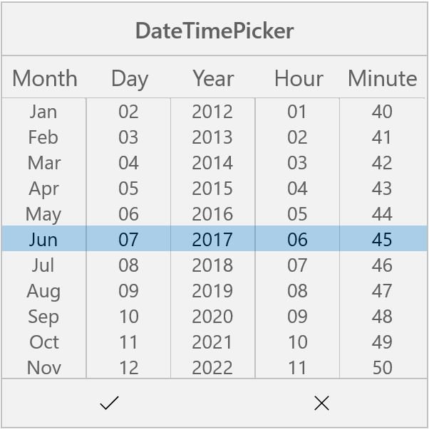

# Date Time Picker in UWP Picker (SfPicker)

In our UWP, SfPicker control has multi column support. Using this we can populate day, month, year, hour and minute values of collection in SfPicker control. 

We have demonstrated how to create custom DateTimePicker using Picker control in the following steps.

**Step** **1** **:** We have created custom class named as “DateTimePicker”. This class should inherit from SfPicker control.



    using Syncfusion.UI.Xaml.Controls.Input;
    using Windows.UI.Xaml;

    namespace DateTimePickerSample
  
    {

      public class DateTimePicker : SfPicker    
  
      {

      }
  
    }



**Step** **2** **:** After that create six ObservableCollection with object type in DateTimePicker class. 

**Collection** **details** **:** 

Day Collection, Month Collection, Year Collection, Hour Collection and Minute Collection.

Day Collection -> We have added current month days using DateTime.DaysInMonth.

Month Collection -> We have added Jan to Dec months

Year Collection -> We have added 1990 to 2050 years.

Hour Collection -> We have added 0 to 24 hours.

Minute Collection -> We have added 00 to 59 minutes.

Date Collection -> We have added all the five collections.

Date Collection is main collection we have assigned this collection to ItemsSource of Picker Control.

The below code demonstrates Date collection creation.



    using Syncfusion.UI.Xaml.Controls.Input;
    using Windows.UI.Xaml;

    namespace DateTimePickerSample

   {

     public class DateTimePicker : SfPicker    

     {
      
      internal Dictionary<string, string> Months { get; set; }

      public ObservableCollection<object> Date { get; set; }

      internal ObservableCollection<object> Month{ get; set; }

      internal ObservableCollection<object> Year{ get; set; }

      internal ObservableCollection<object> Hour{ get; set; }

      internal ObservableCollection<object> Minute{ get; set; }

      public DateTimePicker() 
        
      {

        Months = new Dictionary<string, string>();

        Date = new ObservableCollection<object>();

        Day = new ObservableCollection<object>();

        Month = new ObservableCollection<object>();

        Year = new ObservableCollection<object>();

        Hour = new ObservableCollection<object>();

        Minute = new ObservableCollection<object>();   

        PopulateDateCollection();

        this.ItemsSource = Date;

      }

       public void PopulateDateCollection()

        {

            //populate Days

            for (int i = 1; i <= DateTime.DaysInMonth(DateTime.Now.Year, DateTime.Now.Month); i++)

            {

                if (i < 10)
                
                    Day.Add("0" + i);
               
                else

                    Day.Add(i.ToString());

            }

            //populate Months

            for (int i = 1; i < 13; i++)

            {

                if (!Months.ContainsKey(CultureInfo.CurrentCulture.DateTimeFormat.GetMonthName(i).Substring(0, 3)))
                    Months.Add(CultureInfo.CurrentCulture.DateTimeFormat.GetMonthName(i).Substring(0, 3), CultureInfo.CurrentCulture.DateTimeFormat.GetMonthName(i));
                Month.Add(CultureInfo.CurrentCulture.DateTimeFormat.GetMonthName(i).Substring(0, 3));

            }

            //populate Years

            for (int i = 1990; i <= 2050; i++)

                Year.Add(i.ToString());

            //populate Minutes

            for (int i = 0; i <= 59; i++)

            {

                if (i < 10)

                {

                    Minute.Add("0" + i);

                }

                else

                    Minute.Add(i.ToString());

            }

            //populate Hours

            for (int i = 1; i <= 24; i++)

            {

                if (i < 10)

                {

                    Hour.Add("0" + i.ToString());

                }

                else

                    Hour.Add(i.ToString());

            }
           
            Date.Add(Month);

            Date.Add(Day);

            Date.Add(Year);

            Date.Add(Hour);

            Date.Add(Minute);

        }

      }

    }



**Step** **3** **:** We have updated the day value based on month and year value using Selection changed event of SfPicker control. Since the days of each month differs we have to handle this collection.



    using Syncfusion.UI.Xaml.Controls.Input;
    using Windows.UI.Xaml;

    namespace DateTimePickerSample
  
    {

     private void DateTimePicker_SelectionChanged(object sender, SelectionChangedEventArgs e)
  
        {

            UpdateDays(Date, e);
  
        }

        //Update days method is used to alter the Date collection as per selection change in Month column(if Feb is Selected day collection has value from 1 to 28)

        private void UpdateDays(ObservableCollection<object> Date, SelectionChangedEventArgs e)
  
        {

            try
  
            {

                bool update = false;
  
                if (e.AddedItems != null && e.RemovedItems != null)
  
                {
  
                    if ((e.AddedItems[0] as IList)[2] != (e.RemovedItems[0] as IList)[2])
  
                    {
  
                        update = true;
  
                    }

                    if ((e.AddedItems[0] as IList)[0] != (e.RemovedItems[0] as IList)[0])
  
                    {
  
                        update = true;
  
                    }
  
                }

                if (update)
  
                {
  
                    ObservableCollection<object> days = new ObservableCollection<object>();
  
                    int month = DateTime.ParseExact(Months[(e.AddedItems[0] as IList)[0].ToString()], "MMMM", CultureInfo.InvariantCulture).Month;
  
                    int year = int.Parse((e.AddedItems[0] as IList)[2].ToString());
  
                    for (int j = 1; j <= DateTime.DaysInMonth(year, month); j++)
  
                    {
  
                        if (j < 10)
  
                        {
  
                            days.Add("0" + j);
  
                        }
  
                        else
  
                            days.Add(j.ToString());
  
                    }

                    if (days.Count > 0)
  
                    {
  
                        this.Date.RemoveAt(1);
  
                        this.Date.Insert(1, days);
  
                    }
  
                }

            }
  
            catch
  
            {

            }
  
        }
  
    }



**Step** **4** **:** We have defined each column headers  “MONTH”, “DAY”, “YEAR”, “HOUR” and “MINUTE”  using ColumnHeaderText property of SfPicker control. The below code demonstrates how to define header for each column of SfPicker control.



    using Syncfusion.UI.Xaml.Controls.Input;
    using Windows.UI.Xaml;

    namespace DateTimePickerSample
  
     { 

     public DateTimePicker()
  
        {

            Headers = new ObservableCollection<string>();
           
            Headers.Add("Month");

            Headers.Add("Day");
            
            Headers.Add("Year");
            
            Headers.Add("Hour");
            
            Headers.Add("Minute");
            
            Header = "DateTimePicker";
            
            this.ColumnHeaderText = Headers;

      }
  
     }



**Step** **5** **:** Finally we have enabled SfPicker footer, header and Column header using ShowFooter, ShowHeader and ShowColumnHeader properties.



    using Syncfusion.UI.Xaml.Controls.Input;
    using Windows.UI.Xaml;

    namespace DateTimePickerSample
   
    {
    
     public DateTimePicker()     
    
      {

        ShowFooter = true;

        ShowHeader = true;
        
        ShowColumnHeader = true;

      }
  
    }



**Step** **6** **:** We have added the DateTimePicker control in MainPage page. Please refer the below code snippets.





    <Page xmlns="http://schemas.microsoft.com/winfx/2006/xaml/presentation"

    x:Class="DateTimePickerSample.MainPage"

    xmlns:local="using:DateTimePickerSample"

    xmlns:x="http://schemas.microsoft.com/winfx/2006/xaml"

    xmlns:input="using:Syncfusion.UI.Xaml.Controls.Input">

       <Grid Background="{ThemeResource ApplicationPageBackgroundThemeBrush}">
        
          <Button Click="Button_Click" Height="50" HorizontalAlignment="Center" Content="Show Picker" VerticalAlignment="Center" Width="200" />
        
          <local:DateTimePicker x:Name="date" ColumnHeaderHeight="40" HorizontalAlignment="Center" Height="400" PickerMode="Dialog" Width="400" SelectedItem="{Binding StartDate}" VerticalAlignment="Center"/>
      
      </Grid>

    </Page>

	
	


    using Syncfusion.UI.Xaml.Controls.Input;
    using Windows.UI.Xaml;

    namespace DateTimePickerSample
   
    {

     public sealed partial class MainPage : Page
     
       {

        public MainPage()
     
        {
      
            this.InitializeComponent();
      
            DateTimeViewModel datetime view model = new DateTimeViewModel();
      
            this.DataContext = datetime view model;
      
        }

        private void Button_Click(object sender, RoutedEventArgs e)
      
        {
      
            date.IsOpen = !date.IsOpen;
      
        }
      
      }
    
    }





Screen shot for the above codes.

We have attached DateTimePicker sample for reference. Please download the sample from the following link.

Sample link: [DateTimePicker](http://www.syncfusion.com/downloads/support/directtrac/general/DATETI~2-812099388.ZIP)

