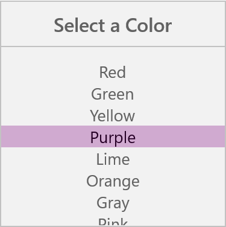

# Dealing with Columns in UWP Picker (SfPicker)

This section explains about the customization of SfPicker Columns

## Adjust Column Width

SfPicker allows user to adjust the column width by hooking `SfPicker.ColumnLoaded` event and then check the column using `ColumnLoadedEventArgs.Column` property and then adjust width of column by setting `ColumnLoadedEventArgs.Width` property.

We have prepared below code snippets to demonstrated DateTimePicker sample using `ColumnLoaded` event.

*MainPage*

Column width of the each and every column can be adjusted by the use of ColumnLoaded event in SfPicker which is implemented in the below code.





    <Page
    x:Class="ColumnDateTime.MainPage"
    xmlns="http://schemas.microsoft.com/winfx/2006/xaml/presentation"
    xmlns:x="http://schemas.microsoft.com/winfx/2006/xaml"
    xmlns:local="using:ColumnDateTime"
    xmlns:syncfusion="using:Syncfusion.UI.Xaml.Controls.Input"/>
   
      <Grid>

        <Button
  
            Click="Button_Click"
  
            Height="50"
  
            HorizontalAlignment="Center"
  
            Content="Show DateTimePicker"
  
            VerticalAlignment="Center"
  
            Width="200" />

        <local:CustomDateTime
  
            x:Name="date"
  
            ColumnHeaderHeight="40"
  
            HorizontalAlignment="Center"
  
            ColumnLoaded="date_ColumnLoaded"           
  
            VerticalAlignment="Center"
  
            Height="500"
  
            PickerMode="Dialog"
  
            Width="500" SelectedItem="{Binding SelectedTime,Mode=TwoWay}"/>

      </Grid>

    </Page>





    using Syncfusion.UI.Xaml.Controls.Input;
    using Windows.UI.Xaml;

    namespace ColumnDateTime

    {

     public sealed partial class MainPage : Page

      {

        public MainPage()

        {

            this.InitializeComponent();

            DateTimePickerViewModel datetime picker view model = new DateTimePickerViewModel();

            this.DataContext = datetime picker view model;
        
        }

        private void Button_Click(object sender, RoutedEventArgs e)

        {

            picker.IsOpen = !picker.IsOpen;
        
        }

        private void date_ColumnLoaded(object source, ColumnLoadedEventArgs args)

        {

            if (args.Column == 0)

                args.Width = 150;

            if (args.Column == 1)

                args.Width = 100;

            if (args.Column == 2)

                args.Width = 120;

            if (args.Column == 3)

                args.Width = 80;

        }

      }

    }





We have attached sample for reference. Please download the below sample.

Sample link: [ColumnDateTime](http://www.syncfusion.com/downloads/support/directtrac/general/COLUMN~3-788944356.ZIP)

## Add Caption

SfPicker allows user to add header for each column by setting `SfPicker.ColumnHeaderText` property and enabling `SfPicker.ShowColumnHeader` property to True.

`ColumnHeaderText` property is of object type and user can assign string or collection. 
If a string type is assigned in `SfPicker.ColumnHeaderText`, that string will be updated in all the column of SfPicker.

To assign the collection in `SfPicker.ColumnHeaderText`, SfPicker column header update based on index with value on collection.

The below code illustrate assign the ColumnHeaderText for SfPicker





    <Page xmlns="http://schemas.microsoft.com/winfx/2006/xaml/presentation"

    x:Class="DatePicker.MainPage"

    xmlns:local="using:DatePicker"

    xmlns:x="http://schemas.microsoft.com/winfx/2006/xaml"

    xmlns:input="using:Syncfusion.UI.Xaml.Controls.Input">

      <Grid>

        <Button Click="Button_Click" Height="50" VerticalAlignment="Center" HorizontalAlignment="Center" Content="Show Picker" Width="200" />

        <local:CustomDatePicker x:Name="date" ColumnHeaderHeight="40" HorizontalAlignment="Center" VerticalAlignment="Center"  PickerMode="Dialog" Height="400" Width="400"  SelectedItem="{Binding StartDate}"/>

      </Grid>

    </Page>





    using Syncfusion.UI.Xaml.Controls.Input;
    using Windows.UI.Xaml;

    namespace DatePicker
   
    {

     public class CustomTimePicker:SfPicker
   
     {

        public ObservableCollection<object> Time { get; set; }

        public ObservableCollection<object> Minute;

        public ObservableCollection<object> Hour;

        public ObservableCollection<object> Format;

        public ObservableCollection<string> ColumnHeaders;

        public CustomDatePicker() 
        
        {

            Date = new ObservableCollection<object>();

            ColumnHeaders = new ObservableCollection<string>();

            ColumnHeaders.Add("Hour");

            ColumnHeaders.Add("Minute");
            
            ColumnHeaders.Add("Format");

            PopulateDateCollection();

        }

        public void PopulateDateCollection()
   
        {
            //populate Days

            for (int i = 1; i <= DateTime.DaysInMonth(DateTime.Now.Year, DateTime.Now.Month); i++)
   
            {
   
                if (i < 10)

                    Day.Add("0" + i);

                else
   
                    Day.Add(i.ToString());
   
            }

            //populate Months

            for (int i = 1; i < 13; i++)
   
            {
   
                if (!Months.ContainsKey(CultureInfo.CurrentCulture.DateTimeFormat.GetMonthName(i).Substring(0, 3)))
                    Months.Add(CultureInfo.CurrentCulture.DateTimeFormat.GetMonthName(i).Substring(0, 3), CultureInfo.CurrentCulture.DateTimeFormat.GetMonthName(i));
                Month.Add(CultureInfo.CurrentCulture.DateTimeFormat.GetMonthName(i).Substring(0, 3));
   
            }

            //populate Years

            for (int i = 1990; i <= 2050; i++)
       
                Year.Add(i.ToString());
           
            Date.Add(Month);

            Date.Add(Day);
            
            Date.Add(Year);

        }
    
      }
  
    }
    




## Caption Customization

This section explains about the column header Background, TextColor and Fonts customization of SfPicker.

### Background

Column header background color can be customized by setting `SfPicker. ColumnHeaderBackground` property of SfPicker.





    <Page xmlns="http://schemas.microsoft.com/winfx/2006/xaml/presentation"

    x:Class="DatePicker.MainPage"

    xmlns:local="using:DatePicker"

    xmlns:x="http://schemas.microsoft.com/winfx/2006/xaml"

    xmlns:input="using:Syncfusion.UI.Xaml.Controls.Input">

      <Grid>

        <syncfusion:SfPicker x:Name="picker" ColumnHeaderBackground="Green" ColumnHeaderText="Color" ShowColumnHeader="True" />

      </Grid>

    </Page>





    using Syncfusion.UI.Xaml.Controls.Input;
    using Windows.UI.Xaml;

    namespace DatePicker
  
    {    

      public sealed partial class MainPage : Page
  
        {

            public MainPage()
  
            {

            this.InitializeComponent();
   
            SfPicker picker = new SfPicker();
 
            picker.ColumnHeaderBackground = new SolidColorBrush(Windows.UI.Colors.Green);
  
            this.DataContext = picker;
   
        }
  
      }
   
    }





### Text Color 

Column header text color can be customized by setting `SfPicker.ColumnHeaderForeground` property of SfPicker.





    <Page xmlns="http://schemas.microsoft.com/winfx/2006/xaml/presentation"

    x:Class="DatePicker.MainPage"

    xmlns:local="using:DatePicker"

    xmlns:x="http://schemas.microsoft.com/winfx/2006/xaml"

    xmlns:input="using:Syncfusion.UI.Xaml.Controls.Input">

      <Grid>

        <syncfusion:SfPicker x:Name="picker" ColumnHeaderForeground="Red" ColumnHeaderText="Color" ShowColumnHeader="True" />

      </Grid>

    </Page>





    using Syncfusion.UI.Xaml.Controls.Input;
    using Windows.UI.Xaml;

    namespace DatePicker
   
    {    

      public sealed partial class MainPage : Page
   
        {

            public MainPage()
   
            {

            this.InitializeComponent();
   
            SfPicker picker = new SfPicker();
     
            picker.ColumnHeaderForeground = new SolidColorBrush(Windows.UI.Colors.Red);
    
            this.DataContext = picker;
   
        }
   
      }
   
    }





### Font 

This section explains about the customization of Column Header text of Font.

#### 	FontFamily

Column Header text FontFamily can be customized by setting `SfPicker.ColumnHeaderFontFamily` property of SfPicker.





    <Page xmlns="http://schemas.microsoft.com/winfx/2006/xaml/presentation"

    x:Class="DatePicker.MainPage"

    xmlns:local="using:DatePicker"

    xmlns:x="http://schemas.microsoft.com/winfx/2006/xaml"

    xmlns:input="using:Syncfusion.UI.Xaml.Controls.Input">

      <Grid>

        <syncfusion:SfPicker x:Name="picker" ColumnHeaderFontFamily="Ariel" ColumnHeaderText="Color" ShowColumnHeader="True" />

      </Grid>

    </Page>





    using Syncfusion.UI.Xaml.Controls.Input;
    using Windows.UI.Xaml;

    namespace DatePicker
  
    {    

      public sealed partial class MainPage : Page
   
        {

            public MainPage()
    
            {

            this.InitializeComponent();
   
            SfPicker picker = new SfPicker();
     
            picker.ColumnHeaderFontFamily = new FontFamily("Ariel");
    
            this.DataContext = picker;
   
        }
   
      }
   
    }





#### 	FontSize

Column header text FontSize can be customized  by setting `SfPicker.ColumnHeaderFontSize` property of SfPicker.





    <Page xmlns="http://schemas.microsoft.com/winfx/2006/xaml/presentation"

    x:Class="DatePicker.MainPage"

    xmlns:local="using:DatePicker"

    xmlns:x="http://schemas.microsoft.com/winfx/2006/xaml"

    xmlns:input="using:Syncfusion.UI.Xaml.Controls.Input">

      <Grid>

        <syncfusion:SfPicker x:Name="picker" ColumnHeaderFontSize="20" ColumnHeaderText="Color" ShowColumnHeader="True" />

      </Grid>

    </Page>





    using Syncfusion.UI.Xaml.Controls.Input;
    using Windows.UI.Xaml;

    namespace DatePicker
  
    {    

      public sealed partial class MainPage : Page
    
        {

            public MainPage()
     
            {

            this.InitializeComponent();
   
            SfPicker picker = new SfPicker();
     
            picker.ColumnHeaderFontSize = 20;
     
            this.DataContext = picker;
    
        }
   
      }
   
    }





#### 	FontAttribute

 Column header text FontAttribute can be customized by setting `SfPicker.ColumnHeaderFontStyle` property of SfPicker.





    <Page xmlns="http://schemas.microsoft.com/winfx/2006/xaml/presentation"

    x:Class="DatePicker.MainPage"

    xmlns:local="using:DatePicker"

    xmlns:x="http://schemas.microsoft.com/winfx/2006/xaml"

    xmlns:input="using:Syncfusion.UI.Xaml.Controls.Input">

      <Grid>

        <syncfusion:SfPicker x:Name="picker" ColumnHeaderFontStyle="Italic" ColumnHeaderText="Color" ShowColumnHeader="True" />

      </Grid>

    </Page>





    using Syncfusion.UI.Xaml.Controls.Input;
    using Windows.UI.Xaml;

    namespace DatePicker
 
    {    

      public sealed partial class MainPage : Page
   
        {

            public MainPage()
     
            {

            this.InitializeComponent();
   
            SfPicker picker = new SfPicker();
     
            picker.ColumnHeaderFontStyle = Windows.UI.Text.FontStyle.Italic;
      
            this.DataContext = picker;
   
        }
   
      }
   
    }





## Cascading

SfPicker allow user to get selection change intimation by setting `SfPicker.SelectionChanged` event 

We have prepared cascading sample for change the SfPicker background color when change the Selection of SfPicker





    <Page xmlns="http://schemas.microsoft.com/winfx/2006/xaml/presentation"

    x:Class="DatePicker.MainPage"

    xmlns:local="using:DatePicker"

    xmlns:x="http://schemas.microsoft.com/winfx/2006/xaml"

    xmlns:input="using:Syncfusion.UI.Xaml.Controls.Input">

      <Grid>
    
        <Button Click="Button_Click" Height="40" Content="Open Picker" Width="200"  HorizontalAlignment="Center" VerticalAlignment="Center" />

        <input:SfPicker
    
            x:Name="picker"
    
            Header="Select a Color"
    
            HorizontalAlignment="Center"
    
            Height="400"
    
            PickerMode="Dialog"
    
            SelectionChanged="picker_SelectionChanged"
    
            Width="400"
    
            ItemsSource="{Binding Colors}"
    
            VerticalAlignment="Center"/>

      </Grid>

    </Page>





*MainPage*

    using Syncfusion.UI.Xaml.Controls.Input;
    using Windows.UI.Xaml;

    namespace DatePicker
 
    {
  
    public sealed partial class MainPage : Page
   
    {
   
        public MainPage()
   
        {
    
            this.InitializeComponent();
   
            ColorInfo color info = new ColorInfo();
     
            this.DataContext = color info;
     
        }

        private void Button_Click(object sender, RoutedEventArgs e)
      
        {
    
            picker.IsOpen = true;
      
      
        }

        private void picker_SelectionChanged(object sender, SelectionChangedEventArgs e)
       
        {
       
            if (e.AddedItems[0] != null)
       
            {
        
                var color = PickerHelper.GetColor(e.AddedItems[0].ToString());
        
                picker.SelectionBackground = new SolidColorBrush(color);

            }
     
        }
    
        public class ColorInfo
      
        {
      
            private ObservableCollection<string> _color;

            public ObservableCollection<string> Colors
       
            {
        
                get { return _color; }
         
                set { _color = value; }
         
            }

            public ColorInfo()
          
            {
           
                Colors = new ObservableCollection<string>();
           
                Colors.Add("Red");
           
                Colors.Add("Green");
           
                Colors.Add("Yellow");
           
                Colors.Add("Purple");
           
                Colors.Add("Lime");
           
                Colors.Add("Orange");
           
                Colors.Add("Gray");
           
                Colors.Add("Pink");

            }
        
        }

        public static class PickerHelper
      
        {
      
            static Dictionary<string, Color> colors = new Dictionary<string, Color>();

            public static Color GetColor(string color)
      
            {
      
                colors.Clear();
      
                colors.Add("Yellow", Colors.Yellow);
      
                colors.Add("Green", Colors.Green);
      
                colors.Add("Orange", Colors.Orange);
      
                colors.Add("Lime", Colors.Lime);
      
                colors.Add("Purple", Colors.Purple);
      
                colors.Add("Pink", Colors.Pink);
      
                colors.Add("Red", Colors.Red);
      
                colors.Add("Gray", Colors.Gray);
      
                return colors[color];
      
            }
      
        }
    
    }





Screen shot for the above code

We have attached sample for reference. please download the sample from the below link.

Sample link:[CascadingColor](http://www.syncfusion.com/downloads/support/directtrac/general/CASCAD~3-1083168533.ZIP)
