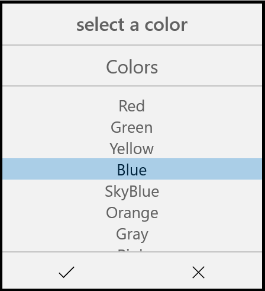

# Getting Started with UWP Picker (SfPicker)

This section explains you the steps to configure a SfPicker control in a real-time scenario and provides a walk-through on some of the customization features available in SfPicker control.

## Adding SfPicker Control

Create a Universal Windows Platform project in Visual Studio and refer to the following assemblies.

* Syncfusion. SfInput.UWP

* Syncfusion.SfShared.UWP

### Create a simple SfPicker

This section explains how to create simple SfPicker control and configure it. SfPicker can configure using C# code. 

### Create the UWP project 

Create new blank project (Universal Windows) using Visual Studio for UWP project. 

### Adding SfPicker in UWP project

1. Add the required assembly reference in UWP and other renderer projects as discussed in **Adding** **SfPicker** **reference** section.
2. Add SfPicker control two way XAML and C#.
* XAML Page
  * Set SfPicker control namespace as `xmlns:syncfusion=using:Syncfusion.UI.Xaml.Controls.Input;` `assembly=Syncfusion.SfInput.UWP;` in XAML Content page.
  * Set the SfPicker control in Content property of ContentPage.
* C# Page
  * Import SfPicker control namespace as `using Syncfusion.UI.Xaml.Controls.Input;` in C# ContentPage.
  * Create new SfPicker instance in ContentPage constructor and assign SfPicker instance to ContentPage Content property.





    <Page
    x:Class="GettingStartedSample.MainPage"
    xmlns="http://schemas.microsoft.com/winfx/2006/xaml/presentation"
    xmlns:x="http://schemas.microsoft.com/winfx/2006/xaml"
    xmlns:local="using:GettingStartedSample"
    xmlns:syncfusion="using:Syncfusion.UI.Xaml.Controls.Input">
    
        <Grid>

        <syncfusion:SfPicker x:Name="picker" />

        </Grid>

    </Page>





    using Syncfusion.UI.Xaml.Controls.Input;
    using Windows.UI.Xaml;

    namespace GettingStartedSample

    {

    public sealed partial class MainPage : Page

    {
        public MainPage()

        {

            this.InitializeComponent();
            
            SfPicker picker = new SfPicker();
            
            this.Content = picker;
        
        }
      
      }
    
    }





### Set Header to the SfPicker

SfPicker allows you to define header text by setting the `SfPicker.ColumnHeaderText` and enable SfPicker header by setting `SfPicker.ShowColumnHeader` property to true. Default value of `SfPicker.ShowColumnHeader` is True.





    <Page
    x:Class="GettingStartedSample.MainPage"
    xmlns="http://schemas.microsoft.com/winfx/2006/xaml/presentation"
    xmlns:x="http://schemas.microsoft.com/winfx/2006/xaml"
    xmlns:local="using:GettingStartedSample"
    xmlns:syncfusion="using:Syncfusion.UI.Xaml.Controls.Input">
    
        <Grid>
	       
            <syncfusion:SfPicker x:Name="picker" Header="select a color"/>
        
        </Grid>
    
    </Page>





    using Syncfusion.UI.Xaml.Controls.Input;
    using Windows.UI.Xaml;

    namespace GettingStartedSample
    
    {

	 public sealed partial class MainPage : Page
    
      {

        public MainPage()
    
        {
    
            this.InitializeComponent();
    
            SfPicker picker = new SfPicker();
    
            picker.Header = "Select a Color";
    
            this.Content = picker;
    
        }
    
      }
    
    }





### Adding SfPicker Items

SfPicker control is a data bounded control. Hence you must create collection of data’s and bind it to SfPicker control.

* Create simple Observable Collection with string type of Data’s for the SfPicker 



    using Syncfusion.UI.Xaml.Controls.Input;
    using Windows.UI.Xaml;

    namespace GettingStartedSample
  
    {

      public class ColorInfo

      {

        private ObservableCollection<string> _color;

        //update the Colors

        public ObservableCollection<string> Colors

        {

            get { return _color; }

            set { _color = value; }

        }

        public ColorInfo()

        {

            Colors = new ObservableCollection<string>();

            Colors.Add("Red");

            Colors.Add("Green");

            Colors.Add("Yellow");

            Colors.Add("Blue");

            Colors.Add("SkyBlue");

            Colors.Add("Orange");

            Colors.Add("Gray");

            Colors.Add("Pink");

        }
   
      }
   
    }



* Binding the Collection to SfPicker

SfPicker allow you to bind collection of data’s by setting `SfPicker.ItemsSource` property. You can bind the collection of data’s in C#.





     <Page
        x:Class="GettingStartedSample.MainPage"
        xmlns="http://schemas.microsoft.com/winfx/2006/xaml/presentation"
        xmlns:x="http://schemas.microsoft.com/winfx/2006/xaml"
        xmlns:local="using:GettingStartedSample"
        xmlns:syncfusion="using:Syncfusion.UI.Xaml.Controls.Input">

      <Grid>
        
        <syncfusion:SfPicker x:Name="picker" Header="Select a Color" ItemsSource="{Binding Colors}" />
    
      </Grid>
    
    </Page>





    using Syncfusion.UI.Xaml.Controls.Input;
    using Windows.UI.Xaml;

    namespace GettingStartedSample

    {

    public sealed partial class MainPage : Page

    {

        public MainPage()

        {

            this.InitializeComponent();

            SfPicker picker = new SfPicker();

            ColorInfo color info = new ColorInfo();

            this.DataContext = color info;

            picker.ItemsSource = color info.Colors;

            this.Content = picker;

        }

      }

    }





### Set title to the Items 

SfPicker allows you to define title to the SfPicker items by setting `SfPicker.ColumnHeaderText` and enable title of the SfPicker items by setting `SfPicker.ShowColumnHeader` property to True. Default value of `SfPicker.ShowColumnHeader` is False.





    <Page
        x:Class="GettingStartedSample.MainPage"
        xmlns="http://schemas.microsoft.com/winfx/2006/xaml/presentation"
        xmlns:x="http://schemas.microsoft.com/winfx/2006/xaml"
        xmlns:local="using:GettingStartedSample"
        xmlns:syncfusion="using:Syncfusion.UI.Xaml.Controls.Input">
           
        <Grid>
           
            <syncfusion:SfPicker x:Name="picker" ColumnHeaderText="Colors" ShowColumnHeader="True" />
        
        </Grid>
    
    </Page>





    using Syncfusion.UI.Xaml.Controls.Input;
    using Windows.UI.Xaml;

    namespace GettingStartedSample

    {

      public sealed partial class MainPage : Page

      {

        public MainPage()

        {

            this.InitializeComponent();

            SfPicker picker = new SfPicker();    

            picker.ColumnHeaderText = "Colors";

            picker.ShowColumnHeader = true;

            this.Content = picker;

        }

      }

    }





### Enable Validation button in Footer

In SfPicker validation button (Ok and Cancel) can be enabled by setting `SfPicker.ShowFooter` property to True. Default value of `SfPicker.ShowFooter` property is False



  

    <Page
        x:Class="GettingStartedSample.MainPage"
        xmlns="http://schemas.microsoft.com/winfx/2006/xaml/presentation"
        xmlns:x="http://schemas.microsoft.com/winfx/2006/xaml"
        xmlns:local="using:GettingStartedSample"
        xmlns:syncfusion="using:Syncfusion.UI.Xaml.Controls.Input">
      
        <Grid>
            
            <syncfusion:SfPicker x:Name="picker" ShowFooter="True" />
        
        </Grid>
    
    </Page>
   


  

    using Syncfusion.UI.Xaml.Controls.Input;
    using Windows.UI.Xaml;

    namespace GettingStartedSample
 
    {

      public sealed partial class MainPage : Page
 
      {

        public MainPage()
 
        {
 
            this.InitializeComponent();
 
            SfPicker picker = new SfPicker();    
 
            picker.ShowFooter = true;
 
            this.Content = picker;
 
        }
 
      }
 
    }





### Open as Dialog

In SfPickerSfPicker can be rendered as a dialog by setting `SfPicker.PickerMode` property to Dialog. Default value of `SfPicker.PickerMode` property is Default. 





    <Page
        x:Class="GettingStartedSample.MainPage"
        xmlns="http://schemas.microsoft.com/winfx/2006/xaml/presentation"
        xmlns:x="http://schemas.microsoft.com/winfx/2006/xaml"
        xmlns:local="using:GettingStartedSample"
        xmlns:syncfusion="using:Syncfusion.UI.Xaml.Controls.Input">
          
        <Grid>
           
            <syncfusion:SfPicker x:Name="picker" PickerMode="Dialog" />
        
        </Grid>
    
    </Page>





    using Syncfusion.UI.Xaml.Controls.Input;
    using Windows.UI.Xaml;

    namespace GettingStartedSample
 
    {

      public sealed partial class MainPage : Page
 
      {

        public MainPage()
 
        {
 
            this.InitializeComponent();
 
            SfPicker picker = new SfPicker();
 
            picker.PickerMode = PickerMode.Dialog;
 
            this.Content = picker;
 
        }
 
      }
 
    }





The picker can be opened programmatically by setting by setting `SfPicker.IsOpen` property to True. Default value of `SfPicker.IsOpen` is False.

Note: This property automatically changed to False when close the dialog by clicking outside of dialog SfPicker.





    <Page
        x:Class="GettingStartedSample.MainPage"
        xmlns="http://schemas.microsoft.com/winfx/2006/xaml/presentation"
        xmlns:x="http://schemas.microsoft.com/winfx/2006/xaml"
        xmlns:local="using:GettingStartedSample"
        xmlns:syncfusion="using:Syncfusion.UI.Xaml.Controls.Input">
           
        <Grid>
            
             <syncfusion:SfPicker x:Name="picker" IsOpen="True" PickerMode="Dialog" />
        
        </Grid>
    
    </Page>





    using Syncfusion.UI.Xaml.Controls.Input;
    using Windows.UI.Xaml;

    namespace GettingStartedSample
 
    {

      public sealed partial class MainPage : Page
 
      {

        public MainPage()
 
        {
 
            this.InitializeComponent();
 
            SfPicker picker = new SfPicker();
 
            picker.IsOpen = true;
 
            this.Content = picker;        
 
        }
 
      }
 
    }
    




Screen shot for the above code

We have attached sample for reference. please download the sample from the below link.

Sample link: [GettingStarted](http://www.syncfusion.com/downloads/support/directtrac/general/GETTIN~2-58595371.ZIP)
