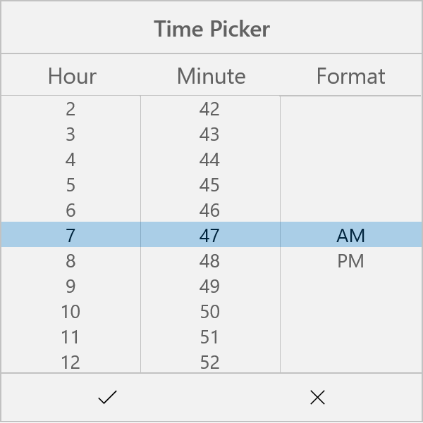

# Time Picker in UWP Picker (SfPicker)

We have demonstrated how to create TimePicker using Picker control in the following steps.

**Step** **1** **:** We have created custom class named as “CustomTimePicker”. This class should inherit from SfPicker control.



    using Syncfusion.UI.Xaml.Controls.Input;
    using Windows.UI.Xaml;

    namespace TimePickerSample
  
        {    
    
         public class CustomTimePicker : SfPicker
   
           {

           }
   
        }



**Step** **2** **:** After that create four ObservableCollection with object type in TimePicker class.

**Collection** **details** **:**

Time Collection, Minute Collection, Hour Collection and Format Collection.

Time Collection->We have added all the three collections.

Minute Collection -> We have added minutes from 0 to 59.

Hour Collection -> We have added hours from 1 to 12.

Format Collection -> We have added two format AM and PM.

The below code demonstrates Time collection creation.



    using Syncfusion.UI.Xaml.Controls.Input;
    using Windows.UI.Xaml;

    namespace TimePickerSample
  
     {    

      public class CustomTimePicker : SfPicker        
  
      {

        public ObservableCollection<string> Headers;
       
        public CustomTimePicker()
  
        {
  
            Headers = new ObservableCollection<string>();
            
            Headers.Add("Hour");
           
            Headers.Add("Minute");
           
            Headers.Add("Format");
            
            Header = "Time Picker";

            this.ColumnHeaderText = Headers;
            	
        }
  
      }
  
     }



**Step** **3** **:** We have defined each column headers “HOUR”, “MINUTE” and “FORMAT” using ColumnHeaderText property of SfPicker control. The below code demonstrates how to define header for each column of SfPicker control.



    using Syncfusion.UI.Xaml.Controls.Input;
    using Windows.UI.Xaml;

    namespace TimePickerSample
   
    {    
 
     public class CustomTimePicker : SfPicker        
   
      {
      
        public ObservableCollection<string> Headers;
       
          public CustomTimePicker()
   
          {
   
            Headers = new ObservableCollection<string>();
            
            Headers.Add("Hour");
           
            Headers.Add("Minute");
           
            Headers.Add("Format");
            
            Header = "Time Picker";

            this.ColumnHeaderText = Headers;
            	
          }
   
       }
   
    }



**Step** **4** **:** Finally we have enabled SfPicker footer, header and Column header using ShowFooter, ShowHeader and ShowColumnHeader properties.



    using Syncfusion.UI.Xaml.Controls.Input;
    using Windows.UI.Xaml;

    namespace TimePickerSample
 
    {    
 
      public CustomTimePicker()        
 
      {

        ShowFooter = true;

        ShowHeader = true;

        ShowColumnHeader = true;

      }
 
    }



**Step** **5** **:** We have added the TimePicker control in MainPage page. Please refer the below code snippets.





    <Page xmlns="http://schemas.microsoft.com/winfx/2006/xaml/presentation"

    x:Class="TimePickerSample.MainPage"

    xmlns:local="using:TimePickerSample"

    xmlns:x="http://schemas.microsoft.com/winfx/2006/xaml"

    xmlns:input="using:Syncfusion.UI.Xaml.Controls.Input">

    <Grid>

        <Button Click="Button_Click" Height="50" VerticalAlignment="Bottom" HorizontalAlignment="Center" Content="Show TimePicker" Width="200" />

        <local:CustomTimePicker x:Name="date" ColumnHeaderHeight="40" HorizontalAlignment="Center" VerticalAlignment="Center"  PickerMode="Dialog" Height="400" Width="400"  SelectedItem="{Binding SelectedTime,Mode=TwoWay}"/>

    </Grid>

    </Page>





    using Syncfusion.UI.Xaml.Controls.Input;
    using Windows.UI.Xaml;

    namespace TimePickerSample
 
    {    

      public sealed partial class MainPage : Page
 
      {

        public MainPage()
 
        {
 
            this.InitializeComponent();
 
            DateTimeViewModel datetime view model = new DateTimeViewModel();
 
            this.DataContext = datetime view model;       
            
         }

        private void Button_Click(object sender, RoutedEventArgs e)
 
        {
 
            date.IsOpen = !date.IsOpen;
 
        }
        
      }
 
    }
    




Screen shot for the above codes.

We have attached TimePicker sample for reference. Please download the sample from the following link.

Sample link: [TimePicker](http://www.syncfusion.com/downloads/support/directtrac/general/TIMEPI~21534601253.ZIP)
