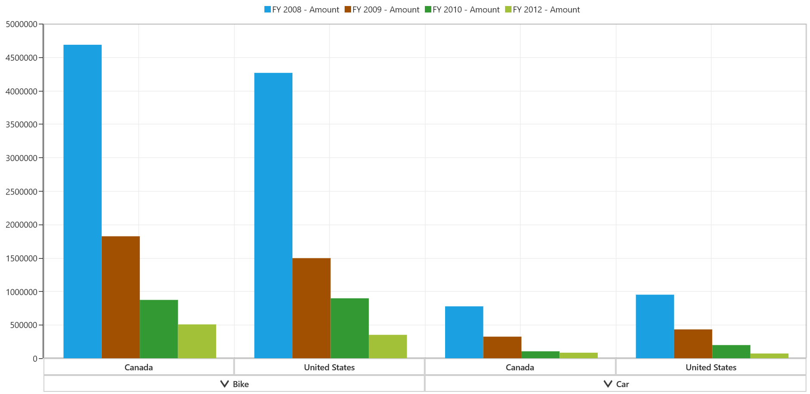

# Legend in UWP Pivot Chart (SfPivotChart)

Legend displays the metadata that helps to identify the data series in the chart. Legend contains a group of legend items based on the series and each legend item is composed of icon, check box, and label.

## Icon

Legend icon represents the symbol associated with each legend item. By default, the legend icon is visible, and it can be hidden by using the `IconVisibility` property as follows.





<syncfusion:SfPivotChart.Legend>
     <syncfusion:PivotChartLegend IconVisibility="Collapsed"/>
</syncfusion:SfPivotChart.Legend>





PivotChart1.Legend.IconVisibility= Visibility.Collapsed;





PivotChart1.Legend.IconVisibility = Visibility.Collapsed





**Icon customization**

The size of the legend icon can be customized by using the `IconWidth` and `IconHeight`properties as illustrated in the following code snippet.





<syncfusion:SfPivotChart.Legend>
     <syncfusion:PivotChartLegend IconWidth="15" IconHeight="15"/>
</syncfusion:SfPivotChart.Legend>





PivotChart1.Legend.IconWidth = 15;
PivotChart1.Legend.IconHeight = 15;





PivotChart1.Legend.IconWidth = 15
PivotChart1.Legend.IconHeight = 15





## Check box

Check box is used to view or collapse the associated series. By default, the `CheckBoxVisibility` is collapsed and can be shown in the legend as follows.





<syncfusion:SfPivotChart.Legend>
    <syncfusion:PivotChartLegend CheckBoxVisibility="Visible"/>
</syncfusion:SfPivotChart.Legend>





PivotChart1.Legend.CheckBoxVisibility = Visibility.Visible;





PivotChart1.Legend.CheckBoxVisibility = Visibility.Visible





## Show/hide legend

You can show or hide the legend in the SfPivotChart control by using the `Visibility` property of the PivotChartLegend. The following code snippet shows how to collapse the visibility of the legend.





<syncfusion:SfPivotChart.Legend>
     <syncfusion:PivotChartLegend Visibility="Collapsed"/>
</syncfusion:SfPivotChart.Legend>





PivotChart1.Legend.Visibility = Visibility.Collapsed;





PivotChart1.Legend.Visibility = Visibility.Collapsed





## Toggling series visibility

The `ToggleSeriesVisibility` property is used to view or collapse the associated series by clicking its legend item. By default, the `ToggleSeriesVisibility` property is set to `False`.

You can enable the `ToggleSeriesVisibility` property as shown in the following code example.





<syncfusion:SfPivotChart.Legend>
     <syncfusion:PivotChartLegend ToggleSeriesVisibility="True"/>
</syncfusion:SfPivotChart.Legend>





PivotChart1.Legend.ToggleSeriesVisibility = true;





PivotChart1.Legend.ToggleSeriesVisibility = True





The series can be collapsed by clicking the respective legend item as follows.

You can view the associated series again by clicking the respective disabled legend item as follows.

## Legend customization

The `ItemMargin` property can be used to modify the space between legend items. The following code snippet illustrates how to customize the default appearance of the legend.





<syncfusion:SfPivotChart.Legend>
    <syncfusion:PivotChartLegend ItemMargin="5" CornerRadius="5" BorderBrush="Black" BorderThickness="1.5" Background="CadetBlue"/>
</syncfusion:SfPivotChart.Legend>





PivotChart1.Legend.ItemMargin = new Thickness(5);
PivotChart1.Legend.CornerRadius = new CornerRadius(5);
PivotChart1.Legend.Background = new SolidColorBrush(Colors.CadetBlue);
PivotChart1.Legend.BorderBrush = new SolidColorBrush(Colors.Black);
PivotChart1.Legend.BorderThickness = new Thickness(1.5);





PivotChart1.Legend.ItemMargin = New Thickness(5)
PivotChart1.Legend.CornerRadius = New CornerRadius(5)
PivotChart1.Legend.Background = New SolidColorBrush(Colors.CadetBlue)
PivotChart1.Legend.BorderBrush = New SolidColorBrush(Colors.Black)
PivotChart1.Legend.BorderThickness = New Thickness(1.5)





## Legend positioning

### Legend position

The `LegendPosition` property allows to position the legend inside or outside the chart area. By default, the legend is positioned outside the chart area. You can change the position of the legend as follows.





<syncfusion:SfPivotChart.Legend>
     <syncfusion:PivotChartLegend LegendPosition="Inside"/>
</syncfusion:SfPivotChart.Legend>





PivotChart1.Legend.LegendPosition = LegendPosition.Inside;





PivotChart1.Legend.LegendPosition = LegendPosition.Inside





### Dock position

**Docking legend**

Legends can be docked left, right, top, or bottom around the chart area by using the `DockPosition` property. By default, the legend is docked at the top of the chart. The following code snippet shows how to display the legend at the bottom.





<syncfusion:SfPivotChart.Legend>
     <syncfusion:PivotChartLegend DockPosition="Bottom"/>
</syncfusion:SfPivotChart.Legend>





PivotChart1.Legend.DockPosition = ChartDock.Bottom;





PivotChart1.Legend.DockPosition = ChartDock.Bottom





**Floating legend**

Legends can be floated at any arbitrary location inside the chart by setting the `DockPosition` as `Floating`. It is positioned by providing its relative position with the help of `OffsetX` and `OffsetY` properties. The following code snippet shows how to display the legend at the bottom.





<syncfusion:SfPivotChart.Legend>
     <syncfusion:PivotChartLegend DockPosition="Floating" OffsetX="150" OffsetY="30"/>
</syncfusion:SfPivotChart.Legend>





PivotChart1.Legend.DockPosition = ChartDock.Floating;
PivotChart1.Legend.OffsetX = 150;
PivotChart1.Legend.OffsetY = 30;





PivotChart1.Legend.DockPosition = ChartDock.Floating
PivotChart1.Legend.OffsetX = 150
PivotChart1.Legend.OffsetY = 30





## Legend orientation

### Horizontal orientation

The orientation can be set as **Horizontal** by which the legend items are arranged horizontally.





<syncfusion:SfPivotChart.Legend>
     <syncfusion:PivotChartLegend Orientation="Horizontal"/>
</syncfusion:SfPivotChart.Legend>





PivotChart1.Legend.Orientation = ChartOrientation.Horizontal;





PivotChart1.Legend.Orientation = ChartOrientation.Horizontal





### Vertical orientation

The orientation can be set as **Vertical** by which the legend items are arranged vertically.





<syncfusion:SfPivotChart.Legend>
     <syncfusion:PivotChartLegend Orientation="Vertical"/>
</syncfusion:SfPivotChart.Legend>





PivotChart1.Legend.Orientation = ChartOrientation.Vertical;





PivotChart1.Legend.Orientation = ChartOrientation.Vertical





### Default orientation

By default, the orientation is set as **Default** and the legend items are arranged in a single row or single column based on the legend position.

To arrange the legend items in predefined number of rows and columns, the `RowCount` and `ColumnCount` properties are used. Based on the following scenarios, the legend items are arranged in the legend.

**Scenario 1:**

When **RowCount only** is specified, then the legend items are arranged according to the specified number of rows. The number of columns can be varied based on the number of legend items.





<syncfusion:SfPivotChart.Legend>
     <syncfusion:PivotChartLegend Orientation="Default" RowCount="2"/>
</syncfusion:SfPivotChart.Legend>





PivotChart1.Legend.Orientation = ChartOrientation.Default;
PivotChart1.Legend.RowCount = 2;





PivotChart1.Legend.Orientation = ChartOrientation.Default
PivotChart1.Legend.RowCount  = 2





**Scenario 2:**

When **ColumnCount only** is specified, then the legend items are arranged according to the specified number of columns. The number of rows can be varied based on the number of legend items.





<syncfusion:SfPivotChart.Legend>
    <syncfusion:PivotChartLegend Orientation="Default" ColumnCount="2"/>
</syncfusion:SfPivotChart.Legend>





PivotChart1.Legend.Orientation = ChartOrientation.Default;
PivotChart1.Legend.ColumnCount = 2;





PivotChart1.Legend.Orientation = ChartOrientation.Default
PivotChart1.Legend.ColumnCount = 2





**Scenario 3:**

When **both the options have different values** is specified, then the preference is given to one which has the higher value. For example, if the row count is 1 and the column count is 4, then the legend items are arranged in 4 rows by giving preference to row count.





<syncfusion:SfPivotChart.Legend>
     <syncfusion:PivotChartLegend Orientation="Default" RowCount="1" ColumnCount="4"/>
</syncfusion:SfPivotChart.Legend>





PivotChart1.Legend.Orientation = ChartOrientation.Default;
PivotChart1.Legend.RowCount = 1;
PivotChart1.Legend.ColumnCount = 4;





PivotChart1.Legend.Orientation = ChartOrientation.Default
PivotChart1.Legend.RowCount = 1
PivotChart1.Legend.ColumnCount = 4





**Scenario 4:**

When **both the options have same value** is specified, then the preference is given to the column count when it is positioned at the top or bottom position, and the preference is given to the row count when it is positioned at the left or right position.





<syncfusion:SfPivotChart.Legend>
     <syncfusion:PivotChartLegend Orientation="Default" RowCount="4" ColumnCount="1"/>
</syncfusion:SfPivotChart.Legend>





PivotChart1.Legend.Orientation = ChartOrientation.Default;
PivotChart1.Legend.RowCount = 4;
PivotChart1.Legend.ColumnCount = 1;





PivotChart1.Legend.Orientation = ChartOrientation.Default
PivotChart1.Legend.RowCount = 4
PivotChart1.Legend.ColumnCount = 1





**Scenario 5:**

When **none** of the options are specified, then the elements are arranged in horizontal order if the legend is positioned at top or bottom position, and the elements are arranged in vertical order if the legend is positioned at left or right position.

A demo sample is available in the following location.

{system drive}:\Users\&lt;User Name&gt;\AppData\Local\Syncfusion\EssentialStudio\&lt;Version Number&gt;\Samples\UWP\SampleBrowser\PivotChart\PivotChart\View\LegendCustomization.xaml
