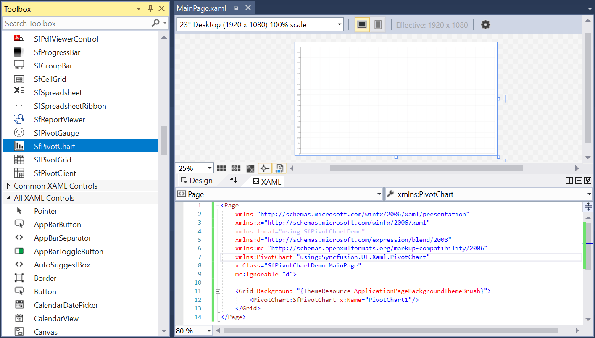
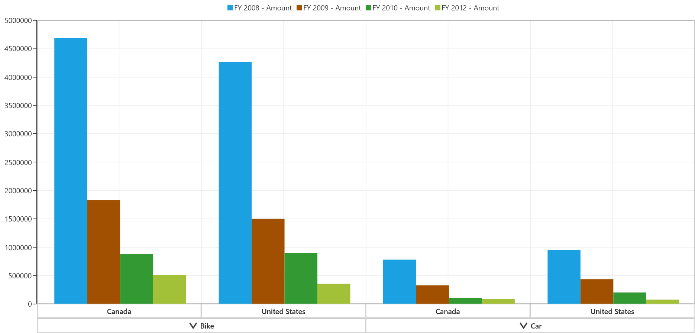

# Getting Started with UWP Pivot Chart (SfPivotChart)

>**Important**
Starting with v16.2.0.x, if you refer to Syncfusion® assemblies from trial setup or from the NuGet feed, include a license key in your projects. Refer to this [link](https://help.syncfusion.com/common/essential-studio/licensing/license-key) to learn about registering Syncfusion® license key in your UWP application to use the components.

This section explains the steps required to create a simple SfPivotChart control bound to relational data source such as IList, IEnumerable, etc.

## Initializing SfPivotChart control

Open Visual Studio IDE and select **File > New > Project** to open the new project dialog.

Select **Installed > Templates > Visual C# > Windows > Universal > Blank APP(Universal Windows)** to create a new UWP application and name the project as "SfPivotChartDemo".

The target version/minimum version dialog appears, in which change the target version of the application as **"Windows 10 (10.0; Build 10240)".**

The SfPivotChart control can be initialized and added to the application through any of the following ways:

1. Through designer.
2. Through XAML.
3. Through code-behind.

### Adding control through designer

Double-click the MainPage.xaml from the solution explorer to open it in the design view.

Click the toolbox and drag the **SfPivotChart** control from the “Syncfusion® Controls for UWP XAML” group to drop it on the middle of the design canvas.

Now, the SfPivotChart control is added to the designer as follows:

### Adding control through XAML

The SfPivotChart control can be added to the project by referring assemblies or SDK as described below:

**Assembly reference**

Right-click the project in the solution explorer and select **Add > Reference...** to add the required assemblies. Then, click **Browse** to select the following assemblies from the installed location and click **OK**.

* Syncfusion.Data.UWP
* Syncfusion.Olap.UWP
* Syncfusion.PivotAnalysis.UWP
* Syncfusion.SfBusyIndicator.UWP
* Syncfusion.SfChart.UWP
* Syncfusion.SfPivotChart.UWP

N> You can find these libraries under the following location.
&lt;Installed Drive&gt;:\Program Files (x86)\Syncfusion\Essential Studio\\&lt;Version&gt;\Assemblies for Universal Windows\10.0

**Extension SDK reference**

Right-click the project in the solution explorer and select **Add > Reference... > Universal Windows > Extensions > Syncfusion® Controls for UWP XAML**.

After adding the required reference, add the following namespace in the *MainPage.xaml* file.





xmlns:PivotChart="using:Syncfusion.UI.Xaml.PivotChart"





Then, add the SfPivotChart control to the grid by using the namespace specified in the following code snippet.





    <Page
        xmlns="http://schemas.microsoft.com/winfx/2006/xaml/presentation"
        xmlns:x="http://schemas.microsoft.com/winfx/2006/xaml"
        xmlns:local="using:SfPivotChartDemo"
        xmlns:d="http://schemas.microsoft.com/expression/blend/2008"
        xmlns:mc="http://schemas.openxmlformats.org/markup-compatibility/2006"
        x:Class="SfPivotChartDemo.MainPage"
        xmlns:PivotChart="using:Syncfusion.UI.Xaml.PivotChart"
        mc:Ignorable="d">

        <Grid Background="{ThemeResource ApplicationPageBackgroundThemeBrush}">
            <PivotChart:SfPivotChart/>
        </Grid>
    </Page>





### Adding control through code-behind

The SfPivotChart control can be added to the project by referring the assemblies or SDK.

**Assembly reference**

Right-click the project in the solution explorer and select **Add > Reference...** to add the required assemblies. Then, click **Browse** to select the following assemblies from the installed location and click **OK**.

* Syncfusion.Data.UWP
* Syncfusion.Olap.UWP
* Syncfusion.PivotAnalysis.UWP
* Syncfusion.SfBusyIndicator.UWP
* Syncfusion.SfChart.UWP
* Syncfusion.SfPivotChart.UWP

N> You can find these libraries under the following location.
&lt;Installed Drive&gt;:\Program Files (x86)\Syncfusion\Essential Studio\\&lt;Version&gt;\Assemblies for Universal Windows\10.0

**Extension SDK reference**

Right-click the project in the solution explorer and select **Add > Reference... > Universal Windows > Extensions > Syncfusion® Controls for UWP XAML**.

After adding the required reference, open the *MainPage.xaml* file and name the grid as "RootGrid" to refer it in the code-behind.





    <Page
        xmlns="http://schemas.microsoft.com/winfx/2006/xaml/presentation"
        xmlns:x="http://schemas.microsoft.com/winfx/2006/xaml"
        xmlns:local="using:SfPivotChartDemo"
        xmlns:d="http://schemas.microsoft.com/expression/blend/2008"
        xmlns:mc="http://schemas.openxmlformats.org/markup-compatibility/2006"
        x:Class="SfPivotChartDemo.MainPage"
        mc:Ignorable="d">

        <Grid Background="{ThemeResource ApplicationPageBackgroundThemeBrush}" x:Name="RootGrid">
        </Grid>
    </Page>





Open the *MainPage.xaml.cs* file and include the namespace "Syncfusion.UI.Xaml.PivotChart". Then, initialize the SfPivotChart control in the constructor and add it to the grid as illustrated below:





using Windows.UI.Xaml.Controls;
using Syncfusion.UI.Xaml.PivotChart;

namespace SfPivotChartDemo
{
    /// 

    /// An empty page that can be used on its own or navigated to within a Frame.
    /// 

    public sealed partial class MainPage : Page
    {
        public MainPage()
        {
            this.InitializeComponent();
            SfPivotChart pivotChart = new SfPivotChart();
            RootGrid.Children.Add(pivotChart);
        }
    }
}





Imports Windows.UI.Xaml.Controls
Imports Syncfusion.UI.Xaml.PivotChart

Namespace SfPivotChartDemo

    Public NotInheritable Partial Class MainPage
        Inherits Page

        Public Sub New()
            Me.InitializeComponent()
            Dim pivotChart As SfPivotChart = New SfPivotChart()
            RootGrid.Children.Add(pivotChart)
        End Sub
    End Class
End Namespace





## Binding relational data to SfPivotChart control

### Creating relational data through view model

After initializing the SfPivotChart control, right-click the project in the solution explorer and select **Add > New Item... > Class** to create a new class file. Then name the class as *ProductSalesViewModel* and click **OK**.

The following code snippet illustrates how to define the relational data for the SfPivotChart.





using System;
using System.Collections.ObjectModel;

namespace SfPivotChartDemo
{
    public class ProductSalesViewModel
    {
        private ProductSalesCollection productSales;

        public ProductSalesCollection ProductSales
        {
            get { return this.productSales; }
            set { this.productSales = value; }
        }

        public ProductSalesViewModel()
        {
            this.productSales = GetSalesData();
        }

        public static ProductSalesCollection GetSalesData()
        {
            // Geography
            string[] countries = new string[] { "Germany", "Canada", "United States" };

            // Time
            string[] dates = new string[] { "FY 2008", "FY 2009", "FY 2010", "FY 2012" };

            // Products
            string[] products = new string[] { "Bike", "Car" };
            Random r = new Random(123345);

            int numberOfRecords = 1000;
            ProductSalesCollection listOfProductSales = new ProductSalesCollection();
            for (int i = 0; i < numberOfRecords; i++)
            {
                ProductSale sales = new ProductSale();
                sales.Country = countries[r.Next(1, countries.GetLength(0))];
                sales.Amount = (3000 * r.Next(1, 12));
                sales.Date = dates[r.Next(r.Next(dates.GetLength(0) + 1))];
                sales.Product = products[r.Next(r.Next(products.GetLength(0) + 1))];
                listOfProductSales.Add(sales);
            }
            return listOfProductSales;
        }
    }

    public class ProductSale
    {
        public string Product { get; set; }
        public string Date { get; set; }
        public string Country { get; set; }
        public double Amount { get; set; }
    }

    public class ProductSalesCollection : ObservableCollection<ProductSale>
    {
    }
}





Imports System
Imports System.Collections.ObjectModel

Namespace SfPivotChartDemo

    Public Class ProductSalesViewModel

        Private productSales As ProductSalesCollection

        Public Property ProductSales As ProductSalesCollection
            Get
                Return Me.productSales
            End Get

            Set(ByVal value As ProductSalesCollection)
                Me.productSales = value
            End Set
        End Property

        Public Sub New()
            Me.productSales = GetSalesData()
        End Sub

        Public Shared Function GetSalesData() As ProductSalesCollection
            Dim countries As String() = New String() {"Germany", "Canada", "United States"}
            Dim dates As String() = New String() {"FY 2008", "FY 2009", "FY 2010", "FY 2012"}
            Dim products As String() = New String() {"Bike", "Car"}
            Dim r As Random = New Random(123345)
            Dim numberOfRecords As Integer = 1000
            Dim listOfProductSales As ProductSalesCollection = New ProductSalesCollection()
            For i As Integer = 0 To numberOfRecords - 1
                Dim sales As ProductSale = New ProductSale()
                sales.Country = countries(r.[Next](1, countries.GetLength(0)))
                sales.Amount =(3000 * r.[Next](1, 12))
                sales.Date = dates(r.[Next](r.[Next](dates.GetLength(0) + 1)))
                sales.Product = products(r.[Next](r.[Next](products.GetLength(0) + 1)))
                listOfProductSales.Add(sales)
            Next

            Return listOfProductSales
        End Function
    End Class

    Public Class ProductSale
        Public Property Product As String
        Public Property Date As String
        Public Property Country As String
        Public Property Amount As Double
    End Class

    Public Class ProductSalesCollection
        Inherits ObservableCollection(Of ProductSale)
    End Class
End Namespace





### Defining item source, pivot axis, pivot legend, and pivot calculations for SfPivotChart control

Relational data can be bound to SfPivotChart control by using the `ItemSource` property through any of the following ways:

* Through XAML
* Through code-behind

**Through XAML**

The relational data mentioned in the *ProductSalesViewModel* is bound to SfPivotChart control with the help of `DataContext`. In addition to this, the `PivotAxis`, `PivotLegend`, and `PivotCalculations` should be assigned to the SfPivotChart for populating data in the specific series.

Refer to the following code snippet.





    <Page xmlns="http://schemas.microsoft.com/winfx/2006/xaml/presentation"
        xmlns:x="http://schemas.microsoft.com/winfx/2006/xaml"
        xmlns:local="using:SfPivotChartDemo"
        xmlns:d="http://schemas.microsoft.com/expression/blend/2008"
        xmlns:mc="http://schemas.openxmlformats.org/markup-compatibility/2006"
        xmlns:PivotChart="using:Syncfusion.UI.Xaml.PivotChart"
        xmlns:pivot="using:Syncfusion.PivotAnalysis.UWP"
        x:Class="SfPivotChartDemo.MainPage"
        mc:Ignorable="d">

        <Grid Background="{ThemeResource ApplicationPageBackgroundThemeBrush}">
            <Grid.DataContext>
                <local:ProductSalesViewModel/>
            </Grid.DataContext>
            <PivotChart:SfPivotChart ItemSource="{Binding ProductSales}">
                <PivotChart:SfPivotChart.PivotAxis>
                    <pivot:PivotItem FieldCaption="Product" FieldMappingName="Product" TotalHeader="Total"/>
                    <pivot:PivotItem FieldCaption="Country" FieldMappingName="Country" TotalHeader="Total"/>
                </PivotChart:SfPivotChart.PivotAxis>
                <PivotChart:SfPivotChart.PivotLegend>
                    <pivot:PivotItem FieldCaption="Date" FieldMappingName="Date" TotalHeader="Total"/>
                </PivotChart:SfPivotChart.PivotLegend>
                <PivotChart:SfPivotChart.PivotCalculations>
                    <pivot:PivotComputationInfo FieldCaption="Amount" FieldName="Amount" Format="#.##" SummaryType="DoubleTotalSum"/>
                </PivotChart:SfPivotChart.PivotCalculations>
            </PivotChart:SfPivotChart>
        </Grid>
    </Page>





**Through code-behind**

The following code snippet illustrates how to bind the data to SfPivotChart control in code-behind.





using Windows.UI.Xaml.Controls;
using Syncfusion.PivotAnalysis.UWP;
using Syncfusion.UI.Xaml.PivotChart;

namespace SfPivotChartDemo
{
    public sealed partial class MainPage : Page
    {
        public MainPage()
        {
            this.InitializeComponent();

            ProductSalesViewModel productSalesViewModel = new ProductSalesViewModel();

            SfPivotChart pivotChart = new SfPivotChart();

            // Assigning ItemSource to PivotChart
            pivotChart.ItemSource = productSalesViewModel.ProductSales;

            // Adding PivotRows to PivotChart
            pivotChart.PivotAxis.Add(new Syncfusion.PivotAnalysis.UWP.PivotItem { FieldMappingName = "Product", TotalHeader = "Total" });
            pivotChart.PivotAxis.Add(new Syncfusion.PivotAnalysis.UWP.PivotItem { FieldMappingName = "Country", TotalHeader = "Country" });

            // Adding PivotColumns to PivotChart
            pivotChart.PivotLegend.Add(new Syncfusion.PivotAnalysis.UWP.PivotItem { FieldMappingName = "Date", TotalHeader = "Date" });

            // Adding PivotCalculations to PivotChart
            pivotChart.PivotCalculations.Add(new PivotComputationInfo { FieldName = "Amount", Format = "#.##", SummaryType = SummaryType.DoubleTotalSum });

            RootGrid.Children.Add(pivotChart);
        }
    }
}





Imports Windows.UI.Xaml.Controls
Imports Syncfusion.PivotAnalysis.UWP
Imports Syncfusion.UI.Xaml.PivotChart

Namespace SfPivotChartDemo
    Public NotInheritable Partial Class MainPage
        Inherits Page
        Public Sub New()
            Me.InitializeComponent()

            Dim productSalesViewModel As New ProductSalesViewModel()

            Dim pivotChart As New SfPivotChart()

            ' Assigning ItemSource to PivotChart
            pivotChart.ItemSource = productSalesViewModel.ProductSales

            ' Adding PivotRows to PivotChart
            pivotChart.PivotAxis.Add(New Syncfusion.PivotAnalysis.UWP.PivotItem With {.FieldMappingName = "Product", .TotalHeader = "Total"})
            pivotChart.PivotAxis.Add(New Syncfusion.PivotAnalysis.UWP.PivotItem With {.FieldMappingName = "Country", .TotalHeader = "Country"})

            ' Adding PivotColumns to PivotChart
            pivotChart.PivotLegend.Add(New Syncfusion.PivotAnalysis.UWP.PivotItem With {.FieldMappingName = "Date", .TotalHeader = "Date"})

            ' Adding PivotCalculations to PivotChart
            pivotChart.PivotCalculations.Add(New PivotComputationInfo With {.FieldName = "Amount", .Format = "#.##", .SummaryType = SummaryType.DoubleTotalSum})

            RootGrid.Children.Add(pivotChart)
        End Sub
    End Class
End Namespace





Finally, run the application to generate the following output.

