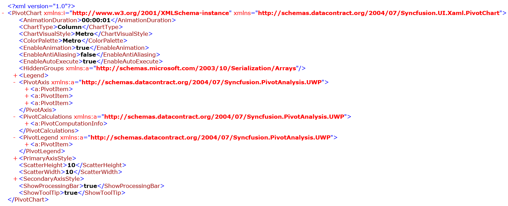

# Serialization and Deserialization in UWP Pivot Chart (SfPivotChart)

This support allows you to serialize and deserialize the settings of SfPivotChart control using [DataContractSerializer](https://msdn.microsoft.com/en-in/library/system.runtime.serialization.datacontractserializer.aspx).

## Serialization

Serialization allows you to save the settings of the SfPivotChart by using the `Serialize` method. It exports the current SfPivotChart control settings to an XML file and it can be done with the help of one of the following methods.

### Serialize using FileSavePicker

It allows you to save the settings of SfPivotChart control to the desired location in _*.xml_ format by using the `Serialize` method. Refer to the following code snippet.





this.pivotChart.Serialize();





Me.pivotChart.Serialize()





The SfPivotChart control will be serialized in XML file as follows.

### Serialize using stream

It allows you to save the SfPivotChart control's settings with the help of `Serialize` method by passing the stream as parameter. Refer to the following code snippet.





var folder = ApplicationData.Current.LocalFolder;
var storageFile = await folder.CreateFileAsync("PivotChart.xml", CreationCollisionOption.ReplaceExisting);
var stream = await storageFile.OpenStreamForWriteAsync();
this.pivotChart.Serialize(stream);





Dim folder As var = ApplicationData.Current.LocalFolder
Dim storageFile As var = folder.CreateFileAsync("PivotChart.xml", CreationCollisionOption.ReplaceExisting)
Dim stream As var = storageFile.OpenStreamForWriteAsync
Me.pivotChart.Serialize(stream)





### Serialize using storage file

It allows you to save the SfPivotChart control's settings with the help of `Serialize` method by passing the storage file as parameter. Refer to the following code snippet.





var folder = ApplicationData.Current.LocalFolder;
var storageFile = await folder.CreateFileAsync("PivotChart.xml", CreationCollisionOption.ReplaceExisting);
this.pivotChart.Serialize(storageFile);





Dim folder As var = ApplicationData.Current.LocalFolder
Dim storageFile As var = folder.CreateFileAsync("PivotChart.xml", CreationCollisionOption.ReplaceExisting)
Me.pivotChart.Serialize(storageFile)





### Serialize To XML string

It allows you to save the settings of SfPivotChart control into an XML string using the `SerializeToXml` method.





string serializedPivotChart = this.pivotChart.SerializeToXml();





Me.pivotChart.SerializeToXml()



Private serializedPivotChart As String = Me.pivotChart.SerializeToXml()



## Deserialization

Deserialization allows you to load the settings of SfPivotChart by using the `Deserialize` method. It reconstructs the SfPivotChart control based on the settings stored in the XML file and it can be done with the help of one of the following methods.

### Deserialize using FileSavePicker

It allows you to reload the SfPivotChart control with the settings available in the _*.xml_ file. This can be achieved by using the `Deserialize` method.





this.pivotChart.Deserialize();





Me.pivotChart.Deserialize()





### Deserialize using stream

It allows you to reload the SfPivotChart control with the settings available in the stream. This can be achieved with the help of `Deserialize` method by passing the stream as parameter.





var folder = ApplicationData.Current.LocalFolder;
var storageFile = await folder.GetFileAsync("PivotChart.xml");
var stream = await storageFile.OpenStreamForReadAsync();
this.pivotChart.Deserialize(stream);





Dim folder As var = ApplicationData.Current.LocalFolder
Dim storageFile As var = folder.GetFileAsync("PivotChart.xml")
Dim stream As var = storageFile.OpenStreamForReadAsync
Me.pivotChart.Deserialize(stream)





### Deserialize using storage file

It allows you to reload the SfPivotChart control with the settings available in the storage file. This can be achieved using the `Deserialize` method by passing the storage file as parameter.





var folder = ApplicationData.Current.LocalFolder;
var storageFile = await folder.GetFileAsync("PivotChart.xml");
this.pivotChart.Deserialize(storageFile);





Dim folder As var = ApplicationData.Current.LocalFolder
Dim storageFile As var = folder.GetFileAsync("PivotChart.xml")
Me.pivotChart.Deserialize(storageFile)





### Deserialize from XML string

It allows you to reload the SfPivotChart with the settings available in the XML string. This can be achieved with the help of `Deserialize` method by passing the XML string as parameter.





// string serializedPivotChart = this.pivotChart.Serialize();
this.pivotChart.Deserialize(serializedPivotChart);





' Dim serializedPivotChart As String = Me.pivotChart.Serialize()
Me.pivotChart.Deserialize(serializedPivotChart)





A demo sample is available in the following location.

{system drive}:\Users\&lt;User Name&gt;\AppData\Local\Syncfusion\EssentialStudio\&lt;Version Number&gt;\Samples\UWP\SampleBrowser\PivotChart\PivotChart\View\Serialization.xaml
