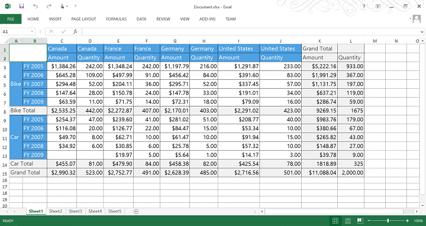
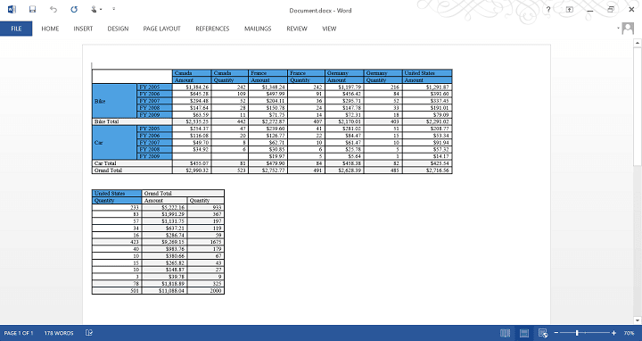
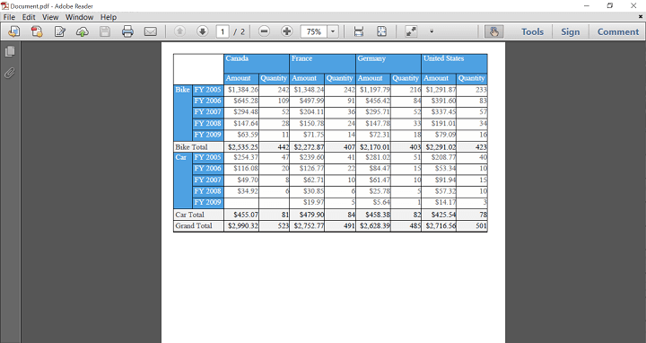
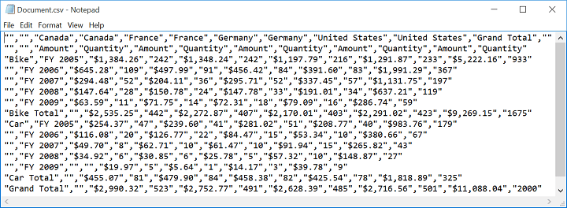
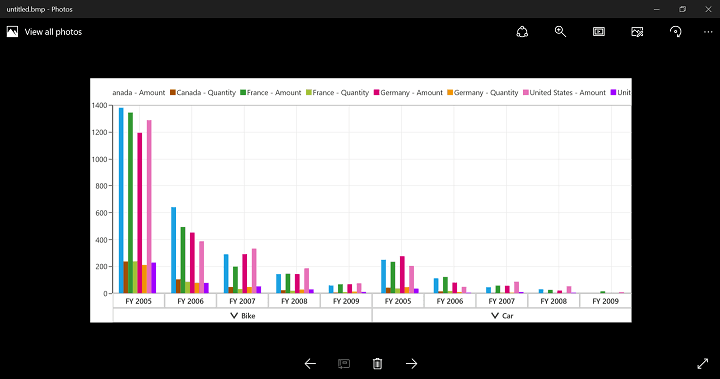
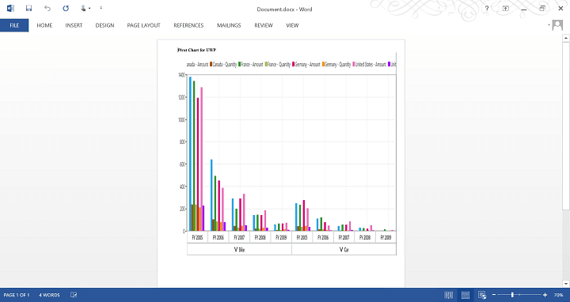
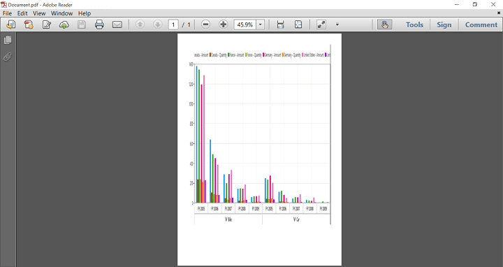

# Exporting in UWP Pivot Client

## Exporting pivot grid

By clicking the respective icons in the pivot grid's toolbar, users can export the pivot grid to the required file format.

| Icon | Name | Description |
| ---- | ---- | ----------- |
|  | Export to Excel | Exports the pivot grid to an Excel document. |
|  | Export to Word | Exports the pivot grid to a Word document. |
|  | Export to PDF | Exports the pivot grid to a PDF document. |
|  | Export to CSV | Exports the pivot grid to a CSV document. |

The following screenshots illustrate the exported pivot grid.

## Exporting pivot chart

By clicking the respective icons in the pivot chart's toolbar, users can export the pivot chart to the required file format.

| Icon | Name | Description |
| ---- | ---- | ----------- |
|  | Export as an Image | Saves the pivot chart as an image. |
|  | Export to Word | Exports the pivot chart to a Word document. |
|  | Export to PDF | Exports the pivot chart to a PDF document. |

The following screenshots illustrate the exported pivot chart.

