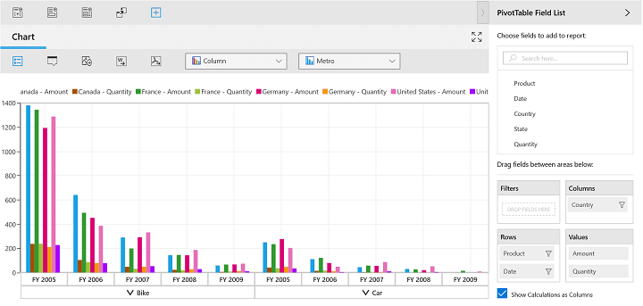
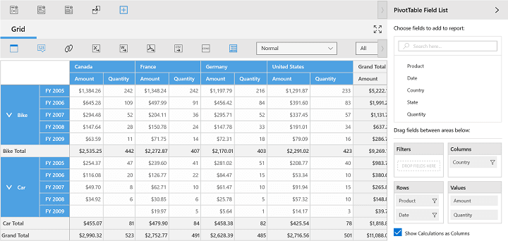

# Layout Customization in UWP Pivot Client (SfPivotClient)

## Display mode

By default, the SfPivotClient displays both the grid and chart components. To view any one of the required components or to view both in the SfPivotClient, the `DisplayMode` property is used.

**Chart only**

To view the pivot chart alone in the SfPivotClient, the `DisplayMode` property should be set to `ChartOnly` as specified in the following code snippet.





<pivotclient:SfPivotClient x:Name="PivotClient1" DisplayMode="ChartOnly" OlapDataManager="{Binding OlapDataManager}"/>





PivotClient1.DisplayMode = PivotClientDisplayMode.ChartOnly;





PivotClient1.DisplayMode = PivotClientDisplayMode.ChartOnly





**Grid only**

To view the pivot grid alone in the SfPivotClient, the `DisplayMode` property should be set to `GridOnly` as specified in the following code snippet.





<pivotclient:SfPivotClient x:Name="PivotClient1" DisplayMode="GridOnly" OlapDataManager="{Binding OlapDataManager}"/>





PivotClient1.DisplayMode = PivotClientDisplayMode.GridOnly;





PivotClient1.DisplayMode = PivotClientDisplayMode.GridOnly





**Both**

To view both the pivot grid and pivot chart in the SfPivotClient, the `DisplayMode` property should be set to `Both` as shown in the following code snippet.





<pivotclient:SfPivotClient x:Name="PivotClient1" DisplayMode="Both" OlapDataManager="{Binding OlapDataManager}"/>





PivotClient1.DisplayMode = PivotClientDisplayMode.Both;





PivotClient1.DisplayMode = PivotClientDisplayMode.Both





A demo sample is available in the following location.

{system drive}:\Users\&lt;User Name&gt;\AppData\Local\Syncfusion\EssentialStudio\&lt;Version Number&gt;\Samples\UWP\SampleBrowser\PivotClient\PivotClient\View\Configuration.xaml
