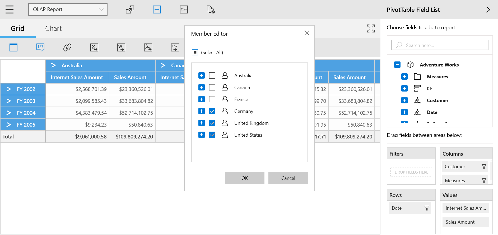
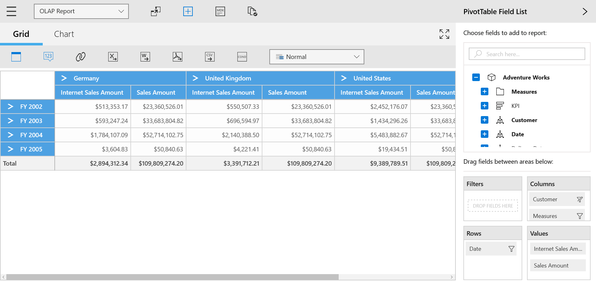
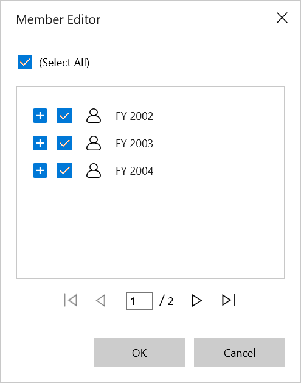
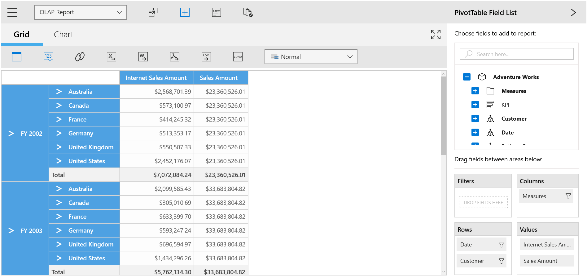

# Data Exploration in UWP Pivot Client (SfPivotClient)

## Filtering

Filtering can be done in the SfPivotClient by using the Member Editor dialog. This dialog will be opened by clicking the desired member's *filter icon*  from the axis element builder, through which members are filtered by checking and unchecking the check boxes corresponding to members. By clicking OK, the OLAP report gets updated and refreshes the pivot grid and pivot chart controls based on selected members in the member editor dialog.

The following screenshots illustrate that the members of Canada, France, and Germany are excluded from the SfPivotClient control.

### Paging in member editor

Paging feature helps to improve the rendering performance of the member editor which is opened by clicking the filter icon of a member in the axis element builder. This feature allows member editor to display the large amount of data by dividing the data into sections. You can enable paging in the member editor by setting the `EnableMemberEditorPaging` property to true. The size of the data to be displayed per page can be customized with the help of `MemberEditorPageSize` property. Refer to the following code snippet.





<pivotclient:SfPivotClient x:Name="PivotClient1" EnableMemberEditorPaging="True" MemberEditorPageSize="3"
                           OlapDataManager="{Binding OlapDataManager}"/>





PivotClient1.EnableMemberEditorPaging = true;
PivotClient1.MemberEditorPageSize = 3;





PivotClient1.EnableMemberEditorPaging = True
PivotClient1.MemberEditorPageSize = 3





## Grouping

The data can be grouped when more than one dimensional element is added to column or row section in the axis element builder. Based on the order of addition, the data is grouped and the OLAP report gets updated. In the following example, members of the date dimension is grouped with respect to members of the customer dimension. Likewise, multiple dimension members can be grouped by dragging the elements from the cube dimension browser to the axis element builder.

