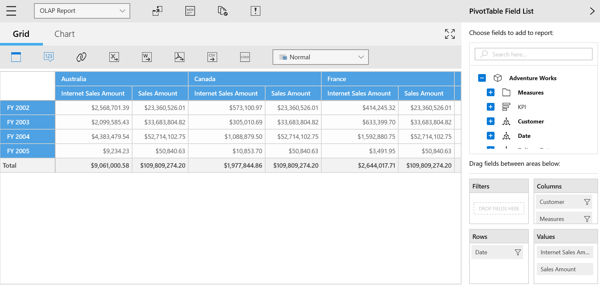

# Defer Update in UWP Pivot Client (SfPivotClient)

Defer update support allows users to refresh the control on-demand and not during every user interaction. To enable on-demand refreshing of data, the `EnableAutoExecute` property should be set to false. If this support is enabled, the *Auto Execute* button  will be appeared on the SfPivotClient's toolbar. To enable the defer update support, you can use the following code snippet.





<pivotclient:SfPivotClient x:Name="PivotClient1" EnableAutoExecute="False" OlapDataManager="{Binding OlapDataManager}"/>





PivotClient1.EnableAutoExecute = false;





PivotClient1.EnableAutoExecute = False





N> If the defer update support has been enabled, the SfPivotClient control will not be updated for any UI interactions and the OLAP report will be updated in the back-end to maintain the actions done so far. To update the SfPivotClient, the *Auto Execute* has to be clicked manually and so, the SfPivotClient control will be refreshed based on the OLAP report available at that instant.

A demo sample is available in the following location.

{system drive}:\Users\&lt;User Name&gt;\AppData\Local\Syncfusion\EssentialStudio\&lt;Version Number&gt;\Samples\UWP\SampleBrowser\PivotClient\PivotClient\View\DeferUpdate.xaml
