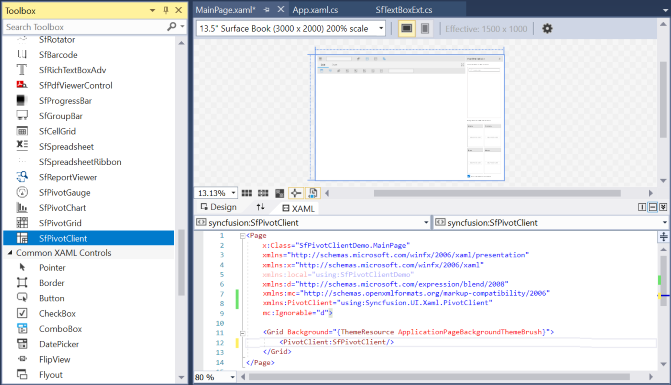
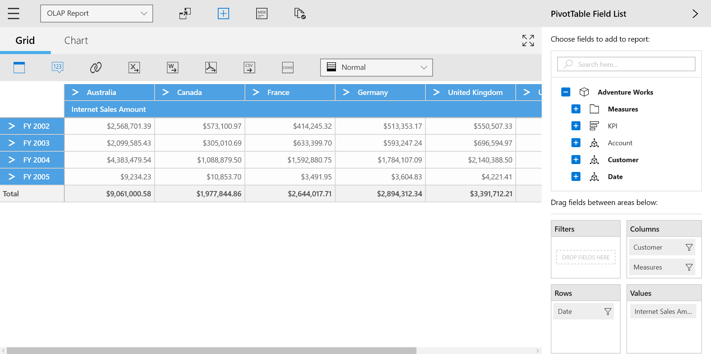

# Getting Started with UWP Pivot Client (SfPivotClient)

>**Important**
To start with v16.2.0.x, if you reference Syncfusion assemblies from a trial setup or NuGet feed, include a license key in your projects. Refer to this [link](https://help.syncfusion.com/common/essential-studio/licensing/license-key) to learn about registering Syncfusion license key in your UWP application to use the components.

This section covers the information required to create a simple SfPivotClient control bound to the OLAP data source and a WCF service that helps to bind the OLAP data with the SfPivotClient control through the OLAP data manager.

## Initializing SfPivotClient control

1. Open Visual Studio IDE and select **File > New > Project** to open a new project dialog.

2. Select **Installed > Templates > Visual C# > Windows > Universal > Blank APP(Universal Windows)** to create a new UWP application and name the project "SfPivotClientDemo".

3. The target version/minimum version dialog appears, in which you can change the target version of the application to **"Windows 10 (10.0; Build 10240)".**

The SfPivotClient control can be initialized and added to the application through any of the following ways:

1. Designer.
2. XAML.
3. Code-behind.

### Adding the control through designer

1. Double-click the MainPage.xaml from the solution explorer to open it in the design view.

2. Click the toolbox and drag the **SfPivotClient** control from the “Syncfusion controls for UWP XAML” group to drop it on the middle of the design canvas.

Now, the SfPivotClient control will be added to the designer as follows.

### Adding control through XAML

The SfPivotClient control can be added to the project by referencing assemblies or extension SDK as described below.

**Assembly reference**

1. Right-click the project in the solution explorer and select **Add > Reference...** to add the required assemblies.

2. Click **Browse** to select the following assemblies from the installed location and click **OK**.

* Syncfusion.Data.UWP
* Syncfusion.Olap.UWP
* Syncfusion.PivotAnalysis.UWP
* Syncfusion.SfBusyIndicator.UWP
* Syncfusion.SfCellGrid.UWP
* Syncfusion.SfChart.UWP
* Syncfusion.SfColorPickers.UWP
* Syncfusion.SfGrid.UWP
* Syncfusion.SfGridCommon.UWP
* Syncfusion.SfInput.UWP
* Syncfusion.SfPivotChart.UWP
* Syncfusion.SfPivotChartConverter.UWP
* Syncfusion.SfPivotClient.UWP
* Syncfusion.SfPivotGrid.UWP
* Syncfusion.SfPivotGridConverter.UWP
* Syncfusion.SfPivotShared.UWP
* Syncfusion.SfShared.UWP
* Syncfusion.SfTabControl.UWP

N> You can find these libraries in the following location.
&lt;Installed Drive&gt;:\Program Files (x86)\Syncfusion\Essential Studio\\&lt;Version&gt;\Assemblies for Universal Windows\10.0

**Extension SDK reference**

1. Right-click the project in the solution explorer and select **Add > Reference... > Universal Windows > Extensions > Syncfusion Controls for UWP XAML**.

2. Add the following namespace in the *MainPage.xaml* file, after adding the required reference.





xmlns:PivotClient="using:Syncfusion.UI.Xaml.PivotClient"





Then, add the SfPivotClient control to the grid by using the namespace specified in the following code snippet.





    <Page
        xmlns="http://schemas.microsoft.com/winfx/2006/xaml/presentation"
        xmlns:x="http://schemas.microsoft.com/winfx/2006/xaml"
        xmlns:local="using:SfPivotClientDemo"
        xmlns:d="http://schemas.microsoft.com/expression/blend/2008"
        xmlns:mc="http://schemas.openxmlformats.org/markup-compatibility/2006"
        x:Class="SfPivotClientDemo.MainPage"
        xmlns:PivotClient="using:Syncfusion.UI.Xaml.PivotClient"
        mc:Ignorable="d">

        <Grid Background="{ThemeResource ApplicationPageBackgroundThemeBrush}">
            <PivotClient:SfPivotClient/>
        </Grid>
    </Page>





### Adding control through code-behind

The SfPivotClient control can be added to the project by referencing assemblies or an extension SDK as described below.

**Assembly reference**

1. Right-click the project in the solution explorer and select **Add > Reference...** to add the required assemblies.

2. Click **Browse** to select the following assemblies from the installed location and click **OK**.

* Syncfusion.Data.UWP
* Syncfusion.Olap.UWP
* Syncfusion.PivotAnalysis.UWP
* Syncfusion.SfBusyIndicator.UWP
* Syncfusion.SfCellGrid.UWP
* Syncfusion.SfChart.UWP
* Syncfusion.SfColorPickers.UWP
* Syncfusion.SfGrid.UWP
* Syncfusion.SfGridCommon.UWP
* Syncfusion.SfInput.UWP
* Syncfusion.SfPivotChart.UWP
* Syncfusion.SfPivotChartConverter.UWP
* Syncfusion.SfPivotClient.UWP
* Syncfusion.SfPivotGrid.UWP
* Syncfusion.SfPivotGridConverter.UWP
* Syncfusion.SfPivotShared.UWP
* Syncfusion.SfShared.UWP
* Syncfusion.SfTabControl.UWP

N> You can find these libraries under the following location.
&lt;Installed Drive&gt;:\Program Files (x86)\Syncfusion\Essential Studio\\&lt;Version&gt;\Assemblies for Universal Windows\10.0

Otherwise, the SfPivotClient control can be added to the project by choosing the SDK reference as follows.

**Extension SDK reference**

1. Right-click the project in the solution explorer and select **Add > Reference... > Universal Windows > Extensions > Syncfusion Controls for UWP XAML**.

2. After adding the required reference, open the *MainPage.xaml* file and name the grid "RootGrid" to refer to it in the code-behind.





    <Page
        xmlns="http://schemas.microsoft.com/winfx/2006/xaml/presentation"
        xmlns:x="http://schemas.microsoft.com/winfx/2006/xaml"
        xmlns:local="using:SfPivotClientDemo"
        xmlns:d="http://schemas.microsoft.com/expression/blend/2008"
        xmlns:mc="http://schemas.openxmlformats.org/markup-compatibility/2006"
        x:Class="SfPivotClientDemo.MainPage"
        mc:Ignorable="d">

        <Grid Background="{ThemeResource ApplicationPageBackgroundThemeBrush}" x:Name="RootGrid">
        </Grid>
    </Page>





3. Open the *MainPage.xaml.cs* file and include the Syncfusion.UI.Xaml.PivotClient namespace. Then, initialize the SfPivotClient control in the constructor and add it to the grid as follows.





using Windows.UI.Xaml.Controls;
using Syncfusion.UI.Xaml.PivotClient;

namespace SfPivotClientDemo
{
    /// 

    /// An empty page that can be used on its own or navigated to within a Frame.
    /// 

    public sealed partial class MainPage : Page
    {
        public MainPage()
        {
            this.InitializeComponent();
            SfPivotClient PivotClient = new SfPivotClient();
            RootGrid.Children.Add(PivotClient);
        }
    }
}





Imports Windows.UI.Xaml.Controls
Imports Syncfusion.UI.Xaml.PivotClient

Namespace SfPivotClientDemo

    Public NotInheritable Partial Class MainPage
        Inherits Page

        Public Sub New()
            Me.InitializeComponent()
            Dim PivotClient As SfPivotClient = New SfPivotClient()
            RootGrid.Children.Add(PivotClient)
        End Sub
    End Class
End Namespace





## Adding service reference to project

N> This section explains how to reference the online service in an UWP application for binding the cube information in the SfPivotClient. The service URL used here refers to the demo cube - “Adventure Works”; it is mainly used for illustration purpose.
To create your own WCF service, refer to the topic of [Creating WCF Service Application.](#creating-wcf-service-application).

After initializing the SfPivotClient control, right-click the project in the solution explorer and select **Add > Service Reference...**.

In the Add Service Reference dialog, enter the following address and click **Go** to add the online service.

[http://bi.syncfusion.com/OlapUWPTestService/OlapManager.svc](http://bi.syncfusion.com/OlapUWPTestService/OlapManager.svc)

## Binding OLAP data to SfPivotClient control

### Defining OLAP report and OLAP data manager through view model

Right-click the project in the solution explorer and select **Add > New Item... > Class** to create a new class file. Then, name the class *OlapViewModel* and click **OK**.

The following code snippet illustrates how to define the OLAP report and OLAP data manager for the SfPivotClient control.

N> The `OlapDataChanged` event should be hooked before assigning the current report to OLAP data manager.





using System.ServiceModel;
using SfPivotClientDemo.OlapManagerService;
using Syncfusion.Olap.UWP.Manager;
using Syncfusion.Olap.UWP.Reports;

namespace SfPivotClientDemo
{
    class OlapViewModel
    {
        #region Private Fields

        /// 

        /// Gets or sets the client channel.
        /// 

        IOlapDataProvider clientChannel;
        /// 

        /// Gets or sets the OlapDataManager.
        /// 

        OlapDataManager olapDataManager;

        #endregion

        #region Public Properties

        /// 

        /// Gets or sets the OlapDataManager.
        /// 

        public OlapDataManager OlapDataManager
        {
            get
            {
                this.olapDataManager = this.olapDataManager ?? this.SetDataManager();
                return this.olapDataManager;
            }
            set { this.olapDataManager = value; }
        }

        #endregion

        #region Setting Connection to Service

        private void SetConnection()
        {
            BasicHttpBinding basicHttpBinding = new BasicHttpBinding();
            basicHttpBinding.MaxReceivedMessageSize = 2147483647;
            basicHttpBinding.MaxBufferSize = 2147483647;
            EndpointAddress address = new EndpointAddress("http://bi.syncfusion.com/OlapUWPTestService/OlapManager.svc/");
            ChannelFactory<IOlapDataProvider> clientFactory = new ChannelFactory<IOlapDataProvider>(basicHttpBinding, address);
            this.clientChannel = clientFactory.CreateChannel();
        }

        #endregion

        #region Setting OLAP Data Manager

        private OlapDataManager SetDataManager()
        {
            this.olapDataManager = new OlapDataManager();
            this.olapDataManager.OlapDataChanged += this.OlapDataManager_OlapDataChanged;
            this.olapDataManager.GetCubeSchema += this.OlapDataManager_GetCubeSchema;
            this.olapDataManager.GetCubeInfoCollection += this.OlapDataManager_GetCubeInfoCollection;
            this.olapDataManager.SetCurrentReport(this.CreateOlapReport());
            return this.olapDataManager;
        }

        #endregion

        #region OLAP Report Creation

        private OlapReport CreateOlapReport()
        {
            OlapReport olapReport = new OlapReport();
            olapReport.Name = "OLAP Report";
            olapReport.CurrentCubeName = "Adventure Works";

            DimensionElement dimensionElementColumn = new DimensionElement();
            dimensionElementColumn.Name = "Customer";
            dimensionElementColumn.HierarchyName = "Customer Geography";
            dimensionElementColumn.AddLevel("Customer Geography", "Country");

            MeasureElements measureElementColumn = new MeasureElements();
            measureElementColumn.Elements.Add(new MeasureElement { Name = "Internet Sales Amount" });

            DimensionElement dimensionElementRow = new DimensionElement();
            dimensionElementRow.Name = "Date";
            dimensionElementRow.AddLevel("Fiscal", "Fiscal Year");

            olapReport.CategoricalElements.Add(dimensionElementColumn);
            olapReport.CategoricalElements.Add(measureElementColumn);
            olapReport.SeriesElements.Add(dimensionElementRow);

            return olapReport;
        }

        #endregion

        #region Event Handlers

        /// 

        /// The event handler method is hooked when the data manager was changed.
        /// 

        /// <param name="sender">The OlapDataManager.</param>
        /// <param name="args">The argument parameter.</param>
        private void OlapDataManager_OlapDataChanged(object sender, OlapDataChangedEventArgs args)
        {
            if (args.MDXQuery != null && sender is OlapDataManager)
            {
                this.SetConnection();
                (sender as OlapDataManager).JSONData = this.clientChannel.GetJSONDataAsync(args.MDXQuery, args.SerializedReport, args.AllowMdxToOlapReportParse).Result;
            }
        }

        /// 

        /// The event handler method is hooked to get the current cube schema.
        /// 

        /// <param name="sender">The OlapDataManager.</param>
        /// <param name="args">The argument parameter.</param>
        private string OlapDataManager_GetCubeSchema(object sender, GetCubeSchemaEventArgs args)
        {
            if (args.CubeName != null && sender is OlapDataManager)
            {
                this.SetConnection();
                return this.clientChannel.GetJSONCubeSchemaAsync(args.CubeName).Result;
            }
            return null;
        }

        /// 

        /// The event handler method is hooked to get the collection of cube information.
        /// 

        /// <param name="sender">The OlapDataManager.</param>
        /// <param name="args">The argument parameter.</param>
        private string OlapDataManager_GetCubeInfoCollection(object sender, GetCubeInfoCollectionEventArgs args)
        {
            if (sender is OlapDataManager)
            {
                this.SetConnection();
                return this.clientChannel.GetJSONCubesAsync().Result;
            }
            return null;
        }

        #endregion
    }
}





Imports System.ServiceModel
Imports SfPivotClientDemo.OlapManagerService
Imports Syncfusion.Olap.UWP.Manager
Imports Syncfusion.Olap.UWP.Reports

Namespace SfPivotClientDemo

    Class OlapViewModel

        Private clientChannel As IOlapDataProvider

        Private olapDataManager As OlapDataManager

        Public Property OlapDataManager As OlapDataManager
            Get
                Me.olapDataManager = If(Me.olapDataManager, Me.SetDataManager())
                Return Me.olapDataManager
            End Get

            Set(ByVal value As OlapDataManager)
                Me.olapDataManager = value
            End Set
        End Property

        Private Sub SetConnection()
            Dim basicHttpBinding As BasicHttpBinding = New BasicHttpBinding()
            basicHttpBinding.MaxReceivedMessageSize = 2147483647
            basicHttpBinding.MaxBufferSize = 2147483647
            Dim address As EndpointAddress = New EndpointAddress("http://bi.syncfusion.com/OlapUWPTestService/OlapManager.svc/")
            Dim clientFactory As ChannelFactory(Of IOlapDataProvider) = New ChannelFactory(Of IOlapDataProvider)(basicHttpBinding, address)
            Me.clientChannel = clientFactory.CreateChannel()
        End Sub

        Private Function SetDataManager() As OlapDataManager
            Me.olapDataManager = New OlapDataManager()
            Me.olapDataManager.OlapDataChanged += AddressOf Me.OlapDataManager_OlapDataChanged
            Me.olapDataManager.GetCubeSchema += AddressOf Me.OlapDataManager_GetCubeSchema
            Me.olapDataManager.GetCubeInfoCollection += AddressOf Me.OlapDataManager_GetCubeInfoCollection
            Me.olapDataManager.SetCurrentReport(Me.CreateOlapReport())
            Return Me.olapDataManager
        End Function

        Private Function CreateOlapReport() As OlapReport
            Dim olapReport As OlapReport = New OlapReport()
            olapReport.Name = "OLAP Report"
            olapReport.CurrentCubeName = "Adventure Works"
            Dim dimensionElementColumn As DimensionElement = New DimensionElement()
            dimensionElementColumn.Name = "Customer"
            dimensionElementColumn.HierarchyName = "Customer Geography"
            dimensionElementColumn.AddLevel("Customer Geography", "Country")
            Dim measureElementColumn As MeasureElements = New MeasureElements()
            measureElementColumn.Elements.Add(New MeasureElement With {.Name = "Internet Sales Amount"})
            Dim dimensionElementRow As DimensionElement = New DimensionElement()
            dimensionElementRow.Name = "Date"
            dimensionElementRow.AddLevel("Fiscal", "Fiscal Year")
            olapReport.CategoricalElements.Add(dimensionElementColumn)
            olapReport.CategoricalElements.Add(measureElementColumn)
            olapReport.SeriesElements.Add(dimensionElementRow)
            Return olapReport
        End Function

        Private Sub OlapDataManager_OlapDataChanged(ByVal sender As Object, ByVal args As OlapDataChangedEventArgs)
            If args.MDXQuery IsNot Nothing AndAlso TypeOf sender Is OlapDataManager Then
                Me.SetConnection()
                (TryCast(sender, OlapDataManager)).JSONData = Me.clientChannel.GetJSONDataAsync(args.MDXQuery, args.SerializedReport, args.AllowMdxToOlapReportParse).Result
            End If
        End Sub

        Private Function OlapDataManager_GetCubeSchema(ByVal sender As Object, ByVal args As GetCubeSchemaEventArgs) As String
            If args.CubeName IsNot Nothing AndAlso TypeOf sender Is OlapDataManager Then
                Me.SetConnection()
                Return Me.clientChannel.GetJSONCubeSchemaAsync(args.CubeName).Result
            End If
            Return Nothing
        End Function

        Private Function OlapDataManager_GetCubeInfoCollection(ByVal sender As Object, ByVal args As GetCubeInfoCollectionEventArgs) As String
            If TypeOf sender Is OlapDataManager Then
                Me.SetConnection()
                Return Me.clientChannel.GetJSONCubesAsync().Result
            End If
            Return Nothing
        End Function
    End Class
End Namespace





### Binding OLAP data manager with SfPivotClient control

The OLAP data can be bound with SfPivotClient control by using the `OlapDataManager` property through the following ways:

* XAML.
* Code-behind.

**Through XAML**

The following code snippet explains how to bind the OLAP data mentioned in the *OlapViewModel* to the SfPivotClient control with the help of `DataContext` in XAML.





    <Page
        x:Class="SfPivotClientDemo.MainPage"
        xmlns="http://schemas.microsoft.com/winfx/2006/xaml/presentation"
        xmlns:x="http://schemas.microsoft.com/winfx/2006/xaml"
        xmlns:local="using:SfPivotClientDemo"
        xmlns:d="http://schemas.microsoft.com/expression/blend/2008"
        xmlns:mc="http://schemas.openxmlformats.org/markup-compatibility/2006"
        xmlns:PivotClient="using:Syncfusion.UI.Xaml.PivotClient"
        mc:Ignorable="d">

        <Grid Background="{ThemeResource ApplicationPageBackgroundThemeBrush}">
            <Grid.DataContext>
                <local:OlapViewModel/>
            </Grid.DataContext>
            <PivotClient:SfPivotClient OlapDataManager="{Binding OlapDataManager}"/>
        </Grid>
    </Page>





**Through code-behind**

The following code snippet illustrates how to bind the OLAP data to the SfPivotClient control in code-behind.





using Syncfusion.UI.Xaml.PivotClient;
using Windows.UI.Xaml.Controls;

namespace SfPivotClientDemo
{
    public sealed partial class MainPage : Page
    {
        public MainPage()
        {
            this.InitializeComponent();
            SfPivotClient pivotClient = new SfPivotClient();
            OlapViewModel olapViewModel = new OlapViewModel();
            pivotClient.OlapDataManager = olapViewModel.OlapDataManager;
            this.RootGrid.Children.Add(pivotClient);
        }
    }
}





Imports Syncfusion.UI.Xaml.PivotClient
Imports Windows.UI.Xaml.Controls

Namespace SfPivotClientDemo

    Public NotInheritable Partial Class MainPage
        Inherits Page

        Public Sub New()
            Me.InitializeComponent()
            Dim pivotClient As SfPivotClient = New SfPivotClient()
            Dim olapViewModel As OlapViewModel = New OlapViewModel()
            pivotClient.OlapDataManager = olapViewModel.OlapDataManager
            Me.RootGrid.Children.Add(pivotClient)
        End Sub
    End Class
End Namespace





Finally, run the application to generate the following output.

## Creating a WCF service application

1. Open the Visual Studio IDE and select **File > New > Project** to open a new project dialog.

2. Select **Installed > Templates > Visual C# > WCF > WCF Service Application** to create a new WCF service application and name the project "OlapManagerService".

3. Right-click the project in the solution explorer and select **Add > Reference...** to add the required assemblies.

4. Then, click **Browse** to select the following assemblies from the installed location and click **OK**.

* Syncfusion.Olap.Base.dll
* Syncfusion.OlapUWP.BaseWrapper.dll

N> You can find these libraries in the following location.
&lt;Installed Drive&gt;:\Program Files (x86)\Syncfusion\Essential Studio\\&lt;Version&gt;\Assemblies\4.6\

I> ADOMD.NET assembly (Microsoft.AnalysisServices.AdomdClient.dll) is required to create a SfPivotClient control.
The above assembly can be obtained only after installing the following setup files.
**SQLSERVER2008_ASADOMD10.msi** and **SQLSERVER2008_ASOLEDB10.msi**
These setup files can be downloaded at [Microsoft download center](https://www.microsoft.com/en-in/download/details.aspx?id=16978).
If you have installed any version of SQL Server Analysis Service (SSAS) or Microsoft ADOMD.NET utility, then the location of Microsoft.AnalysisServices.AdomdClient library is [system drive:\Program Files (x86)\Microsoft.NET\ADOMD.NET].

Now, the "Service1.svc" will be as follows.





<%@ ServiceHost Language="C#" Debug="true" Service="OlapManagerService.Service1" CodeBehind="Service1.svc.cs" %>





Then, double-click the "Service1.svc" file in the solution explorer and replace the existing code with the exact following code.





using Syncfusion.Olap.UWP.Common;
using Syncfusion.Olap.UWP.Data;
using Syncfusion.Olap.UWP.Manager;
using System.ServiceModel;
using System.ServiceModel.Activation;

namespace OlapManagerService
{
    [AspNetCompatibilityRequirements(RequirementsMode = AspNetCompatibilityRequirementsMode.Allowed)]
    [ServiceBehavior(IncludeExceptionDetailInFaults = true)]
    public class Service1: IOlapDataProvider
    {
        #region Private variables

        private readonly OlapDataProvider _dataProvider;

        #endregion

        # region Constructor
        /// 

        /// Initializes a new instance of the <see cref="Service1"/> class.
        /// 

        public Service1()
        {
            string connectionString = "Data Source=http://bi.syncfusion.com/olap/msmdpump.dll; Initial Catalog=Adventure Works DW 2008 SE;";
            _dataProvider = new OlapDataProvider(connectionString);
        }

        #endregion

        # region IOlapDataProvider Members

        public string GetJSONData(string mDXQuery, string currentReport, bool allowMdxToOlapReportParse)
        {
            CellSet cellSet = _dataProvider.ExecuteMdxQuery(mDXQuery, currentReport, allowMdxToOlapReportParse);
            _dataProvider.DataProvider.CloseConnection();
            return cellSet != null ? Utils.Serialize(cellSet) : string.Empty;
        }

        public string GetJSONCubeSchema(string cubeName)
        {
            CubeSchema cubeSchema = _dataProvider.GetCubeSchema(cubeName);
            _dataProvider.DataProvider.CloseConnection();
            return cubeSchema != null ? Utils.Serialize(cubeSchema) : string.Empty;
        }

        public string GetJSONCubes()
        {
            CubeInfoCollection cubeInfoCollection = _dataProvider.GetCubes();
            _dataProvider.DataProvider.CloseConnection();
            return cubeInfoCollection != null ? Utils.Serialize(cubeInfoCollection) : string.Empty;
        }

        public string GetJSONChildMembers(string cubeName, string levelName)
        {
            MemberCollection memberCollection = _dataProvider.GetChildMembers(cubeName, levelName);
            _dataProvider.DataProvider.CloseConnection();
            return memberCollection != null ? Utils.Serialize(memberCollection) : string.Empty;
        }

        public string GetJSONChildrenByMDX(string command)
        {
            MemberCollection memberCollection = _dataProvider.GetChildrenByMDX(command);
            _dataProvider.DataProvider.CloseConnection();
            return memberCollection != null ? Utils.Serialize(memberCollection) : string.Empty;
        }

        public string GetJSONDataWithTotalCount(string currentReport)
        {
            SerializableDictionary<string, object> count = _dataProvider.GetCellSetWithTotalCount(currentReport);
            _dataProvider.DataProvider.CloseConnection();
            return count != null ? Utils.Serialize(count) : string.Empty;
        }

        public string GetJSONExecuteDrillThroughQuery(string mdxQuery)
        {
            var executedQuery = _dataProvider.ExecuteDrillThroughQuery(mdxQuery);
            _dataProvider.DataProvider.CloseConnection();
            return executedQuery != null ? Utils.Serialize(executedQuery) : null;
        }

        public string GetJSONExecuteMemberCount(string mdxQuery)
        {
            var memberCount = _dataProvider.ExecuteMemberCount(mdxQuery);
            _dataProvider.DataProvider.CloseConnection();
            return memberCount >= 0 ? Utils.Serialize(memberCount) : string.Empty;
        }

        public string GetJSONLevelMembersUsingMdx(string memberUniqueName, int axisPosition, bool isGrandTotalOn, string cubeName, string pagingParams)
        {
            var levelMembers = _dataProvider.GetLevelMembersUsingMdx(memberUniqueName, axisPosition, isGrandTotalOn, cubeName, pagingParams);
            _dataProvider.DataProvider.CloseConnection();
            return levelMembers != null ? Utils.Serialize(levelMembers) : string.Empty;
        }

        public string GetJSONMeasureGroupsDimensions(string cubeName, string measureGroupName)
        {
            var dimensions = _dataProvider.GetMeasureGroupsDimensions(cubeName, measureGroupName);
            _dataProvider.DataProvider.CloseConnection();
            return dimensions != null ? Utils.Serialize(dimensions) : string.Empty;
        }

        public string GetJSONParentMember(string uniqueName, string currentCubeName)
        {
            var parentMember = _dataProvider.GetParentMember(uniqueName, currentCubeName);
            _dataProvider.DataProvider.CloseConnection();
            return parentMember != null ? Utils.Serialize(parentMember) : string.Empty;
        }

        #endregion
    }
}





Imports Syncfusion.Olap.UWP.Common
Imports Syncfusion.Olap.UWP.Data
Imports Syncfusion.Olap.UWP.Manager
Imports System.ServiceModel
Imports System.ServiceModel.Activation

Namespace OlapManagerService

    <AspNetCompatibilityRequirements(RequirementsMode:=AspNetCompatibilityRequirementsMode.Allowed)>
    <ServiceBehavior(IncludeExceptionDetailInFaults:=True)>
    Public Class Service1
        Inherits IOlapDataProvider

        Private ReadOnly _dataProvider As OlapDataProvider

        Public Sub New()
            Dim connectionString As String = "Data Source=http://bi.syncfusion.com/olap/msmdpump.dll; Initial Catalog=Adventure Works DW 2008 SE;"
            _dataProvider = New OlapDataProvider(connectionString)
        End Sub

        Public Function GetJSONData(ByVal mDXQuery As String, ByVal serializedReport As String) As String
            Dim cellSet As CellSet = _dataProvider.ExecuteMdxQuery(mDXQuery, serializedReport)
            _dataProvider.DataProvider.CloseConnection()
            Return If(cellSet IsNot Nothing, Utils.Serialize(cellSet), String.Empty)
        End Function

        Public Function GetJSONCubeSchema(ByVal cubeName As String) As String
            Dim cubeSchema As CubeSchema = _dataProvider.GetCubeSchema(cubeName)
            _dataProvider.DataProvider.CloseConnection()
            Return If(cubeSchema IsNot Nothing, Utils.Serialize(cubeSchema), String.Empty)
        End Function

        Public Function GetJSONCubes() As String
            Dim cubeInfoCollection As CubeInfoCollection = _dataProvider.GetCubes()
            _dataProvider.DataProvider.CloseConnection()
            Return If(cubeInfoCollection IsNot Nothing, Utils.Serialize(cubeInfoCollection), String.Empty)
        End Function

        Public Function GetJSONChildMembers(ByVal cubeName As String, ByVal levelName As String) As String
            Dim memberCollection As MemberCollection = _dataProvider.GetChildMembers(cubeName, levelName)
            _dataProvider.DataProvider.CloseConnection()
            Return If(memberCollection IsNot Nothing, Utils.Serialize(memberCollection), String.Empty)
        End Function

        Public Function GetJSONChildrenByMDX(ByVal command As String) As String
            Dim memberCollection As MemberCollection = _dataProvider.GetChildrenByMDX(command)
            _dataProvider.DataProvider.CloseConnection()
            Return If(memberCollection IsNot Nothing, Utils.Serialize(memberCollection), String.Empty)
        End Function

        Public Function GetJSONDataWithTotalCount(ByVal serializedReport As String) As String
            Dim count As SerializableDictionary(Of String, Object) = _dataProvider.GetCellSetWithTotalCount(serializedReport)
            _dataProvider.DataProvider.CloseConnection()
            Return If(count IsNot Nothing, Utils.Serialize(count), String.Empty)
        End Function
    End Class
End Namespace





N> Here, the sample cube path is specified for demonstration purpose. You can modify the connection string as desired.

Include the basic HTTP binding and service endpoint address in the web.config file by replacing the following code snippet of the serviceModel section.





    <system.serviceModel>
        <bindings>
        <basicHttpBinding>
            <!-- Create a custom binding for our service to enable sending large amount of data -->
            <binding name="MyBasicHttpBinding" maxBufferPoolSize="2147483647" maxReceivedMessageSize="2147483647" maxBufferSize="2147483647">
            <readerQuotas maxArrayLength="2147483647" maxBytesPerRead="2147483647" maxDepth="2147483647" maxNameTableCharCount="2147483647" maxStringContentLength="2147483647" />
            </binding>
        </basicHttpBinding>
        </bindings>
        <behaviors>
        <serviceBehaviors>
            <behavior name="">
            <serviceMetadata httpGetEnabled="true" httpsGetEnabled="true" />
            <serviceDebug includeExceptionDetailInFaults="false" />
            <dataContractSerializer maxItemsInObjectGraph="2147483647" />
            </behavior>
            <!-- Enable the serializer to serialize greater number of records -->
            <behavior name="OlapManagerService.OlapManager">
            <serviceMetadata httpGetEnabled="true" />
            <serviceDebug includeExceptionDetailInFaults="true" />
            <dataContractSerializer maxItemsInObjectGraph="2147483647" />
            </behavior>
        </serviceBehaviors>
        </behaviors>

        <protocolMapping>
            <add binding="basicHttpsBinding" scheme="https"/>
        </protocolMapping>

        <serviceHostingEnvironment multipleSiteBindingsEnabled="false"/>
        <services>
        <!--Bind the WCF service to our custom binding-->
        <service behaviorConfiguration="OlapManagerService.OlapManager" name="OlapManagerService.Service1">
            <endpoint address="" binding="basicHttpBinding" bindingConfiguration="MyBasicHttpBinding" contract="Syncfusion.Olap.UWP.Manager.IOlapDataProvider" />
            <endpoint address="mex" binding="mexHttpBinding" contract="IMetadataExchange" />
        </service>
        </services>
    </system.serviceModel>





Build and host the WCF service in IIS. Refer to the hosted URL as service reference in your Universal Windows Platform (UWP) application (client application). This is how you can host the service in IIS and refer to the obtained URL as a service reference in the sample as illustrated in the [previous section](#adding-service-reference-to-project).