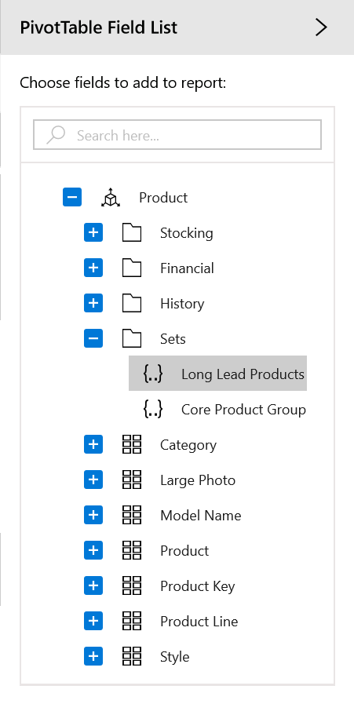

# Named Set in UWP Pivot Client (SfPivotClient)

The SfPivotClient supports the binding of OLAP data with named set records that is pre-defined in the cube. Named set is a collection of tuples and members, which can be defined and saved as a part of the cube definition. Named set records reside inside the *Sets* folder which is under a dimension element. These elements can be dragged to columns, or rows, or filters axis of the axis element builder. To work with a lengthy, complex, or commonly used expression easier, the Multidimensional Expressions (MDX) helps you to define a named set.

The cube dimension browser displays dimensions, measures, and KPIs with named sets from the selected cube inside a tree on the right. To visualize these members, you can drag the members to the axis element builder.

