# PivotClient: Components in UWP Pivot Client (SfPivotClient)

## Cube selector

The cube selector allows you to select any one of the cubes available in the connected database. This can be achieved by selecting the data connection menu item from the reports menu. The cube selector dialog will be opened with a drop-down list, displaying the list of cubes available in the current connection. The SfPivotClient will load the corresponding cube elements while changing the cube from the drop-down list.

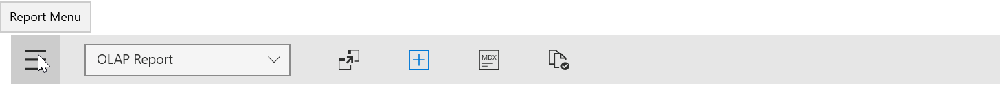

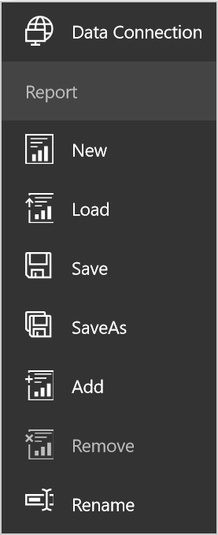

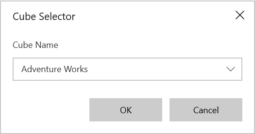

## Cube dimension browser

The cube dimension browser is a tree view-like structure that organizes the cube elements such as dimensions, hierarchies, measures, etc., from the selected cube into independent and logical groups.

### Node types

* Display folder: Folder that contains a set of similar elements.
* Measure: Quantity available for analysis.
* Dimension: A name given to parts of the cube that categorize data.
* Attribute hierarchy: Level of attributes down the hierarchy.
* User-defined hierarchy: Members of a dimension in a hierarchical structure.
* Level: Denotes a specific level in the category.
* Named set: A collection of tuples and members, which can be defined and saved as a part of a cube definition.

**Attribute hierarchy**

Attribute hierarchy contains the following levels:

* Leaf level contains distinct attribute members, and each member of the leaf level is known as a leaf member.
* Intermediate level exists if the attribute hierarchy is a parent-child hierarchy.

**User-defined hierarchy**

A user-defined hierarchy organizes the members of a dimension into a hierarchical structure and provides the navigation paths in a cube. For example, take a dimension table that supports three attributes such as year, quarter, and month. These attributes are used to construct a user-defined hierarchy and named calendar in the time dimension that relates to all levels.

**Differentiating user-defined hierarchies and attribute hierarchies**

* A user-defined hierarchy contains more than one level, whereas an attribute hierarchy contains only one level.
* A user-defined hierarchy provides a navigation path between the levels taken from the attribute hierarchies of the same dimension.

### Symbolic representation of nodes

| Icon | Name | Node type | Is Draggable |
| -------- | -------- | -------- | -------- |
|  | Display Forlder | Display Folder | False |
| 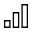 | Measure | Measure | True |
| 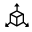 | Dimension | Dimension | True |
| 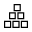 | User Defined Hierarchy | Hierarchy | True |
| 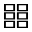 | Attribute Hierarchy | Hierarchy | True |
| 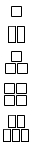 | Levels (in order) | Level Element | True |
| 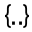 | Named Set | Named Set | True |
| 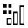 | Calculated Members | Calculated Member | True|
| 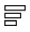 | Virtual KPI | VirtualKpi Member | True|
|  | KPI | Kpi Member | True|

## Axis element builder

The axis element builder allows you to build elements in the axes of the SfPivotClient. This supports four axes: categorical, series, filter(slicer), and value. Based on the construction of the axes, the SfPivotGrid and the SfPivotChart will display the resultant data.

### Categorical axis (columns)

The categorical axis defines one or more elements that are displayed in columns of the SfPivotGrid and as labels of y-axis in the SfPivotChart. If more than one dimension is present on the categorical axis, then the SfPivotGrid and SfPivotChart will stack each dimension based on the order that they appear on the categorical axis.

### Series axis (rows)

The series axis defines one or more dimensions that are displayed in rows of the SfPivotGrid and as labels of x-axis in the SfPivotChart. If more than one dimension is present on the series axis, then the SfPivotGrid and SfPivotChart will stack each dimension based on the order that they appear on the series axis.

### Filter axis (filters)

The filter axis allows you to analyze any member of a dimension in depth, and it is used as a slicer to narrow the focus of multidimensional data that is displayed in the SfPivotGrid and SfPivotChart.

N> To display the member’s data for the slicer, the corresponding member should not exist on both categorical and series axes.

### Value axis (values)

The value axis represents the measures elements present in the current OLAP report.

### Split button

The split button highlights the elements in the axis element builder. It holds measures, dimensions, and named set elements which can be dragged and dropped from the cube dimensional browser into the axis element builder.

While dragging and dropping, a split button is created with the caption, which is displaying correspond to dimension or named set.

When a measure node is dragged and dropped, a split button is created to maintain the measure collection and it is maintained for holding all measures added to the report.

### Operations in axis element builder

**Adding elements to axis**

The measure, dimension, hierarchy, level, and named set elements can be dragged from the cube dimension browser and dropped into the desired axis element builder by using the drag-and-drop operation. Also, the measure, dimension, hierarchy, level, and named set elements can be moved from one axis to another by dragging an appropriate element and dropping them at desired position.

**Removing elements from axis**

To remove measures, dimension, hierarchy, level, and named set element from the axis element builder, right-click the element and select the **Remove** option from the context menu.

The following screenshot illustrates the element being removed from the axis element builder.

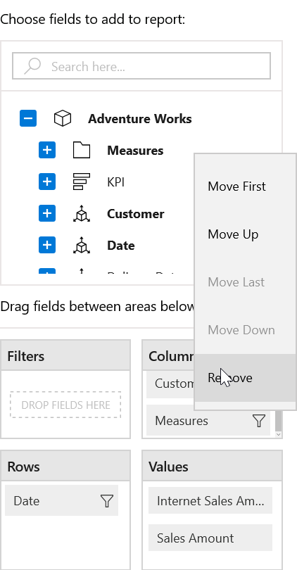

**Rearranging elements in axis**

Rearranging can be done with the help of context menu available in the axis element builder. Right-click the desired element, and then select the required option such as *Move Up* or *Move Down* or *Move First* or *Move Last* from the menu items to rearrange the selected element.

The following screenshot illustrates the element being rearranged in the axis element builder.

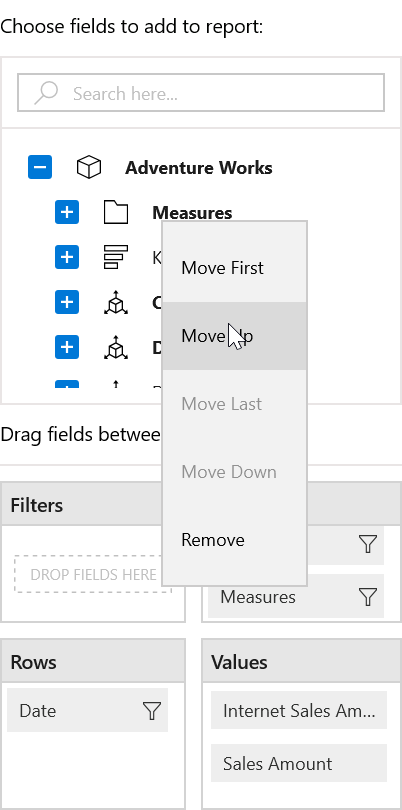

## Element editors

### Measure editor

The measure editor is a dialog that displays the collection of measures in the current report. It can be opened by clicking the **filter icon** that is present over the right corner of the measure node in the axis element builder.

### Member editor

Member editor is a dialog that displays the collection of members available in the selected hierarchy, and the members are represented in a tree view structure. It can be opened by clicking the *filter icon* present over the right corner of the member node in the axis element builder.

The *Select All* in the dialog allows users to select and unselect entire nodes for filtering.

## Toolbar

By default, the following options are available in the toolbar.

* Report menu: The menu button that contains options with respect to all OLAP report manipulations.
* Report list: The drop-down list that displays the list of OLAP reports loaded in the SfPivotClient.
* Toggle pivot: The toggle button that toggles the elements from the categorical axis to the series axis and vice versa.
* Show/hide expanders: The toggle button that toggles the visibility of expanders used for drilling operations.
* Show MDX dialog: The button used to display the MDX query that is parsed from the current OLAP report.
* Enable/disable paging: The toggle button used to enable or disable the paging feature in the SfPivotClient.

## Report manipulations

The OLAP reports can be manipulated with the help of options available under the report menu and the options will be displayed by clicking the **Report Menu** in the SfPivotClient's toolbar.

**New report**

The new report option helps users to clear the existing report collection and to create a new report collection with a single report. By clicking the new report menu item, a report dialog is prompted to specify the name for the OLAP report. By clicking OK, the only one empty report with the specified name is loaded in the SfPivotClient.

**Add report**

Add report option helps users to add a report to the existing report collection. By clicking the add report menu item, a report dialog is prompted to specify the name for the OLAP report. By clicking OK, a report with the specified name is added to the existing collection.

**Remove report**

The remove report option removes the current/active report from the report collection. This option works only if the report collection has more than one report.

**Rename report**

The rename report option helps users to rename the current report. By clicking the rename report menu item, a report dialog is prompted for specifying a new name for the current report. By clicking OK, the active report gets refreshed with the new name.

**Save report**

This option saves the report in the local system. The Save As dialog opens only one time for prompting a name with the report, which needs to be stored. It stores the report collection by a single name in a database.

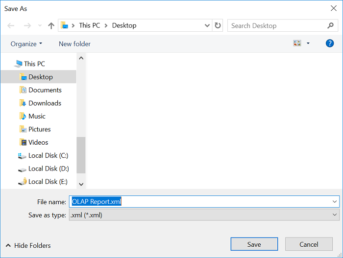

**Save As report**

This option saves the report in the local system. The Save As dialog opens for prompting a name with the report, which needs to be stored. It stores the report collection by more than one name in a database.

**Load report**

This option loads a report from the local system. By clicking the load report menu item, the dialog box opens to load a report into the SfPivotClient.

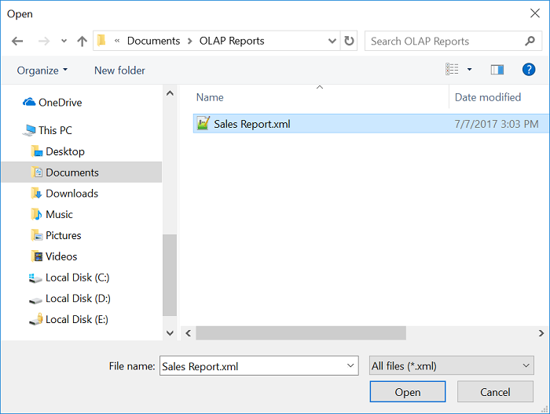

**Report list**

It is the drop-down list that contains the names of all reports in the report collection. By selecting the required report from the report list, the selected report will be set as active report and gets loaded.

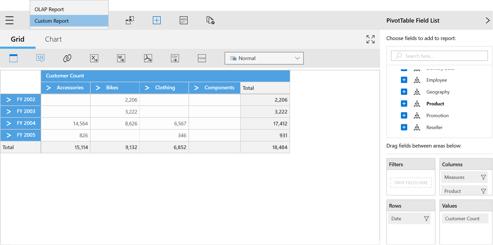

## SfPivotGrid and SfPivotChart

The [SfPivotGrid](http://help.syncfusion.com/uwp/sfpivotgrid/overview/) and [SfPivotChart](http://help.syncfusion.com/uwp/sfpivotchart/overview) controls will be rendered with respect to operations done at the axis element builder.
