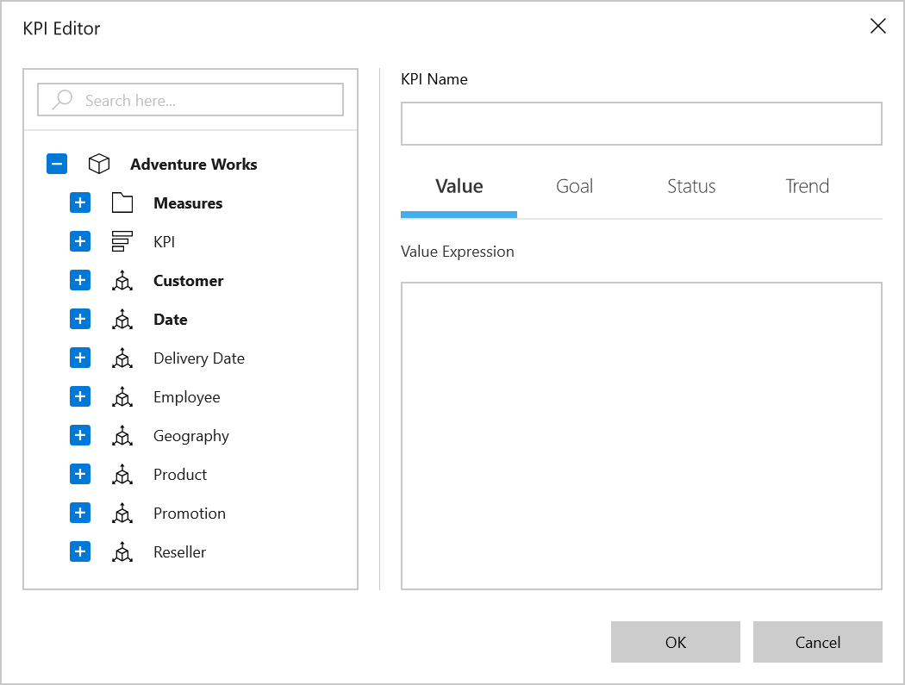

# Virtual KPI in UWP Pivot Client (SfPivotClient)

Key performance indicators can be virtually defined during the runtime. This feature enables users to create KPIs without storing them in SSAS (SQL Server Analysis Services). This feature is very useful when users want to define KPIs dynamically, and it minimizes the time required to create KPIs.

There are two ways to define a virtual KPI element in the SfPivotClient as illustrated below.

**Using virtual KPI editor dialog**

The virtual KPI editor dialog can be opened by clicking the **Create a Virtual KPI Element**  available in the SfPivotClient's toolbar. This icon will be visible only if the `EnableVirtualKpi` property is set to true as mentioned below.





<pivotclient:SfPivotClient x:Name="PivotClient1" EnableVirtualKpi="True" OlapDataManager="{Binding OlapDataManager}"/>





PivotClient1.EnableVirtualKpi = true;





PivotClient1.EnableVirtualKpi = True





**Using OLAP report**

You can define the virtual KPI element in the OLAP report along with its associated measures, and it can be added to any axis of the current OLAP report. The following code specifies how to define the virtual KPI element in the OLAP report.

N> The vVirtual KPI element should be specified in the same axis containing measure elements.





OlapReport olapReport = new OlapReport
{
    Name = "Virtual KPI Report",
    CurrentCubeName = "Adventure Works"
};

DimensionElement dimensionElementColumn = new DimensionElement();
dimensionElementColumn.Name = "Customer";
dimensionElementColumn.HierarchyName = "Customer Geography";
dimensionElementColumn.AddLevel("Customer Geography", "Country");

MeasureElements measureElementColumn = new MeasureElements();
measureElementColumn.Elements.Add(new MeasureElement { Name = "Internet Sales Amount" });
measureElementColumn.Elements.Add(new MeasureElement { Name = "Sales Amount" });

// Virtual KPI element
VirtualKpiElement Virtualkpi = new VirtualKpiElement();
Virtualkpi.Name = "Growth in Order Quantity";
Virtualkpi.KpiGoalExpression = "[Measures].[Order Quantity]";
Virtualkpi.KpiStatusExpression = "Case When [Measures].[Order Quantity] > 1 Then 1 Else -1 End";
Virtualkpi.KpiTrendExpression = "Case When IsEmpty ( ParallelPeriod ( [Date].[Fiscal].[Fiscal Year], 1, [Date].[Fiscal].CurrentMember ) ) Then 0  Else -1 End";
Virtualkpi.KpiValueExpression = "[Measures].[Order Quantity]";
olapReport.VirtualKpiElements.Add(Virtualkpi);

KpiElements kpiElement = new KpiElements();
kpiElement.Elements.Add(new KpiElement { Name = "Revenue", ShowKPIStatus = true, ShowKPIGoal = false, ShowKPITrend = true, ShowKPIValue = true });

DimensionElement dimensionElementRow = new DimensionElement();
dimensionElementRow.Name = "Date";
dimensionElementRow.AddLevel("Fiscal", "Fiscal Year");

// Adding column members
olapReport.CategoricalElements.Add(dimensionElementColumn);

// Adding measure element
olapReport.CategoricalElements.Add(measureElementColumn);
olapReport.CategoricalElements.Add(Virtualkpi);
olapReport.CategoricalElements.Add(kpiElement);

// Adding row members
olapReport.SeriesElements.Add(dimensionElementRow);

PivotClient1.OlapDataManager.SetCurrentReport(olapReport);





Dim olapReport As New OlapReport() With { _
    Key .Name = "Calculated Report", _
    Key .CurrentCubeName = "Adventure Works" _
}

Dim dimensionElementColumn As New DimensionElement()
dimensionElementColumn.Name = "Customer"
dimensionElementColumn.HierarchyName = "Customer Geography"
dimensionElementColumn.AddLevel("Customer Geography", "Country")

Dim measureElementColumn As New MeasureElements()
measureElementColumn.Elements.Add(New MeasureElement() With { _
    Key .Name = "Internet Sales Amount" _
})
measureElementColumn.Elements.Add(New MeasureElement() With { _
    Key .Name = "Sales Amount" _
})

Dim dimensionElementRow As New DimensionElement()
dimensionElementRow.Name = "Date"
dimensionElementRow.AddLevel("Fiscal", "Fiscal Year")

' Calculated measure
Dim calculatedMeasure1 As New CalculatedMember()
calculatedMeasure1.Name = "Order on Discount Sale"
calculatedMeasure1.Expression = "[Measures].[Order Quantity] + ([Measures].[Order Quantity] * 0.10)"
calculatedMeasure1.AddElement(New MeasureElement() With { _
    Key .Name = "Order Quantity" _
})
olapReport.CalculatedMembers.Add(calculatedMeasure1)

' Adding column members
olapReport.CategoricalElements.Add(dimensionElementColumn)
olapReport.CategoricalElements.Add(calculatedMeasure1)

' Adding measure element
olapReport.CategoricalElements.Add(measureElementColumn)

' Adding row members
olapReport.SeriesElements.Add(dimensionElementRow)

pivotClient1.OlapDataManager.SetCurrentReport(olapReport)





Dim olapReport As New OlapReport() With { _
    Key .Name = "Virtual KPI Report", _
    Key .CurrentCubeName = "Adventure Works" _
}

Dim dimensionElementColumn As New DimensionElement()
dimensionElementColumn.Name = "Customer"
dimensionElementColumn.HierarchyName = "Customer Geography"
dimensionElementColumn.AddLevel("Customer Geography", "Country")

Dim measureElementColumn As New MeasureElements()
measureElementColumn.Elements.Add(New MeasureElement() With { _
    Key .Name = "Internet Sales Amount" _
})
measureElementColumn.Elements.Add(New MeasureElement() With { _
    Key .Name = "Sales Amount" _
})

' Virtual KPI element
Dim Virtualkpi As New VirtualKpiElement()
Virtualkpi.Name = "Growth in Order Quantity"
Virtualkpi.KpiGoalExpression = "[Measures].[Order Quantity]"
Virtualkpi.KpiStatusExpression = "Case When [Measures].[Order Quantity] > 1 Then 1 Else -1 End"
Virtualkpi.KpiTrendExpression = "Case When IsEmpty ( ParallelPeriod ( [Date].[Fiscal].[Fiscal Year], 1, [Date].[Fiscal].CurrentMember ) ) Then 0  Else -1 End"
Virtualkpi.KpiValueExpression = "[Measures].[Order Quantity]"
olapReport.VirtualKpiElements.Add(Virtualkpi)

Dim kpiElement As New KpiElements()
kpiElement.Elements.Add(New KpiElement() With { _
    Key .Name = "Revenue", _
    Key .ShowKPIStatus = True, _
    Key .ShowKPIGoal = False, _
    Key .ShowKPITrend = True, _
    Key .ShowKPIValue = True _
})

Dim dimensionElementRow As New DimensionElement()
dimensionElementRow.Name = "Date"
dimensionElementRow.AddLevel("Fiscal", "Fiscal Year")

' Adding column members
olapReport.CategoricalElements.Add(dimensionElementColumn)

' Adding measure element
olapReport.CategoricalElements.Add(measureElementColumn)
olapReport.CategoricalElements.Add(Virtualkpi)
olapReport.CategoricalElements.Add(kpiElement)

' Adding row members
olapReport.SeriesElements.Add(dimensionElementRow)

PivotClient1.OlapDataManager.SetCurrentReport(olapReport)





A demo sample is available in the following location.

{system drive}:\Users\&lt;User Name&gt;\AppData\Local\Syncfusion\EssentialStudio\&lt;Version Number&gt;\Samples\UWP\SampleBrowser\PivotClient\PivotClient\View\VirtualKPI.xaml
