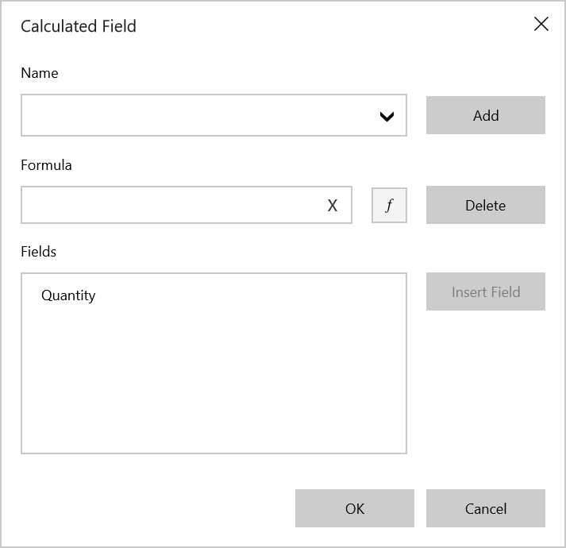
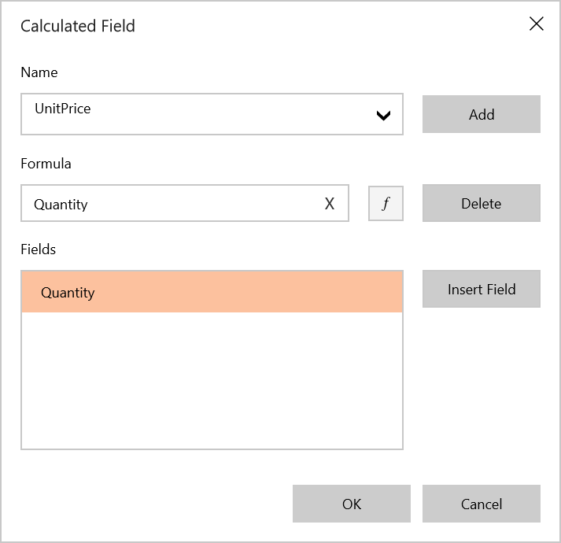
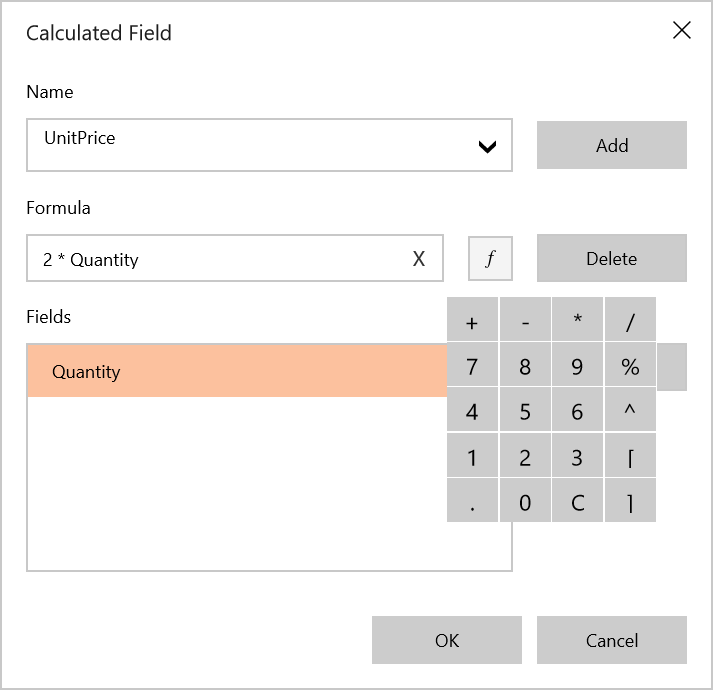
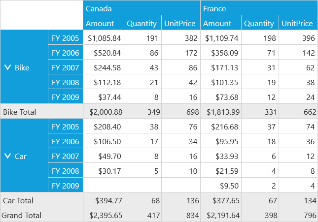

# Calculated Field in UWP Pivot Client (SfPivotClient)

The SfPivotClient supports adding a new calculated field based on existing calculated items using the calculated field dialog.

**Adding a calculated field**

1. To add a calculated field, click the **Calculated Field**  in the client toolbar. The calculated field dialog opens.

2. Define the **Name** for the calculated field.

 

3. Enter the **Formula** by inserting the calculation fields through the **Fields** section. For inserting numerical operators, you can use the formula pop-up as shown in the following screenshot.

4. Click **Add** to add the calculated field, and then click **OK** to populate the values in the SfPivotClient.

