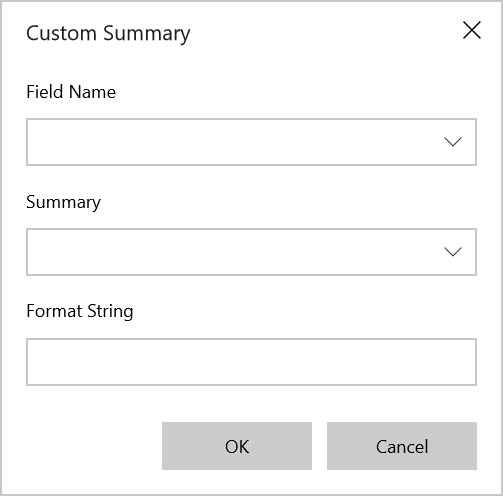
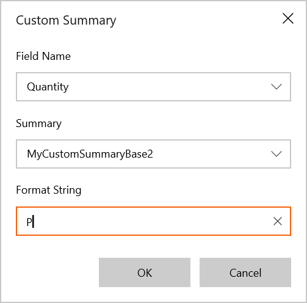
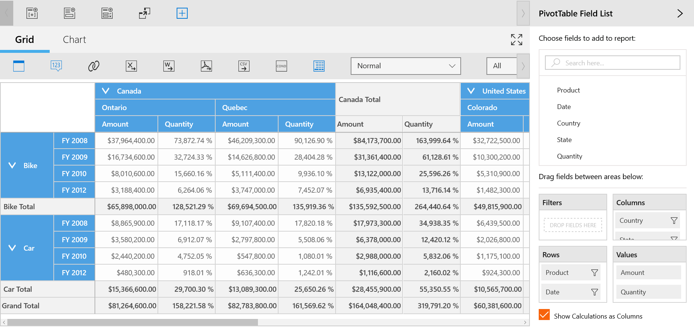

# Custom Summary in UWP Pivot Client (SfPivotClient)

The SfPivotClient supports changing the summary type of existing calculation items to custom at runtime using the custom summary dialog.

**Defining a custom summary**

1. To change the summary type as custom summary, click the **Custom Summary**  in the client toolbar. The custom summary dialog opens.

2. Select the existing pivot calculation name from the **Field Name** drop-down list.

3. One or more custom summary types can be kept in the **Summary** drop-down list. You can select any one of the CustomSummaryBase from this collection.

4. Define the format for the required field using the **Format String** field. For example, 'C' for Currency, 'P' for Percentage, and 'N' for Numeric.

5. Then, click **OK** to populate the values in the SfPivotClient.

