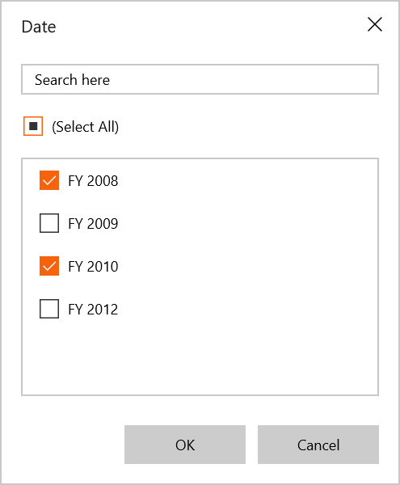
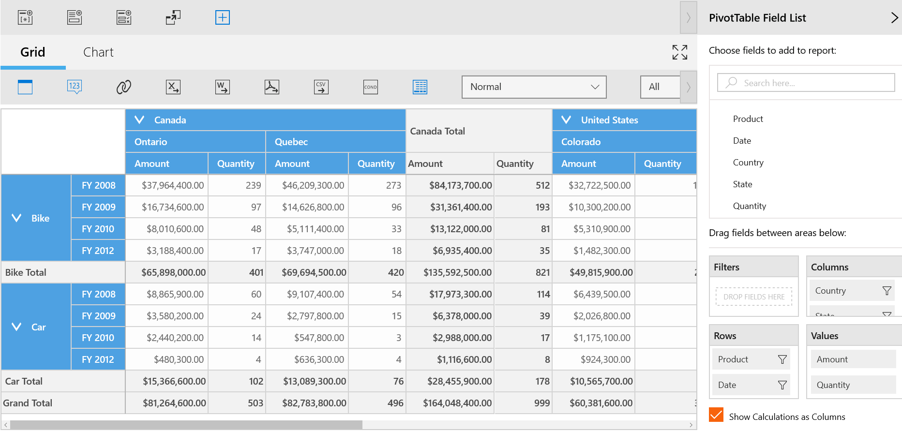
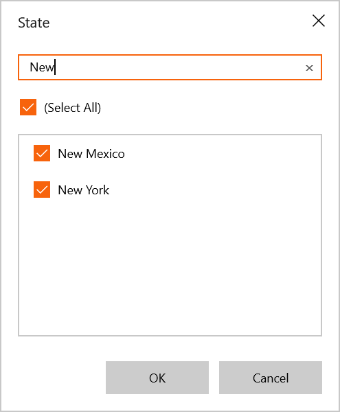

# Data Exploration in UWP Pivot Client (SfPivotClient)

## Filtering

Filtering can be applied to the SfPivotClient control at runtime by using the **Filter Editor** dialog. This dialog can be opened by clicking the **Filter icon** present over the right corner of fields in the rows or columns section of the axis element builder.

The filter editor dialog is used to filter the values at runtime. It displays only a subset of data that meets a specific criteria and hides the data that you do not want to display.

The **Select All** option in the dialog allows users to select or deselect all fields for filtering. If you want to filter some values, you must uncheck some field values in the filter editor dialog, and then click **OK**.

The following screenshots illustrate that the members of FY2009 and FY2012 are excluded from the SfPivotClient control.

## Grouping

The data can be grouped when more than one pivot item is added to the column or row section in the axis element builder. Based on the order of addition, the data is grouped, and then the control is refreshed.

In the following example, the **Date** values get grouped with respect to the values of the **Product**. Likewise, multiple dimension members can be grouped by dragging the elements from the cube dimension browser to the axis element builder.

## Searching

If you want to search the pivot item values, you should enter the required text in the search box. Based on the search text, the relevant field values will be displayed in the field list.

The following screenshot shows how to search pivot item values in the filter editor dialog.

