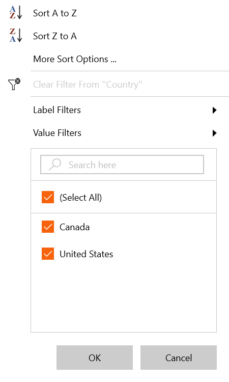
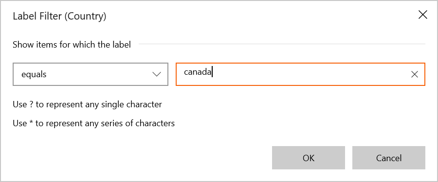
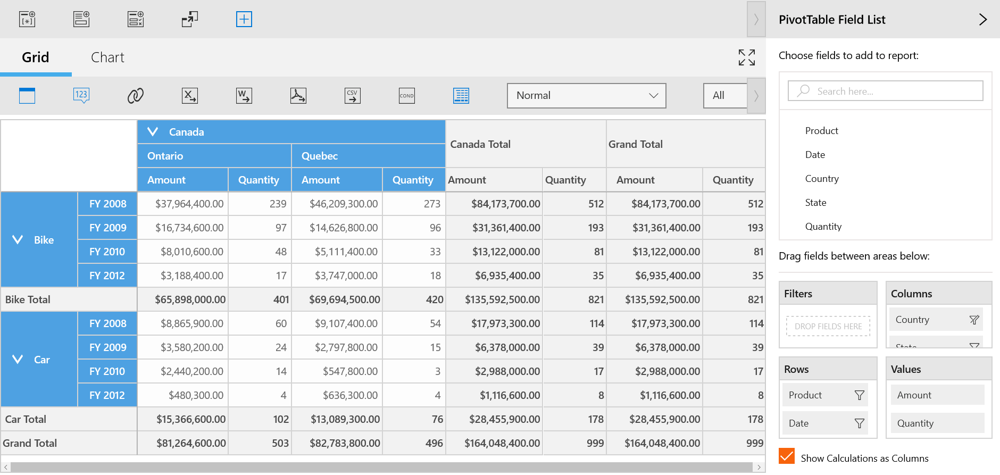
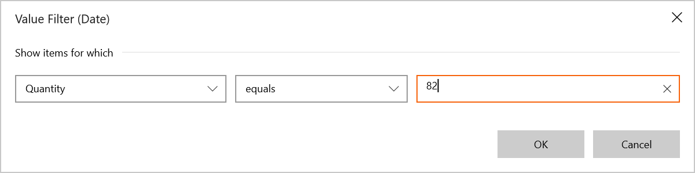
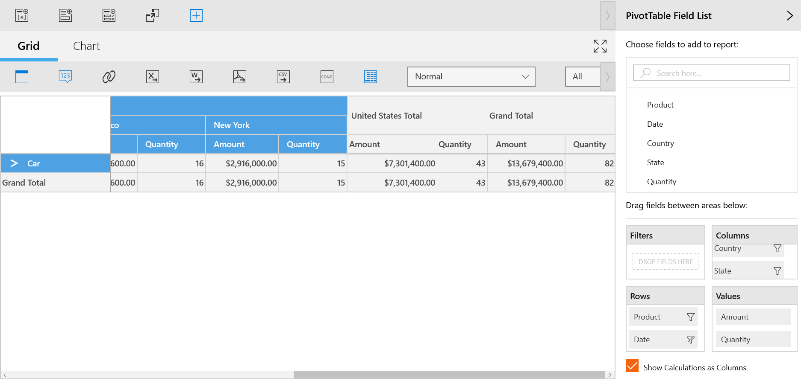

# Excel-Like Filtering and Sorting in UWP Pivot Client (SfPivotClient)

The SfPivotClient control supports Excel-like filtering and sorting that is applied to a pivot item. You can enable or disable the Excel-like sorting and filtering support in the SfPivotClient by setting the `AllowMultiFunctionalSortFilter` property.

Refer to the following code snippet to enable Excel-like filtering and sorting.





<syncfusion:SfPivotClient x:Name="pivotClient" AllowMultiFunctionalSortFilter="True" />





this.pivotClient.AllowMultiFunctionalSortFilter = true;





Me.pivotClient.AllowMultiFunctionalSortFilter = True





## Multi-functional features

**Sort A to Z**

This allows you to sort the corresponding pivot item in the ascending order.

**Sort Z to A**

This allows you to sort the corresponding pivot item in the descending order.

**More sort options**

This allows you to sort the corresponding pivot item based on the grand total of the pivot calculation field.

**Clear filters**

This allows you to clear all the filter changes that are applied to the corresponding pivot item and bring back the SfPivotClient to the normal state.

**Label filters**

This allows you to filter the SfPivotClient based on labels of the pivot item field and this can be achieved by using various options that are listed below:

* Equals.
* Does Not Equal.
* Begins With.
* Does Not Begin With.
* Ends with.
* Does Not End With.
* Contains.
* Does Not Contain.
* Greater Than.
* Greater Than or Equal To.
* Less than.
* Less than or Equal To.
* Between.
* Not Between.

_Label filter dialog for filtering "Canada" in Country_

_SfPivotClient applied with label filter_

**Value filters**

This allows you to filter the SfPivotClient based on values of the pivot item field and this can be achieved by using various options that are listed below:

* Equals.
* Does Not Equal.
* Greater Than.
* Greater Than or Equal To.
* Less than.
* Less than or Equal To.
* Between.
* Not Between.
* Top 10.

_Value filter dialog for filtering "France" using its Quantity value "398"_

_SfPivotClient applied with value filter_
