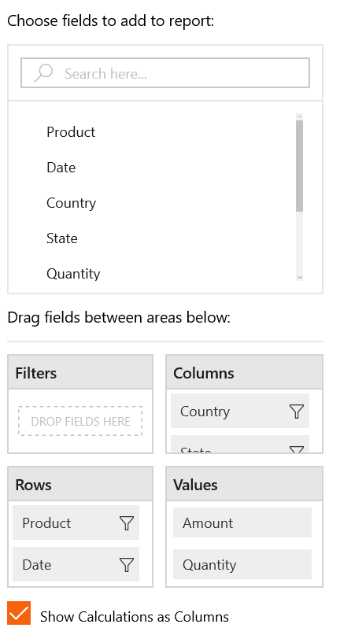
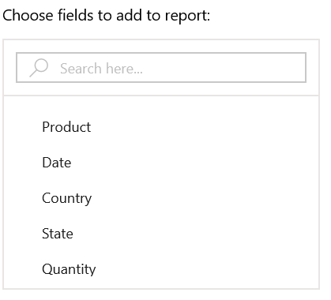
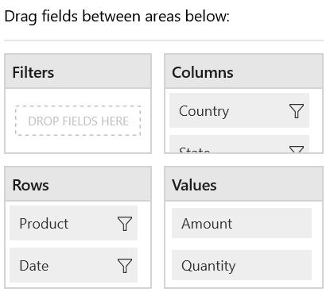
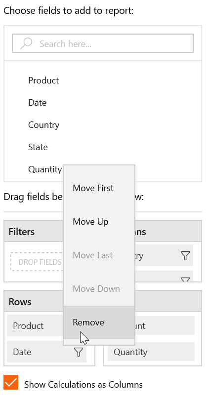
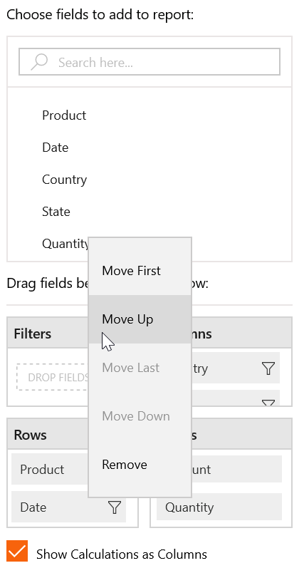
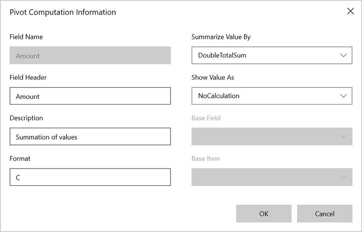
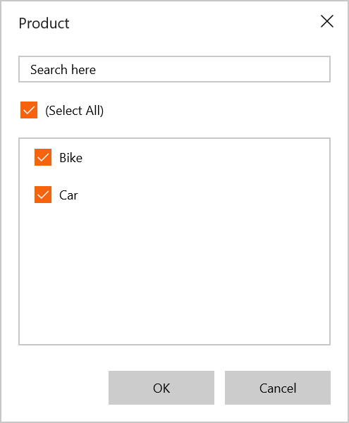

# PivotClient: Components in UWP Pivot Client (SfPivotClient)

## Pivot table field list

By using the pivot table field list, you can add, rearrange, or remove fields to show the data in the SfPivotClient exactly as desired.

With the current implementation of grouping bar, the deleted items cannot be added again in the SfPivotClient. To achieve this requirement, the pivot
table field list is maintained with components listed below:

* Pivot browser.
* Axis element builder.
* Show calculations as columns.

### Pivot browser

The pivot browser represents the collection of pivot items available in the data source. You can add the pivot items to rows or columns section by dragging and dropping pivot items from the browser to the required axis element builder.

### Axis element builder

The axis element builder is used to rearrange and reposition fields in the SfPivotClient. Based on fields in the section, the SfPivotGrid and the SfPivotChart will display the resultant data.

#### Filters

The filters section is used to narrow the focus of multidimensional data that is displayed in the SfPivotChart or SfPivotGrid. To display the fields in the filter section, the corresponding field should not be present in both columns and rows sections.

#### Columns

The columns section is used to display fields as columns at the top of a report.

It defines one or more fields that are displayed in pivot columns of the SfPivotGrid. If more than one field is present in the column section, then the SfPivotChart or SfPivotGrid will stack each dimension. The order in which the fields are stacked is based on the order that they appear on the pivot columns.

#### Rows

The rows section is used to display fields as rows at the top of a report.

It defines one or more fields that are displayed in the pivot rows of the SfPivotGrid. If more than one field is present in the row section, then the SfPivotChart or SfPivotGrid will stack each dimension. The order in which the fields are stacked is based on the order that they appear on the pivot rows.

#### Values

The values section is used to display the summary fields of the SfPivotGrid. It defines one or more PivotComputationInfo items that are displayed in the pivot calculations of the SfPivotGrid.

#### Split button

The split button highlights the elements in the axis element builder. It holds the pivot item, or pivot computation item, or filter expression item which can be dragged from the pivot browser and dropped into the axis element builder.

While dragging and dropping, a split button is created along with the caption, which is displayed correspond to the pivot item, or pivot computation item, or filter expression item.

#### Operations in axis element builder

**Adding items to axis**

The pivot items or pivot computation items can be dragged from the pivot browser and dropped into the axis element builder at desired position using the drag-and-drop operation. Also, you can move the items from any axis to other axis by dragging an appropriate item and dropping them at desired position in the axis element builder.

**Removing items from axis**

To remove the pivot item or pivot computation item from the axis element builder, right-click the items in rows or columns, or filters, or values and select the **Remove** option from the context menu.

The following screenshot illustrates how to remove an item from the axis element builder.

**Rearranging items in axis**

The items in the axis can be rearranged by using the context menu available in the axis element builder. Right-click the desired item from rows or columns, or values, or filters, and then select the desired option such as *Move Down*, *Move Up*, *Move First*, and *Move Last*  from menu items to rearrange the selected item.

The following screenshot illustrates how to rearrange an item in the axis element builder.

### Pivot computation information dialog

The pivot computation information dialog is used to change or edit value formats, summary types, calculation types, and field header. It can be opened by double-clicking the fields in the values section.

### Filter editor dialog

Filter editor dialog displays collection of selected pivot items. It can be opened by clicking the *Filter Button* present over right corner of the fields in the rows or columns section.

Filter editor dialog is used to filter the values at runtime, so that it displays only a subset of data that meets a criteria as specified, and hides the data that you do not want to display.

The **Select All** option in the dialog allows users to select or unselect all fields for filtering.

### Show calculations as columns

The SfPivotClient supports showing the calculation values in the columns or rows section. To view the calculation values in the row, uncheck the “Show Calculations as column” check box.

## Toolbar

By default the following options are available in the toolbar.

* Expression field: Adds an expression field at runtime.
* Custom summary: Changes the SummaryType into custom for existing pivot calculations.
* Calculated field: Adds a calculated field at runtime.
* Toggle pivot: Swaps the pivot items from rows to columns and vice versa.
* Show/hide icon: Toggles the visibility of show/hide icon used for drilling operations.

## SfPivotGrid and SfPivotChart

The [SfPivotGrid](http://help.syncfusion.com/uwp/sfpivotgrid/overview/) and [SfPivotChart](http://help.syncfusion.com/uwp/sfpivotchart/overview) controls will be rendered with respect to operations done at the axis element builder.
