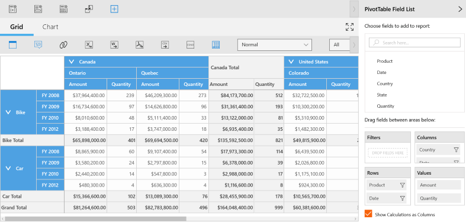
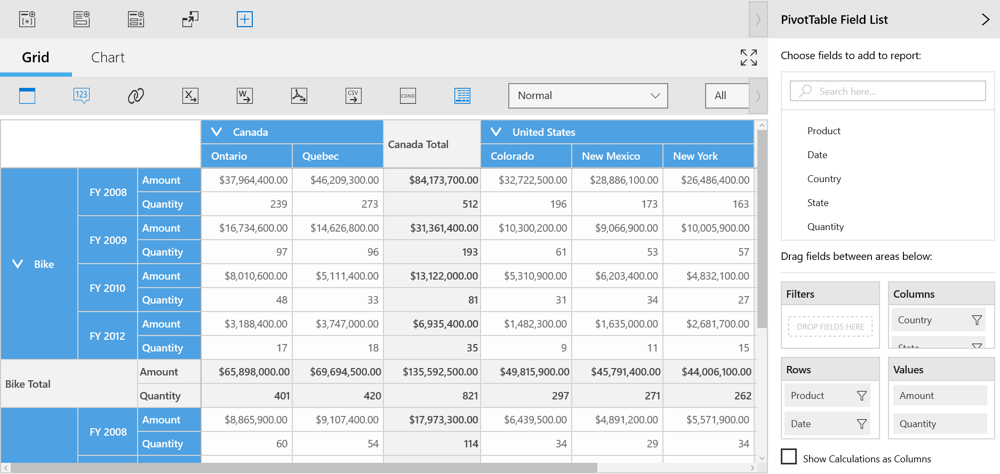

# Show Calculations as Columns or Rows in UWP Pivot Client (SfPivotClient)

The SfPivotClient supports showing the calculation values as columns or rows by using the `ShowCalculationsAsColumns` property. By default, its value is true. To view the calculation values in the row, it should be set to false.

There are two ways to enable or disable this feature as illustrated below.

**Using code**

The calculations can be displayed in columns or rows by setting the `ShowCalculationsAsColumns` property of the SfPivotClient.

Refer to the following code snippet to display the calculations in column.





<syncfusion:SfPivotClient x:Name="pivotClient" ShowCalculationsAsColumns="True" />





this.pivotClient.ShowCalculationsAsColumns = true;





Me.pivotClient.ShowCalculationsAsColumns = True





## Using pivot table field list

You can enable or disable this support by using the "Show Calculations as Column” check box available in the PivotTableFieldList.

_PivotClient displaying calculations as columns_

_PivotClient displaying calculations as rows_
