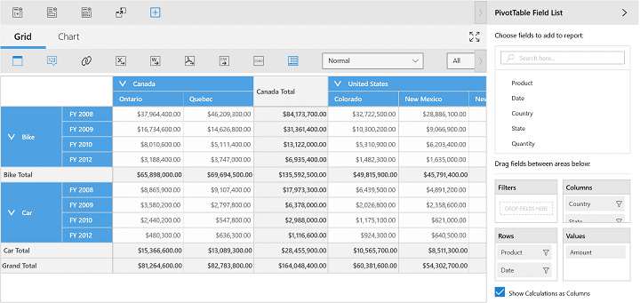
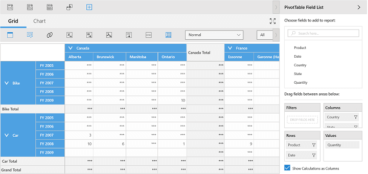

# Summary Types in UWP Pivot Client (SfPivotClient)

The SfPivotClient supports summarizing the data for various data types by using the `SummaryType` property. This property should be defined while defining the pivot calculation by using the `PivotComputationInfo` class to specify the summary type. It holds the following summary types:

* **DoubleTotalSum**: Computes the sum of double or integer from pivot values for the corresponding pivot item.
* **DoubleAverage**: Computes the average of double or integer from pivot values for the corresponding pivot item.
* **DoubleMaximum**: Computes the maximum of double or integer from pivot values for the corresponding pivot item.
* **DoubleMinimum**: Computes the minimum of double or integer from pivot values for the corresponding pivot item.
* **DoubleStandardDeviation**: Computes the standard deviation of double or integer from pivot values for the corresponding pivot item.
* **DoubleVariance**: Computes the variance of double or integer from pivot values for the corresponding pivot item.
* **Count**: Computes the count of double or integer from pivot values for the corresponding pivot item.
* **DecimalTotalSum**: Computes the sum of decimal from pivot values for the corresponding pivot item.
* **IntTotalSum**: Computes the sum of integer from pivot values for the corresponding pivot item.
* **Custom**: Specifies that you are using a custom SummaryBase object to define the calculation.
* **DisplayIfDiscreteValuesEqual**: Displays the aggregated value in the pivot computation column if all the values are common.

The following code snippet shows how to set the summary type of the pivot calculation.





<syncfusion:SfPivotClient Name="PivotClient1" ItemSource="{Binding ProductSalesData}"
                        PivotRows="{Binding PivotRows}" PivotColumns="{Binding PivotColumns}">
    <syncfusion:SfPivotClient.PivotCalculations>
        <syncfusion:PivotComputationInfo CalculationName="Total" FieldName="Amount" Format="C" SummaryType="DoubleTotalSum" />
    </syncfusion:SfPivotClient.PivotCalculations>
</syncfusion:SfPivotClient>





PivotClient1.PivotCalculations.Add(new PivotComputationInfo { FieldName = "Amount", Format = "C", SummaryType = SummaryType.DoubleTotalSum });





PivotClient1.PivotCalculations.Add(New PivotComputationInfo() With { _
    Key .FieldName = "Amount", _
    Key .Format = "C", _
    Key .SummaryType = SummaryType.DoubleTotalSum _
})





## DisplayIfDiscreteValuesEqual SummaryType

**DisplayIfDiscreteValuesEqual** is a new summary type that displays the aggregated value in the pivot calculation column if all the values are common, else the default value will be displayed as **'*'**.

You can also change the default value to any custom string of your choice by using the `PadString` property as specified in the following code snippet.





<syncfusion:SfPivotClient Name="PivotClient1" ItemSource="{Binding ProductSalesData}"
                          PivotRows="{Binding PivotRows}" PivotColumns="{Binding PivotColumns}">
    <syncfusion:SfPivotClient.PivotCalculations>
        <syncfusion:PivotComputationInfo CalculationName="Total" FieldName="Quantity" Format="#.##"                                                                     SummaryType="DisplayIfDiscreteValuesEqual" PadString="***"/>
    </syncfusion:SfPivotClient.PivotCalculations>
</syncfusion:SfPivotClient>





PivotClient1.PivotCalculations.Add(new PivotComputationInfo
{
    FieldName = "Quantity",
    Format = "#.##",
    SummaryType = SummaryType.DisplayIfDiscreteValuesEqual,
    PadString ="***"
});





PivotClient1.PivotCalculations.Add(New PivotComputationInfo() With { _
    Key .FieldName = "Quantity", _
    Key .Format = "#.##", _
    Key .SummaryType = SummaryType.DisplayIfDiscreteValuesEqual, _
    Key .PadString = "***" _
})





