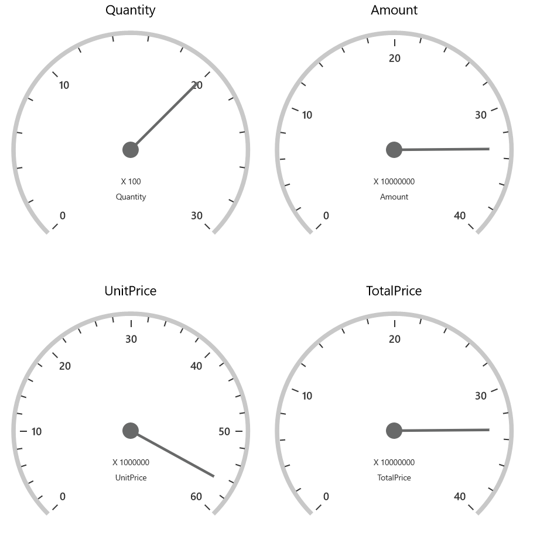
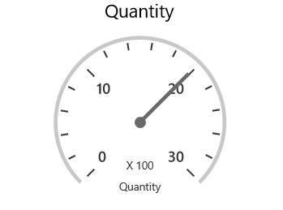
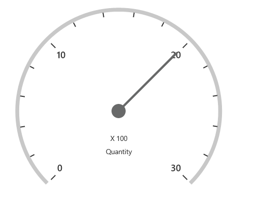
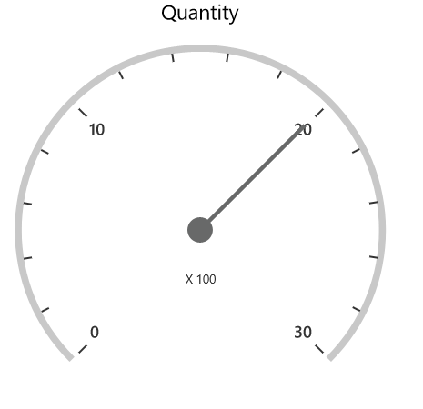
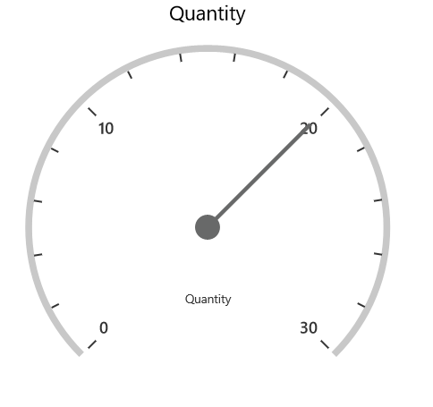

# Appearance in UWP Pivot Gauge (SfPivotGauge)

## Layout customization

The [SfPivotGauge](https://help.syncfusion.com/cr/uwp/Syncfusion.UI.Xaml.PivotGauge.SfPivotGauge.html) supports displaying multiple gauges in a structured layout using the [RowsCount](https://help.syncfusion.com/cr/uwp/Syncfusion.UI.Xaml.PivotGauge.SfPivotGauge.html#Syncfusion_UI_Xaml_PivotGauge_SfPivotGauge_RowsCount) and [ColumnsCount](https://help.syncfusion.com/cr/uwp/Syncfusion.UI.Xaml.PivotGauge.SfPivotGauge.html#Syncfusion_UI_Xaml_PivotGauge_SfPivotGauge_ColumnsCount) properties. These properties specify the number of rows and columns required to display the control.





<syncfusion:SfPivotGauge x:Name="PivotGauge1" RowsCount="2" ColumnsCount="2"
                         ItemSource="{Binding ProductSalesData}" PivotRows="{Binding PivotRows}"
                         PivotColumns="{Binding PivotColumns}" PivotCalculations="{Binding PivotCalculations}"/>





PivotGauge1.RowsCount = 2;
PivotGauge1.ColumnsCount = 2;





PivotGauge1.RowsCount = 2
PivotGauge1.ColumnsCount = 2





## Gauge radius

The [SfPivotGauge](https://help.syncfusion.com/cr/uwp/Syncfusion.UI.Xaml.PivotGauge.SfPivotGauge.html) supports adjusting its radius by assigning a proper value to its [Radius](https://help.syncfusion.com/cr/uwp/Syncfusion.UI.Xaml.PivotGauge.SfPivotGauge.html#Syncfusion_UI_Xaml_PivotGauge_SfPivotGauge_Radius) property. The following code snippet illustrates how to modify the radius of the SfPivotGauge.





<syncfusion:SfPivotGauge x:Name="PivotGauge1" Radius="75"
                         ItemSource="{Binding ProductSalesData}" PivotRows="{Binding PivotRows}"
                         PivotColumns="{Binding PivotColumns}" PivotCalculations="{Binding PivotCalculations}"/>





PivotGauge1.Radius = 75;





PivotGauge1.Radius = 75





## Gauge header

The gauge header is a combination of details about the calculation and KPI. The header components of the [SfPivotGauge](https://help.syncfusion.com/cr/uwp/Syncfusion.UI.Xaml.PivotGauge.SfPivotGauge.html) can be hidden by using the [ShowGaugeHeaders](https://help.syncfusion.com/cr/uwp/Syncfusion.UI.Xaml.PivotGauge.SfPivotGauge.html#Syncfusion_UI_Xaml_PivotGauge_SfPivotGauge_ShowGaugeFactors) property, as specified in the following code snippet.





<syncfusion:SfPivotGauge x:Name="PivotGauge1" ShowGaugeHeaders="False"
                         ItemSource="{Binding ProductSalesData}" PivotRows="{Binding PivotRows}"
                         PivotColumns="{Binding PivotColumns}" PivotCalculations="{Binding PivotCalculations}"/>





PivotGauge1.ShowGaugeHeaders = false;





PivotGauge1.ShowGaugeHeaders = False





## Gauge label

The visibility of gauge labels displayed inside the gauge can be toggled with the help of the [ShowGaugeLabels](https://help.syncfusion.com/cr/uwp/Syncfusion.UI.Xaml.PivotGauge.SfPivotGauge.html#Syncfusion_UI_Xaml_PivotGauge_SfPivotGauge_ShowGaugeLabels) property. The following code snippet shows how to hide the labels of the SfPivotGauge.





<syncfusion:SfPivotGauge x:Name="PivotGauge1" ShowGaugeLabels="False"
                         ItemSource="{Binding ProductSalesData}" PivotRows="{Binding PivotRows}"
                         PivotColumns="{Binding PivotColumns}" PivotCalculations="{Binding PivotCalculations}"/>





PivotGauge1.ShowGaugeLabels = false;





PivotGauge1.ShowGaugeLabels = False





## Gauge factor

The gauge factor component can be hidden by using the [ShowGaugeFactors](https://help.syncfusion.com/cr/uwp/Syncfusion.UI.Xaml.PivotGauge.SfPivotGauge.html#Syncfusion_UI_Xaml_PivotGauge_SfPivotGauge_ShowGaugeFactors) property, as specified in the following code snippet.





<syncfusion:SfPivotGauge x:Name="PivotGauge1" ShowGaugeFactors="False"
                         ItemSource="{Binding ProductSalesData}" PivotRows="{Binding PivotRows}"
                         PivotColumns="{Binding PivotColumns}" PivotCalculations="{Binding PivotCalculations}"/>





PivotGauge1.ShowGaugeFactors = false;





PivotGauge1.ShowGaugeFactors = False





