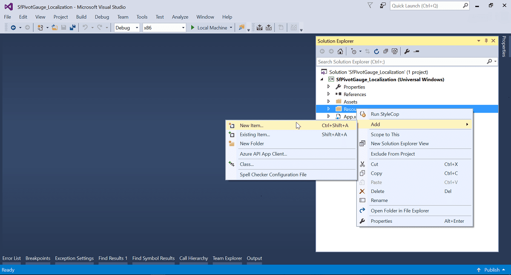
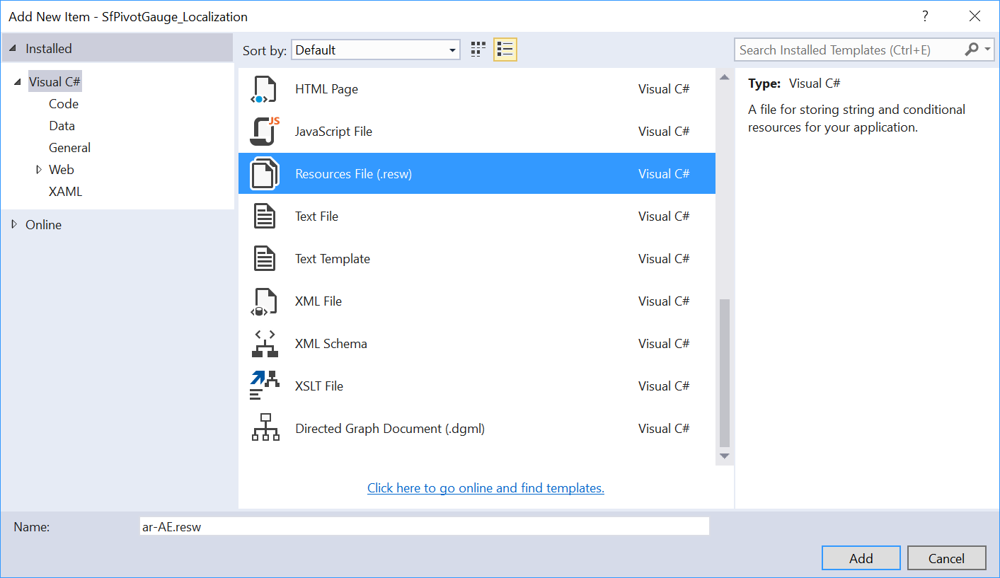
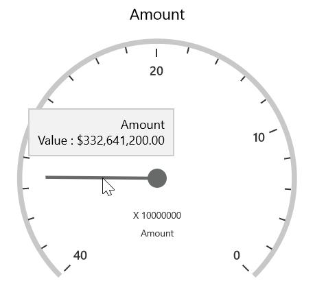

# Localization in UWP Pivot Gauge (SfPivotGauge)

Localization is a key feature to provide software solutions targeted at global users. The [SfPivotGauge](https://help.syncfusion.com/cr/uwp/Syncfusion.UI.Xaml.PivotGauge.SfPivotGauge.html) allows users to localize the control to a specific locale and supports "resx" based localization.

You should perform the following steps to localize the control:

* Translation.
* Resource file and file name conventions.
* Culture specification.

## Translation

The first step in localization is translating the strings that can be localized to the destination locale.

N> The localization key field should be the same for all locales. Do not translate it.

## Resource file and file name conventions

After translating the strings that can be localized:

1. Right-click the project file to create a new folder in the project. Select **Add > New Folder** and rename the folder "Resources".

2. Right-click the **Resources** folder to create a new resource file. Go to **Add > New Item**.

N> The resource file name should be in the format "&lt;Culture Code&gt;.resx".

3. Copy and paste the translated locale to the resource file created in the previous step.

## Culture specification

You should specify the CurrentUICulture in the `Application_Startup` method of the App.xaml.cs file or the constructor of the MainPage.xaml.cs file.

N> If you are specifying the current culture in the constructor of the main page, ensure that the culture is specified before calling the `InitializeComponent()` method.





public sealed partial class MainPage : Page
{
    public MainPage()
    {
        ApplicationLanguages.PrimaryLanguageOverride = "ar-AE";
        this.InitializeComponent();
    }
}





Public NotInheritable Partial Class MainPage
    Inherits Page
    Public Sub New()
        ApplicationLanguages.PrimaryLanguageOverride = "ar-AE"
        Me.InitializeComponent()
    End Sub
End Class





## RTL

The [SfPivotGauge](https://help.syncfusion.com/cr/uwp/Syncfusion.UI.Xaml.PivotGauge.SfPivotGauge.html) provides RTL support to display the content from right to left by setting the `FlowDirection` property to **RightToLeft**.





<syncfusion:SfPivotGauge x:Name="PivotGauge1" FlowDirection="RightToLeft"
                         ItemSource="{Binding ProductSalesData}" PivotRows="{Binding PivotRows}"
                         PivotColumns="{Binding PivotColumns}" PivotCalculations="{Binding PivotCalculations}"/>





PivotGauge1.FlowDirection = FlowDirection.RightToLeft;





PivotGauge1.FlowDirection = FlowDirection.RightToLeft





A demo sample is available in the following location.

{system drive}:\Users\\&lt;User Name&gt;\AppData\Local\Syncfusion\EssentialStudio\\&lt;Version Number&gt;\Samples\UWP\SampleBrowser\PivotGauge\PivotGauge\View\Localization.xaml
