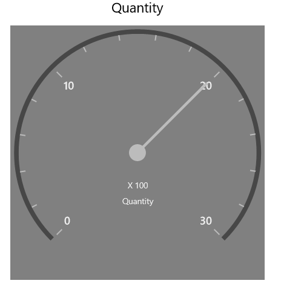

# Theming in UWP Pivot Gauge (SfPivotGauge)

Theming is the process of applying particular settings to visual elements of a control. Following built-in themes are supported in the SfPivotGauge control:

* Blend
* Lime
* Metro
* Office2010Black
* Office2010Blue
* Office2010Silver
* Office2013DarkGray
* Office2013LightGray
* Office2013White
* Office2016Colorful
* Office2016DarkGray
* Office2016White
* Office365
* Saffron
* VisualStudio2013
* VisualStudio2015

By using the `GaugeVisualStyle` property in the SfPivotGauge, you can set the visual style of the control. By default, the `Metro` theme is applied. The following code snippet shows how to change the visual style for the SfPivotChart.





<syncfusion:SfPivotGauge x:Name="PivotGauge1" GaugeVisualStyle="Blend"
                         ItemSource="{Binding ProductSalesData}" PivotRows="{Binding PivotRows}"
                         PivotColumns="{Binding PivotColumns}" PivotCalculations="{Binding PivotCalculations}">
</syncfusion:SfPivotGauge>





PivotGauge1.GaugeVisualStyle = PivotGaugeVisualStyle.Blend;





PivotGauge1.GaugeVisualStyle = PivotGaugeVisualStyle.Blend;





