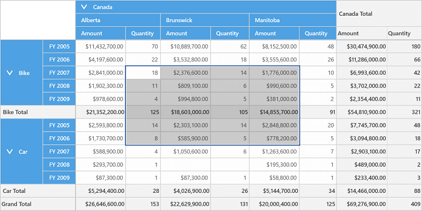
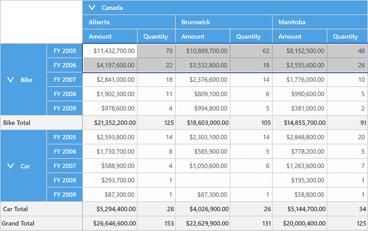
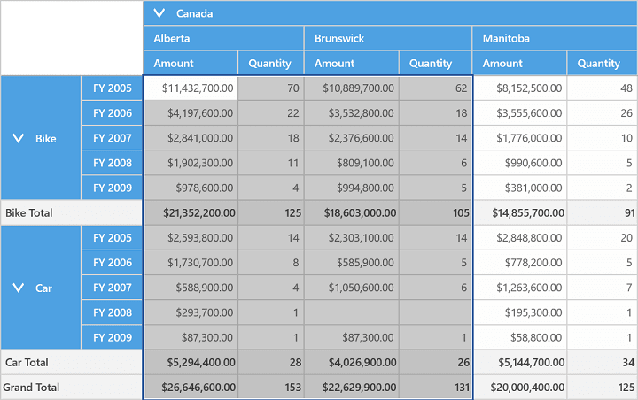
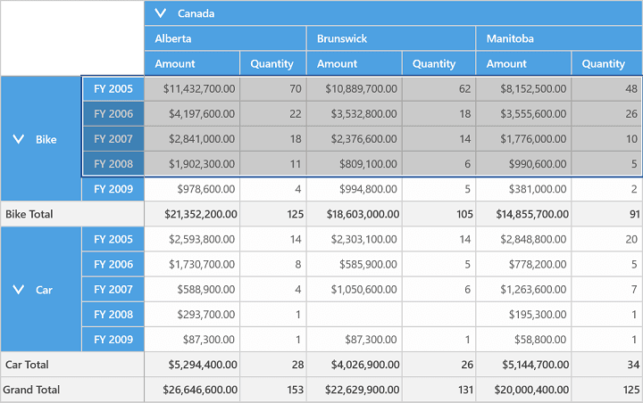
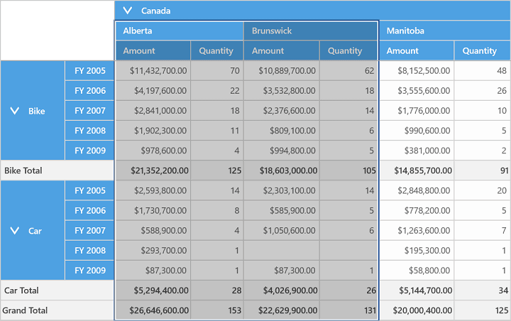

# Cell Selection in UWP Pivot Grid (SfPivotGrid)

The SfPivotGrid supports cell selection. You can select grid value cells like in Microsoft Excel. This can be achieved by setting the `AllowSelection` property of the SfPivotGrid to true.

On cell selection, the **SelectionChanged** event will be triggered and **PivotGridSelectionChangedEventArgs** will return an IEnumerable collection of column index, row index, and value index of the selected cell. The event argument will return the cell range and selection mode such as mouse-down, mouse-move, mouse-up, etc.

Refer to the following code snippet to enable cell selection.





<!--Adding SfPivotGrid and enabling cell selection-->
<syncfusion:SfPivotGrid x:Name="PivotGrid1" **AllowSelection="True"**/>





this.PivotGrid1.AllowSelection = true;





Me.PivotGrid1.AllowSelection = True





This is illustrated in the following screenshot.

## Multi-row selection

You can select a whole row in the pivot grid by clicking the specific row header. You can also select multiple rows by clicking one row header and dragging it through other row headers.

## Multi-column selection

You can select a whole column in the pivot grid by clicking the specific column header. You can also select multiple columns by clicking one column header and dragging it through other column headers.

## Selection with headers

The `AllowSelectionWithHeaders` property can be used to achieve the cell selection behavior along with headers. Refer to the following code snippet to enable the cell selection with headers.

N> It is applicable only for relational data source.





<syncfusion:SfPivotGrid x:Name="PivotGrid1" **AllowSelectionWithHeaders="True"**/>





this.PivotGrid1.AllowSelectionWithHeaders = true;





Me.PivotGrid1.AllowSelectionWithHeaders = True





The following screenshot illustrates the cell selection along with row headers.

The following screenshot illustrates the cell selection along with column headers.

A demo sample is available in the following location.

{system drive}:\Users\&lt;User Name&gt;\AppData\Local\Syncfusion\EssentialStudio\&lt;Version Number&gt;\Samples\UWP\SampleBrowser\PivotGrid\PivotGrid\View\CellSelection.xaml
