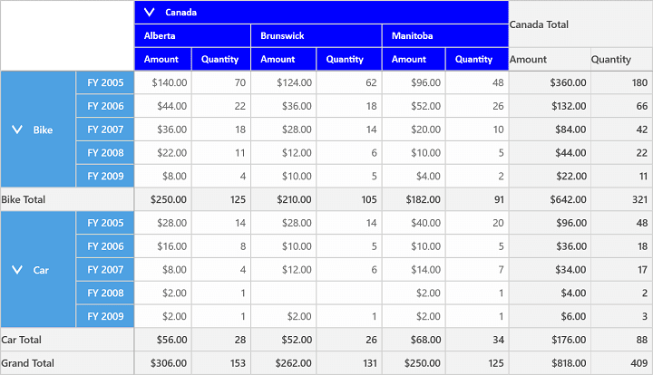
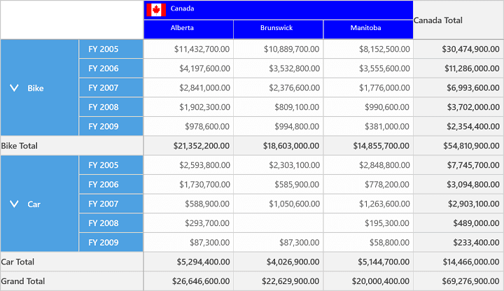

# Cell Style and Template in UWP Pivot Grid (SfPivotGrid)

## Cell style

The column cells, row cells, summary cells, and value cells of a grid can be formatted independently with the help of specific style properties:

* `ColumnHeaderStyle`: Specifies the style for column headers.
* `RowHeaderStyle`: Specifies the style for row headers.
* `SummaryColumnStyle`: Specifies the style for summary column cells.
* `SummaryRowStyle`: Specifies the style for summary row cells.
* `ValueCellStyle`: Specifies the style for value cells.

A cell can be customized by using the following properties.

<table>
<tr>
<th>
Property</th><th>
Description</th><th>
Type</th></tr>
<tr>
<td>
Background</td><td>
Defines the background color of a grid cell.</td><td>
Brush</td></tr>
<tr>
<td>
FontFamily</td><td>
Defines the font family of a grid cell.</td><td>
FontFamily</td></tr>
<tr>
<td>
FontSize</td><td>
Defines the font size of a grid cell.</td><td>
int</td></tr>
<tr>
<td>
FontWeight</td><td>
Defines the font weight of a grid cell.</td><td>
FontWeight</td></tr>
<tr>
<td>
Foreground</td><td>
Defines the foreground color of a grid cell.</td><td>
Brush</td></tr>
</table>

**Defining cell style**

The following code snippet illustrates how to customize the style of column header cell.





<syncfusion:SfPivotGrid x:Name="PivotGrid1" ItemSource="{Binding ProductSalesData}" PivotRows="{Binding PivotRows}"
                        PivotColumns="{Binding PivotColumns}" PivotCalculations="{Binding PivotCalculations}">
            <syncfusion:SfPivotGrid.ColumnHeaderStyle>
                <syncfusion:PivotGridCellStyle Background="Blue" FontFamily="Calibri" Foreground="White" FontWeight="SemiBold" FontSize="13"/>
            </syncfusion:SfPivotGrid.ColumnHeaderStyle>
</syncfusion:SfPivotGrid>





 //Specifying the Background color for Grid column header
 this.PivotGrid1.ColumnHeaderStyle.Background = new SolidColorBrush(Colors.Blue);
 //Specifying the Foreground color for Grid column header
 this.PivotGrid1.ColumnHeaderStyle.Foreground = new SolidColorBrush(Colors.White);
 //Specifying the Font Family for Grid column header
 this.PivotGrid1.ColumnHeaderStyle.FontFamily = new FontFamily("Calibri");
 //Specifying the Font Weight for Grid column header
 this.PivotGrid1.ColumnHeaderStyle.FontWeight = FontWeights.SemiBold; 
  //Specifying the Font Size for Grid column header
 this.PivotGrid1.ColumnHeaderStyle.FontSize = 13;




 
'Specifying the Background color for Grid column header
Me.PivotGrid1.ColumnHeaderStyle.Background = New SolidColorBrush(Colors.Blue)
'Specifying the Foreground color for Grid column header
Me.PivotGrid1.ColumnHeaderStyle.Foreground = New SolidColorBrush(Colors.White)
'Specifying the Font Family for Grid column header
Me.PivotGrid1.ColumnHeaderStyle.FontFamily = New FontFamily("Calibri")
'Specifying the Font Weight for Grid column header
Me.PivotGrid1.ColumnHeaderStyle.FontWeight = FontWeights.SemiBold
'Specifying the Font Size for Grid column header
Me.PivotGrid1.ColumnHeaderStyle.FontSize = 13	





## Cell template

The SfPivotGrid allows you to define custom template for modifying the default appearance of all cells in the SfPivotGrid. The style for each cell can be defined by using the `Style` property in `PivotGridCellStyle` and the style should be defined with the `PivotGridTemplateCell` type.

**Defining cell template**

You can define your own style for column cells by using the `ColumnHeaderStyle` property, row cells by using the `RowHeaderStyle` property, value cells by using the `ValueCellStyle` property, and summary cells by using the `SummaryRowStyle` and `SummaryColumnStyle` properties. The defined template is assigned to the `Style` property of corresponding cell style in the SfPivotGrid control.

The following code snippet illustrates how to customize the style of column header cell using the custom template.





<Grid>
    <Grid.Resources>
        <converter:ImageConverter x:Key="imageConverter"/>
        
    </Grid.Resources>
     <syncfusion:SfPivotGrid x:Name="PivotGrid1" ItemSource="{Binding ProductSalesData}" PivotRows="{Binding PivotRows}"
                        PivotColumns="{Binding PivotColumns}" PivotCalculations="{Binding PivotCalculations}">
            <syncfusion:SfPivotGrid.ColumnHeaderStyle>
                <syncfusion:PivotGridCellStyle Background="Blue" Style="{StaticResource colStyle}"/>
            </syncfusion:SfPivotGrid.ColumnHeaderStyle>
    </syncfusion:SfPivotGrid>
</Grid>





public class ImageConverter : IValueConverter
{
	public object Convert(object value, Type targetType, object parameter, string language)
	{
		string imageSrc = "";
		PivotCellInfo cellInfo = value as PivotCellInfo;
		if (cellInfo != null)
		{
			switch (cellInfo.FormattedText)
			{
				case "Australia":
					imageSrc = "ms-appx:///PivotGrid/View/Assets/Images/CountryFlags/Australia.png";
					return imageSrc;
				case "Canada":
					imageSrc = "ms-appx:///PivotGrid/View/Assets/Images/CountryFlags/Canada.png";
					return imageSrc;
				case "France":
					imageSrc = "ms-appx:///PivotGrid/View/Assets/Images/CountryFlags/France.png";
					return imageSrc;
				case "Germany":
					imageSrc = "ms-appx:///PivotGrid/View/Assets/Images/CountryFlags/Germany.png";
					return imageSrc;
				case "United Kingdom":
					imageSrc = "ms-appx:///PivotGrid/View/Assets/Images/CountryFlags/UK.png";
					return imageSrc;
				case "United States":
					imageSrc = "ms-appx:///PivotGrid/View/Assets/Images/CountryFlags/USA.png";
					return imageSrc;
			}
		}
		return imageSrc;
	}
    
	public object ConvertBack(object value, Type targetType, object parameter, string language)
	{
		throw new NotImplementedException();
	}
}





Public Class ImageConverter	
	Public Function Convert(value As Object, targetType As Type, parameter As Object, language As String) As Object
		Dim imageSrc As String = ""
		Dim cellInfo As PivotCellInfo = TryCast(value, PivotCellInfo)
		If cellInfo IsNot Nothing Then
			Select Case cellInfo.FormattedText
				Case "Australia"
					imageSrc = "ms-appx:///PivotGrid/View/Assets/Images/CountryFlags/Australia.png"
					Return imageSrc
				Case "Canada"
					imageSrc = "ms-appx:///PivotGrid/View/Assets/Images/CountryFlags/Canada.png"
					Return imageSrc
				Case "France"
					imageSrc = "ms-appx:///PivotGrid/View/Assets/Images/CountryFlags/France.png"
					Return imageSrc
				Case "Germany"
					imageSrc = "ms-appx:///PivotGrid/View/Assets/Images/CountryFlags/Germany.png"
					Return imageSrc
				Case "United Kingdom"
					imageSrc = "ms-appx:///PivotGrid/View/Assets/Images/CountryFlags/UK.png"
					Return imageSrc
				Case "United States"
					imageSrc = "ms-appx:///PivotGrid/View/Assets/Images/CountryFlags/USA.png"
					Return imageSrc
			End Select
		End If
		Return imageSrc
	End Function
	Public Function ConvertBack(value As Object, targetType As Type, parameter As Object, language As String) As Object
		Throw New NotImplementedException()
	End Function
End Class





A demo sample is available in the following location.

{system drive}:\Users\&lt;User Name&gt;\AppData\Local\Syncfusion\EssentialStudio\&lt;Version Number&gt;\Samples\UWP\SampleBrowser\PivotGrid\PivotGrid\View\CellTemplate.xaml
