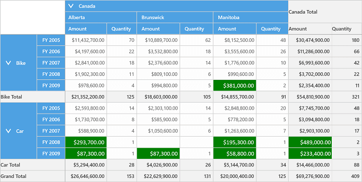

# Conditional Formatting in UWP Pivot Grid (SfPivotGrid)

The SfPivotGrid supports conditional formatting which allows you to format the grid cells based on certain conditions. Conditional formats can be specified with the help of `ConditionalFormats` property through which required number of formatters of **PivotGridDataConditionalFormat** type can be added to the SfPivotGrid.

Using the `Conditions` property of PivotGridDataConditionalFormat instance, you can specify the filter criteria for cells and the style to be applied for the filtered cells with the help of `CellStyle` property. After defining these specifications, the respective styles are applied to only those cells that satisfy the specified condition.

The following code snippet illustrates how to add conditional formats in the SfPivotGrid.





<syncfusion:SfPivotGrid x:Name="PivotGrid1">
    <syncfusion:SfPivotGrid.ConditionalFormats>
        <!-- Adding Conditions -->
        <syncfusion:PivotGridDataConditionalFormat Name="Condition1">
            <!-- Specifying Conditions -->
            <syncfusion:PivotGridDataConditionalFormat.Conditions>
                <syncfusion:PivotGridDataCondition ConditionType="LessThan" MeasureElement="Amount"
                                                   Value = "500000" PredicateType="And"/>
            </syncfusion:PivotGridDataConditionalFormat.Conditions>
            <!-- Specifying Cell Style -->
            <syncfusion:PivotGridDataConditionalFormat.CellStyle>
                <syncfusion:PivotGridCellStyle Background="Green" Foreground="White" FontFamily="Calibri" FontSize="16"/>
            </syncfusion:PivotGridDataConditionalFormat.CellStyle>
        </syncfusion:PivotGridDataConditionalFormat>
    </syncfusion:SfPivotGrid.ConditionalFormats>
</syncfusion:SfPivotGrid>





// Specifying PivotGridData Conditional Format.
PivotGridDataConditionalFormat conditionalFormat = new PivotGridDataConditionalFormat();
// Adding Conditions to PivotGridData Conditional Format.
conditionalFormat.Conditions.Add(new PivotGridDataCondition()
{
    ConditionType= PivotGridDataConditionType.LessThan,
    MeasureElement="Amount",
    Value="500000",
    PredicateType = PredicateType.And
});
// Specifying Cell Style to Conditional Format.
conditionalFormat.CellStyle = new PivotGridCellStyle()
{
    Background= Brushes.Green,
    FontFamily = new FontFamily("Calibri"),
    FontSize=16
};
// Adding Conditions to Grid.
this.PivotGrid1.ConditionalFormats.Add(conditionalFormat);





' Specifying PivotGridData Conditional Format.
Dim conditionalFormat As New PivotGridDataConditionalFormat()
' Adding Conditions to PivotGridData Conditional Format.
conditionalFormat.Conditions.Add(New PivotGridDataCondition() With
{
    .ConditionType= PivotGridDataConditionType.LessThan,
    .MeasureElement="Amount", .Value="500000",
    .PredicateType = PredicateType.And
})
' Specifying Cell Style to Conditional Format.
conditionalFormat.CellStyle = New PivotGridCellStyle() With
{
    .Background= Brushes.Green,
    .FontFamily = New FontFamily("Calibri"),
    .FontSize=16
}
' Adding Conditions to Grid.
Me.PivotGrid1.ConditionalFormats.Add(conditionalFormat)





A demo sample is available in the following location.

{system drive}:\Users\&lt;User Name&gt;\AppData\Local\Syncfusion\EssentialStudio\&lt;Version Number&gt;\Samples\UWP\SampleBrowser\PivotGrid\PivotGrid\View\ConditionalFormat.xaml
