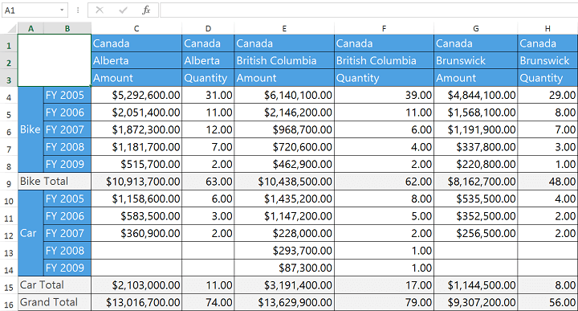
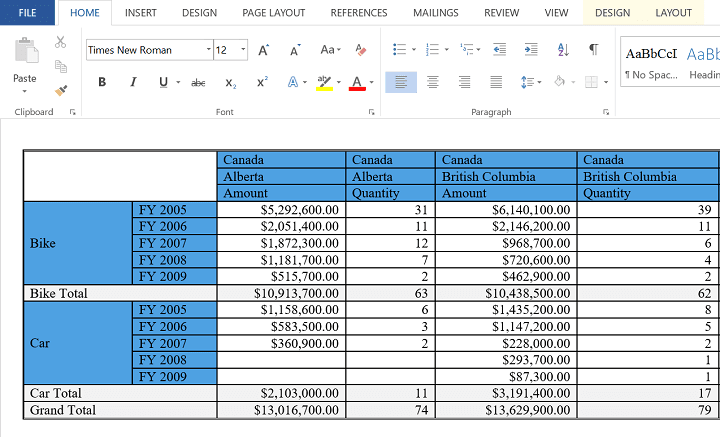
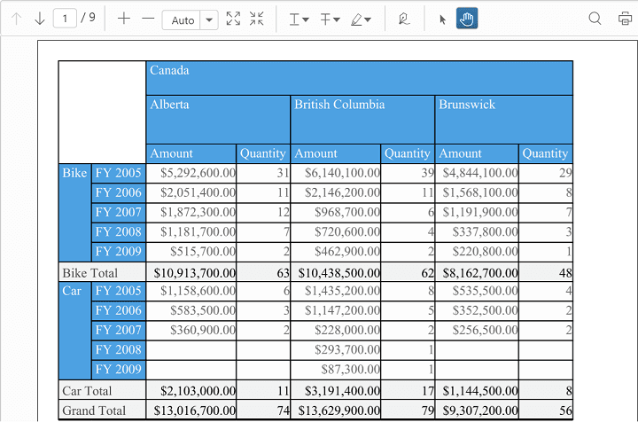
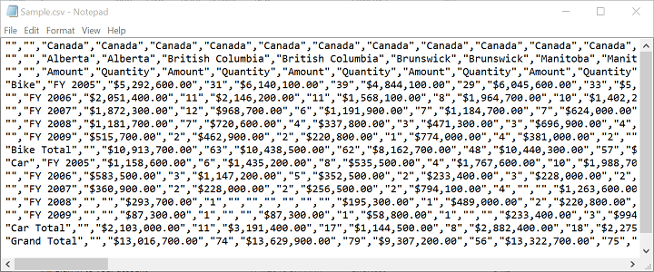

# Exporting in UWP Pivot Grid (SfPivotGrid)

The SfPivotGrid can be exported to Microsoft Excel, Microsoft Word, PDF, and CSV file formats. By default, the grid style for export is obtained from the ExportingGridStyleInfo instance. To perform exporting operation, refer to the following assembly in the application.

* Syncfusion.SfPivotGridConverter.UWP

## Export to Excel

To export the SfPivotGrid contents to Excel, include the namespace **Syncfusion.UI.Xaml.PivotGridConverter** in the code-behind file. Then, create an instance of `ExportPivotGridToExcel` object to access the `ExportToDocument` method. `FileSavePicker` can be used to save the exported file in the preferred location.

Refer to the following code snippet to export the SfPivotGrid to Microsoft Excel.





FileSavePicker savePicker = new FileSavePicker();
savePicker.SuggestedFileName = "Sample";
ExportPivotGridToExcel export = new ExportPivotGridToExcel(this.PivotGrid1, this.PivotGrid1.GetExportingGridStyleInfo(), "xlsx", true);
export.ExportToDocument("Sample");





Dim savePicker As New FileSavePicker()
savePicker.SuggestedFileName = "Sample"
Dim export As New ExportPivotGridToExcel(Me.PivotGrid1, Me.PivotGrid1.GetExportingGridStyleInfo(), "xlsx", True)
export.ExportToDocument("Sample")




## Export to Word

To export the SfPivotGrid contents to Word, include the namespace **Syncfusion.UI.Xaml.PivotGridConverter** in the code-behind file. Then, create an instance of `ExportPivotGridToWord` object to access the `ExportToDocument` method. `FileSavePicker` can be used to save the exported file in the preferred location.

Refer to the following code snippet to export the SfPivotGrid to Word document.





FileSavePicker savePicker = new FileSavePicker();
savePicker.SuggestedFileName = "Sample";
ExportPivotGridToWord export = new ExportPivotGridToWord(this.PivotGrid1, this.PivotGrid1.GetExportingGridStyleInfo());
export.ExportToDocument("Sample");





Dim savePicker As New FileSavePicker()
savePicker.SuggestedFileName = "Sample"
Dim export As New ExportPivotGridToWord(Me.PivotGrid1, Me.PivotGrid1.GetExportingGridStyleInfo())
export.ExportToDocument("Sample")





## Export to PDF

To export the SfPivotGrid contents to PDF, include the namespace **Syncfusion.UI.Xaml.PivotGridConverter** in the code-behind file. Then, create an instance of `ExportPivotGridToPdf` object to access the `ExportToDocument` method. `FileSavePicker` can be used to save the exported file in the preferred location.

Refer to the following code snippet to export the SfPivotGrid to Word document.





FileSavePicker savePicker = new FileSavePicker();
savePicker.SuggestedFileName = "Sample";
ExportPivotGridToPdf export = new ExportPivotGridToPdf(this.PivotGrid1, this.PivotGrid1.GetExportingGridStyleInfo());
export.ExportToDocument("Sample");





Dim savePicker As New FileSavePicker()
savePicker.SuggestedFileName = "Sample"
Dim export As New ExportPivotGridToPdf(Me.PivotGrid1, Me.PivotGrid1.GetExportingGridStyleInfo())
export.ExportToDocument("Sample")





## Export to CSV

To export the SfPivotGrid contents to CSV, include the namespace **Syncfusion.UI.Xaml.PivotGridConverter** in the code-behind file. Then, create an instance of `ExportPivotGridToCsv` object to access the `ExportToDocument` method. `FileSavePicker` can be used to save the exported file in the preferred location.

Refer to the following code snippet to export the SfPivotGrid to CSV document.





FileSavePicker savePicker = new FileSavePicker();
savePicker.SuggestedFileName = "Sample";
ExportPivotGridToCsv export = new ExportPivotGridToCsv(this.PivotGrid1);
export.ExportToDocument("Sample");





Dim savePicker As New FileSavePicker()
savePicker.SuggestedFileName = "Sample"
Dim export As New ExportPivotGridToCsv(Me.PivotGrid1)
export.ExportToDocument("Sample")





N> You can use a *Button* instance to the page and then specify the required code snippet to export the SfPivotGrid in the `Click` event handler method.

A demo sample is available in the following location.

{system drive}:\Users\<User_Name>\AppData\Local\Syncfusion\EssentialStudio\<Version_Number>\Samples\UWP\SampleBrowser\PivotGrid\PivotGrid\View\Exporting.xaml
