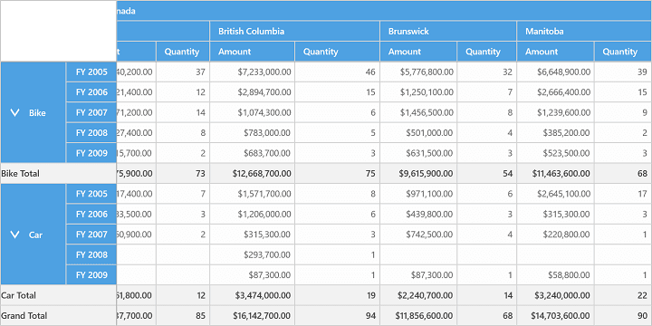

# Freeze Headers in UWP Pivot Grid (SfPivotGrid)

The SfPivotGrid provides built-in support to freeze the column and row headers. This can be achieved by setting the `FreezeHeaders` property of SfPivotGrid to `true`.

Refer to the following code snippet to enable FreezeHeaders.





<syncfusion:SfPivotGrid x:Name="PivotGrid1" **FreezeHeaders="True"**/>





// To freeze SfPivotGrid Headers
this.PivotGrid1.FreezeHeaders = true;





' To freeze SfPivotGrid Headers
Me.PivotGrid1.FreezeHeaders = True





This is illustrated in the following screenshot.

A demo sample is available in the following location.

{system drive}:\Users\&lt;User Name&gt;\AppData\Local\Syncfusion\EssentialStudio\&lt;Version Number&gt;\Samples\UWP\SampleBrowser\PivotGrid\PivotGrid\View\GettingStarted.xaml
