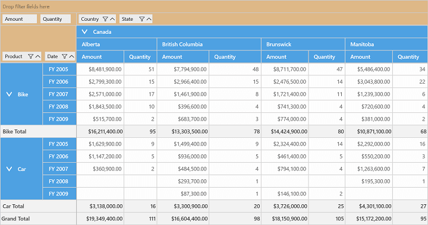
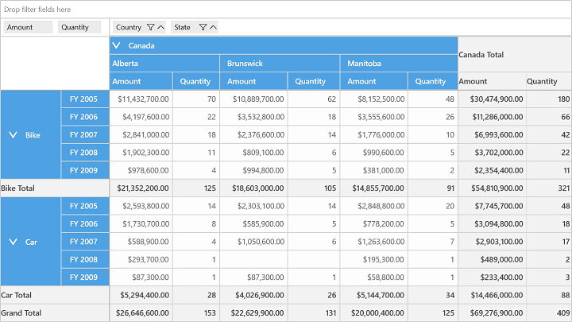
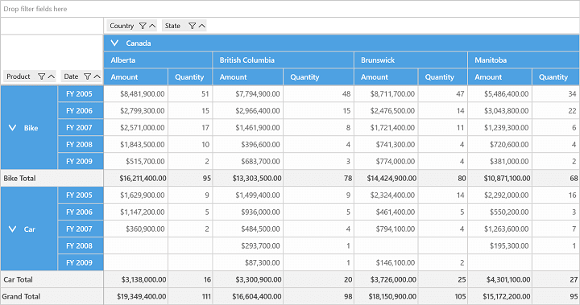
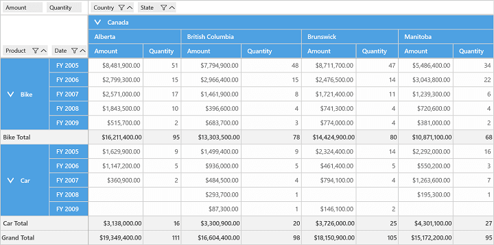

# Grouping Bar in UWP Pivot Grid (SfPivotGrid)

Grouping bar allows you to slice and dice the fields between column, row, value, and filter areas. It allows you to add, rearrange, or remove the fields to show the exact data required in the SfPivotGrid. The following are the different kinds of grouping bar available in the SfPivotGrid.

* **Filter Grouping Bar:** Holds the filter items of the SfPivotGrid control.
* **Value Grouping Bar:** Holds the value items of the SfPivotGrid control.
* **Column Grouping Bar:** Holds the column items of the SfPivotGrid control.
* **Row Grouping Bar:** Holds the row items of the SfPivotGrid control.

By default, the grouping bar is disabled in the SfPivotGrid control and it can be enabled by using the `ShowGroupingBar` property. The following code snippet defines how to enable the grouping bar.





<syncfusion:SfPivotGrid  x:Name="PivotGrid1" **ShowGroupingBar="True"**/>





this.PivotGrid1.ShowGroupingBar = true;





Me.PivotGrid1.ShowGroupingBar = True





## Grouping bar operations

The grouping bar allows you to perform sorting, filtering, and summarizing the data in the way that you want at runtime. Each grouping bar item includes the following components:

* A **caption** string is used to identify the content of the field.
* A **filter button** is used to filter the field values by users.
* A **sort indicator** is used to identify the sort order applied to field's values.
* A **remove button** is used to remove the corresponding field.

N> **Remarks:** Sorting and filtering operations are restricted for value items. Similarly, sorting operation cannot be performed for filter items.

**Filtering operation**

The filtering operation of the grouping bar can be enabled or disabled using the `EnableGroupingBarFiltering` property. The following code snippet illustrates how to hide the filtering operation.





<syncfusion:SfPivotGrid  x:Name="PivotGrid1" ShowGroupingBar="True" **EnableGroupingBarFiltering="False"**/>





this.PivotGrid1.ShowGroupingBar = true;
this.PivotGrid1.EnableGroupingBarFiltering = false;





Me.PivotGrid1.ShowGroupingBar = True
Me.PivotGrid1.EnableGroupingBarFiltering = False





**Sorting operation**

The sorting operation in the grouping bar can be enabled or disabled by using the `EnableGroupingBarSorting` property. The following code snippet shows how to disable the sorting operation.





<syncfusion:SfPivotGrid  x:Name="PivotGrid1" EnableGroupingBarSorting="False"/>





this.PivotGrid1.EnableGroupingBarSorting = false;





Me.PivotGrid1.EnableGroupingBarSorting = False





The following screenshot shows the SfPivotGrid without sorting icons.

**Removing operation**

The removing operation can be disabled by setting the `EnableGroupingBarRemoving` property to false as specified in the following code snippet. By default, it is true.





<syncfusion:SfPivotGrid  x:Name="PivotGrid1" ShowGroupingBar="True" EnableGroupingBarRemoving="False"/>





this.PivotGrid1.ShowGroupingBar = true;
this.PivotGrid1.EnableGroupingBarRemoving = false;





Me.PivotGrid1.ShowGroupingBar = True;
Me.PivotGrid1.EnableGroupingBarRemoving = False





## Grouping bar customization

**Grouping bar background**

You can customize the background color of grouping bar by using the `GroupingBarBackground` property as specified in the following code snippet.





<syncfusion:SfPivotGrid  x:Name="PivotGrid1" ShowGroupingBar="True" **GroupingBarBackground="BurlyWood"**/>





this.PivotGrid1.ShowGroupingBar = true;
this.PivotGrid1.GroupingBarBackground = new SolidColorBrush(Colors.BurlyWood);





Me.PivotGrid1.ShowGroupingBar = True
Me.PivotGrid1.GroupingBarBackground = New SolidColorBrush(Colors.BurlyWood)





**Grouping bar item background**

You can customize the background color of individual grouping bar items by defining the `GroupingBarItemBackground` property in the SfPivotGrid control.





<syncfusion:SfPivotGrid  x:Name="PivotGrid1" ShowGroupingBar="True" **GroupingBarItemBackground="BurlyWood"**/>





this.PivotGrid1.ShowGroupingBar = true;
this.PivotGrid1.GroupingBarItemBackground = new SolidColorBrush(Colors.BurlyWood);





Me.PivotGrid1.ShowGroupingBar = True
Me.PivotGrid1.GroupingBarItemBackground = New SolidColorBrush(Colors.BurlyWood)





## Disabling specific grouping bar

The SfPivotGrid supports disabling the grouping bar of specific area as illustrated below.

**Disabling row grouping bar**

The `EnableRowHeaderArea` property of the SfPivotGrid allows you to customize the visibility of grouping bar in the row header area. The following code snippet shows how to disable the row grouping bar.





<syncfusion:SfPivotGrid  x:Name="PivotGrid1" EnableRowHeaderArea="False"/>





this.PivotGrid1.EnableRowHeaderArea = false;





Me.PivotGrid1.EnableRowHeaderArea = False





**Disabling column grouping bar**

The `EnableColumnHeaderArea` property of the SfPivotGrid allows you to customize the visibility of grouping bar in the column header area. The following code snippet shows how to disable the column grouping bar.





<syncfusion:SfPivotGrid  x:Name="PivotGrid1" EnableColumnHeaderArea="False"/>





this.PivotGrid1.EnableColumnHeaderArea = false;





Me.PivotGrid1.EnableColumnHeaderArea = False





**Disabling value grouping bar**

The `EnableValueHeaderArea` property of the SfPivotGrid allows you to customize the visibility of grouping bar in the value header area. The following code snippet shows how to disable the value grouping bar.





<syncfusion:SfPivotGrid  x:Name="PivotGrid1" EnableValueHeaderArea="False"/>





this.PivotGrid1.EnableValueHeaderArea = false;





Me.PivotGrid1.EnableValueHeaderArea = False





**Disabling filter grouping bar**

The `EnableFilterHeaderArea` property of the SfPivotGrid allows you to customize the visibility of grouping bar in the filter header area. The following code snippet shows how to disable the filter grouping bar.





<syncfusion:SfPivotGrid  x:Name="PivotGrid1" EnableFilterHeaderArea="False"/>





this.PivotGrid1.EnableFilterHeaderArea = false;





Me.PivotGrid1.EnableFilterHeaderArea = False





A demo sample is available in the following location.

{system drive}:\Users\&lt;User Name&gt;\AppData\Local\Syncfusion\EssentialStudio\&lt;Version Number&gt;\Samples\UWP\SampleBrowser\PivotGrid\PivotGrid\View\GroupingBar.xaml
