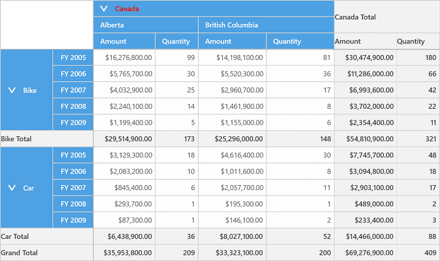
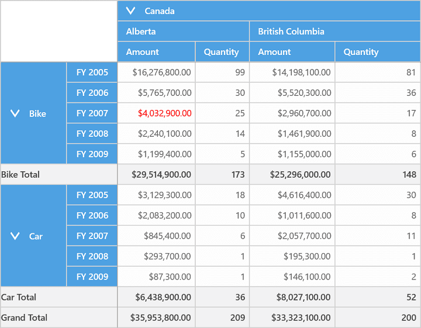
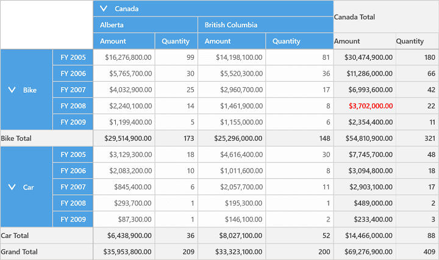
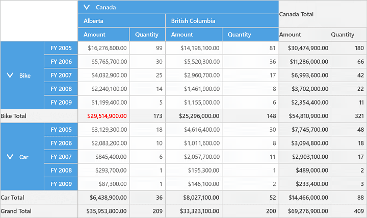

# Hyperlink Cells in UWP Pivot Grid (SfPivotGrid)

The SfPivotGrid allows hyperlinking of cells to retrieve detailed information about a particular cell. Hyperlink can be individually applied to the following cells:

* Column header cells.
* Row header cells.
* Value cells.
* Summary column cells.
* Summary row cells.

The hyperlink options can be enabled or disabled separately for column header cells, row header cells, summary column cells, summary row cells, and value cells by using the `IsHyperlinkCell` property in the `PivotGridCellStyle` class.

**Hyperlink in column header cells**

The following code snippet illustrates how to enable hyperlink in column header cells.





<syncfusion:SfPivotGrid x:Name="PivotGrid1" ItemSource="{Binding ProductSalesData}" PivotRows="{Binding PivotRows}"
                        PivotColumns="{Binding PivotColumns}" PivotCalculations="{Binding PivotCalculations}">
    <syncfusion:SfPivotGrid.ColumnHeaderStyle>
        <syncfusion:PivotGridCellStyle IsHyperlinkCell="True"/>
    </syncfusion:SfPivotGrid.ColumnHeaderStyle>
</syncfusion:SfPivotGrid>





this.PivotGrid1.ColumnHeaderStyle.IsHyperlinkCell = true;





Me.PivotGrid1.ColumnHeaderStyle.IsHyperlinkCell = True





**Hyperlink in row header cells**

The following code snippet illustrates how to enable the hyperlink in row header cells.





<syncfusion:SfPivotGrid x:Name="PivotGrid1" ItemSource="{Binding ProductSalesData}" PivotRows="{Binding PivotRows}"
                        PivotColumns="{Binding PivotColumns}" PivotCalculations="{Binding PivotCalculations}">
    <syncfusion:SfPivotGrid.RowHeaderStyle>
        <syncfusion:PivotGridCellStyle IsHyperlinkCell="True"/>
    </syncfusion:SfPivotGrid.RowHeaderStyle>
</syncfusion:SfPivotGrid>





this.PivotGrid1.RowHeaderStyle.IsHyperlinkCell = true;





Me.PivotGrid1.RowHeaderStyle.IsHyperlinkCell = True





**Hyperlink in value cells**

The following code snippet illustrates how to enable the hyperlink in value cells.





<syncfusion:SfPivotGrid x:Name="PivotGrid1" ItemSource="{Binding ProductSalesData}" PivotRows="{Binding PivotRows}"
                        PivotColumns="{Binding PivotColumns}" PivotCalculations="{Binding PivotCalculations}">
    <syncfusion:SfPivotGrid.ValueCellStyle>
        <syncfusion:PivotGridCellStyle IsHyperlinkCell="True"/>
    </syncfusion:SfPivotGrid.ValueCellStyle>
</syncfusion:SfPivotGrid>





this.PivotGrid1.ValueCellStyle.IsHyperlinkCell = true;





Me.PivotGrid1.ValueCellStyle.IsHyperlinkCell = True





**Hyperlink in summary column cells**

The following code snippet illustrates how to enable the hyperlink in summary column cells.





<syncfusion:SfPivotGrid x:Name="PivotGrid1" ItemSource="{Binding ProductSalesData}" PivotRows="{Binding PivotRows}"
                        PivotColumns="{Binding PivotColumns}" PivotCalculations="{Binding PivotCalculations}">
    <syncfusion:SfPivotGrid.SummaryColumnStyle>
        <syncfusion:PivotGridCellStyle IsHyperlinkCell="True"/>
    </syncfusion:SfPivotGrid.SummaryColumnStyle>
</syncfusion:SfPivotGrid>





this.PivotGrid1.SummaryColumnStyle.IsHyperlinkCell = true;





Me.PivotGrid1.SummaryColumnStyle.IsHyperlinkCell = True





**Hyperlink in summary row cells**

The following code snippet illustrates how to enable hyperlink in summary row cells.





<syncfusion:SfPivotGrid x:Name="PivotGrid1" ItemSource="{Binding ProductSalesData}" PivotRows="{Binding PivotRows}"
                        PivotColumns="{Binding PivotColumns}" PivotCalculations="{Binding PivotCalculations}">
    <syncfusion:SfPivotGrid.SummaryRowStyle>
        <syncfusion:PivotGridCellStyle IsHyperlinkCell="True"/>
    </syncfusion:SfPivotGrid.SummaryRowStyle>
</syncfusion:SfPivotGrid>





this.PivotGrid1.SummaryRowStyle.IsHyperlinkCell = true;





Me.PivotGrid1.SummaryRowStyle.IsHyperlinkCell = True





A demo sample is available in the following location.

{system drive}:\Users\&lt;User Name&gt;\AppData\Local\Syncfusion\EssentialStudio\&lt;Version Number&gt;\Samples\UWP\SampleBrowser\PivotGrid\PivotGrid\View\Hyperlink.xaml
