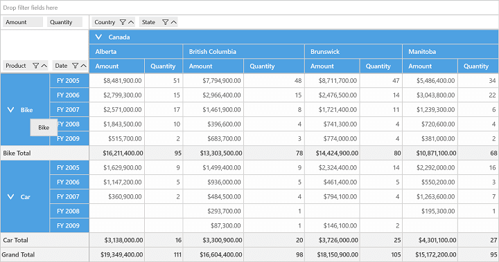
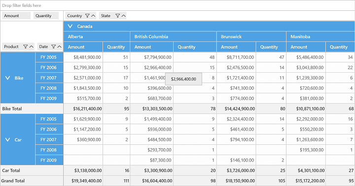

# Tooltip in UWP Pivot Grid (SfPivotGrid)

The SfPivotGrid additionally displays the cell information within a tooltip when the mouse pointer is moved over header cells or value cells.

## Header cell tooltip

The SfPivotGrid provides information about header cells when the mouse pointer is moved over it. Tooltip over header cells can be enabled by setting the `ShowHeaderCellsToolTip` property of the SfPivotGrid to `true` as shown in the following code snippet.





<syncfusion:SfPivotGrid x:Name="PivotGrid1" ShowHeaderCellsToolTip="True"/>





this.PivotGrid1.ShowHeaderCellsToolTip = true;





Me.PivotGrid1.ShowHeaderCellsToolTip = True





## Value cell tooltip

The SfPivotGrid provides information about value cells when the mouse pointer is moved over it. Tooltip over value cells can be enabled by setting the `ShowValueCellToolTip` property of the SfPivotGrid to `true` as shown in the following code snippet.





<syncfusion:SfPivotGrid x:Name="PivotGrid1" ShowValueCellToolTip="True"/>





this.PivotGrid1.ShowValueCellToolTip = true;





Me.PivotGrid1.ShowValueCellToolTip = True





A demo sample is available in the following location.

{system drive}:\Users\&lt;User Name&gt;\AppData\Local\Syncfusion\EssentialStudio\&lt;Version Number&gt;\Samples\UWP\SampleBrowser\PivotGrid\PivotGrid\View\GettingStarted.xaml
