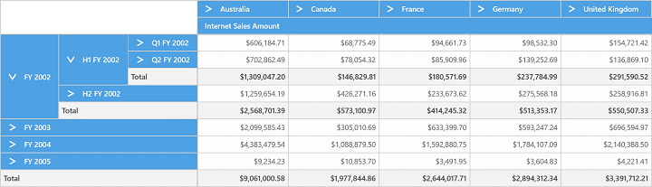
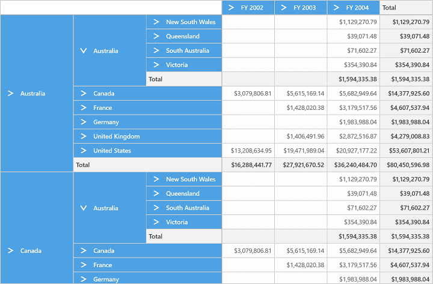
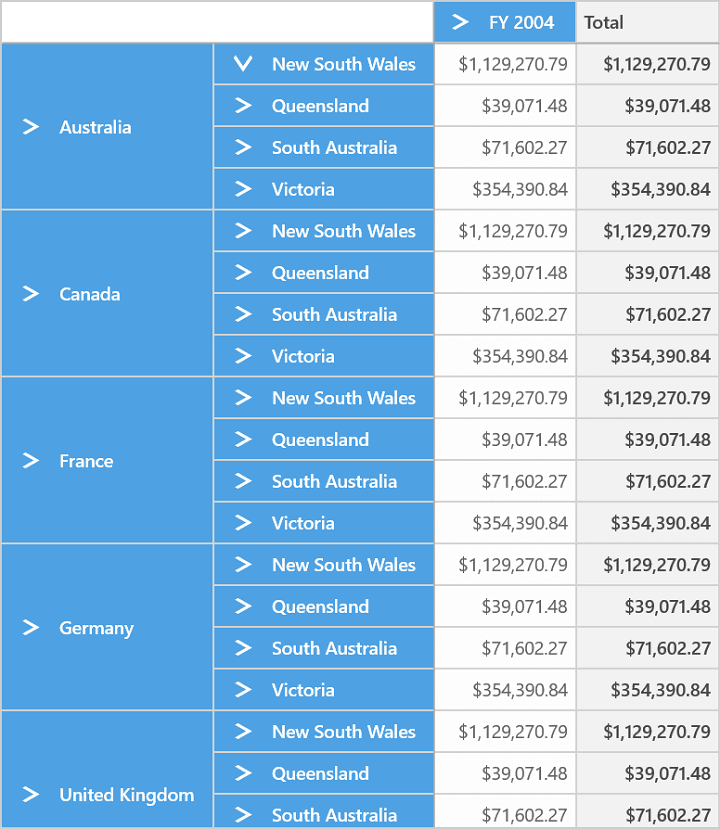
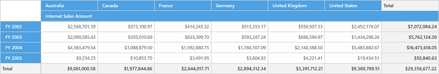

# Drill Operation in UWP Pivot Grid (SfPivotGrid)

## Drill down/Drill up

This is a basic feature of the SfPivotGrid through which the amount of information can be limited for a better view. It allows you to drill down to access the detailed level of data or drill up to see the summarized data by using the expander present in grid cells.

Drill up, also called as roll up; it navigates from more detailed data to less detailed data by climbing up a concept hierarchy for a dimension.

Drill down, also called as roll down; it is the reverse of drill up which navigates from less detailed data to more detailed data by climbing down the concept hierarchy for the dimension.

While binding hierarchical dimensions (for example, the time dimension includes 3 levels namely year, quarter, and month), the SfPivotGrid allows you to visualize the data for different levels by using the collapsible labels which is illustrated in the following screenshot.

## Drill types

The following drill types are supported in the SfPivotGrid:

* Drill member
* Drill position
* Drill replace

**Drill member**

The drill member is the default drilling type performed in the SfPivotGrid. When multiple dimensions are added in the grid, expanding a single member expands the corresponding member element across all of its positions. The following code snippet and screenshot illustrates how the elements are drilled in the drill member type.





pivotGrid1.OlapDataManager.CurrentReport.DrillType = DrillType.DrillMember;





pivotGrid1.OlapDataManager.CurrentReport.DrillType = DrillType.DrillMember





**Drill position**

The drill position type enables users to drill only the current position of the selected member in the OLAP report. This excludes the drilled data of the selected member in other positions by using an MDX query. The following code snippet and screenshot illustrate how the elements are drilled in the drill position type.





pivotGrid1.OlapDataManager.CurrentReport.DrillType = DrillType.DrillPosition;





pivotGrid1.OlapDataManager.CurrentReport.DrillType = DrillType.DrillPosition





**Drill replace**

The SfPivotGrid supports drill replace type, in which the control tends to display only the immediate child members and ancestors on drill-down. The following code snippet and screenshot illustrate how the elements are drilled in the drill replace type.





pivotGrid1.OlapDataManager.CurrentReport.DrillType = DrillType.DrillReplace;





pivotGrid1.OlapDataManager.CurrentReport.DrillType = DrillType.DrillReplace





N> The drilled-down member will be replaced with drilled data and it cannot be drilled-up.

N> Since the `DrillType` property interacts with `OlapDataManager`, you should call the `DataBind()` method of the SfPivotGrid after assigning the value to this property.

## Show/hide expanders

The expander refers to the arrow sign prior to the member present in grid cells. The visibility of expanders in the SfPivotGrid can be toggled with the help of `ShowExpanders` property available in the OLAP report.

Refer to the following code snippet to disable expanders in the SfPivotGrid.





pivotGrid1.OlapDataManager.CurrentReport.ShowExpanders = false;





pivotGrid1.OlapDataManager.CurrentReport.ShowExpanders = False





N> Since the `ShowExpanders` property interacts with the `OlapDataManager`, you should call the `DataBind()` method of the SfPivotGrid after assigning the value to this property.
