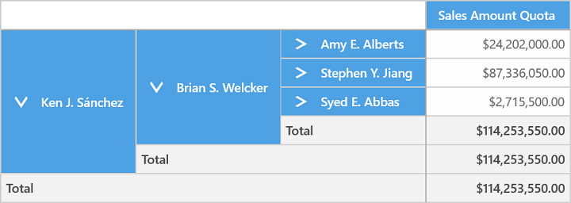

# Member Properties in UWP Pivot Grid (SfPivotGrid)

The SfPivotGrid allows binding of members along with their properties. Member properties cover the basic information about each member in each tuple. This basic information includes the member name, parent level, number of children, and so on. Member properties are available for all members at a given level.

To display the member properties along with the dimension member, the OLAP report requires member properties defined in the concerned dimension element. The grid layout should be set to “ExcelLikeLayoutWithMemberProperties” as specified in the following code snippet.





<syncfusion:SfPivotGrid x:Name="PivotGrid1" Layout="ExcelLikeLayoutWithMemberProperties"
                        OlapDataManager="{Binding OlapDataManager}">
</syncfusion:SfPivotGrid>





OlapReport olapReport = new OlapReport();
// Specifying the current cube name
olapReport.CurrentCubeName = "Adventure Works";
MeasureElements measureElementColumn = new MeasureElements();
// Specifying the Name for the Measure Element
measureElementColumn.Elements.Add(new MeasureElement { Name = "Sales Amount Quota" });
DimensionElement dimensionElementRow = new DimensionElement();
// Specifying the Dimension Name
dimensionElementRow.Name = "Employee";
// Specifying the Hierarchy and level name for the Dimension Element
dimensionElementRow.AddLevel("Employees", "Employee Level 02");
dimensionElementRow.Hierarchy.LevelElements["Employee Level 02"].IncludeAvailableMembers = true;
// Adding the Member properties to the Dimension Element
dimensionElementRow.MemberProperties.Add(new MemberProperty("Title", "[Employee].[Employees].[Title]"));
dimensionElementRow.MemberProperties.Add(new MemberProperty("Phone", "[Employee].[Employees].[Phone]"));
dimensionElementRow.MemberProperties.Add(new MemberProperty("Email Address", "[Employee].[Employees].[Email Address]"));

DimensionElement dimensionElementColumn = new DimensionElement();
// Specifying the Dimension Name
dimensionElementColumn.Name = "Product";
// Specifying the Hierarchy and level name for the Dimension Element
dimensionElementColumn.AddLevel("Product Categories", "Category");
dimensionElementColumn.MemberProperties.Add(new MemberProperty("Dealer Price", "[Product].[Product Categories].[Dealer Price]"));
dimensionElementColumn.MemberProperties.Add(new MemberProperty("Standard Cost", "[Product].[Product Categories].[Standard Cost]"));
// Adding Row Members
olapReport.SeriesElements.Add(dimensionElementRow);
///Adding Column Members
olapReport.CategoricalElements.Add(measureElementColumn);
PivotGrid1.OlapDataManager.SetCurrentReport(olapReport);





Dim olapReport As New OlapReport()
' Selecting the Cube
olapReport.CurrentCubeName = "Adventure Works"
Dim measureElements As New MeasureElements()
' Specifying the Name for Measure Element
measureElements.Add(New MeasureElement With {.Name = " Sales Amount Quota"})
Dim dimensionElementRow As New DimensionElement()
' Specifying the Name for Row Dimension Element
dimensionElementRow.Name = "Employee"
' Specifying the Level element
dimensionElementRow.AddLevel("Employees", "Employee Level 02")
dimensionElementRow.Hierarchy.LevelElements["Employee Level 02"].IncludeAvailableMembers = true;
' Adding the Member properties to the Dimension Element
dimensionElementRow.MemberProperties.Add(new MemberProperty("Title", "[Employee].[Employees].[Title]"));
dimensionElementRow.MemberProperties.Add(new MemberProperty("Phone", "[Employee].[Employees].[Phone]"));
dimensionElementRow.MemberProperties.Add(new MemberProperty("Email Address", "[Employee].[Employees].[Email Address]"));

Dim dimensionElementColumn As New DimensionElement()
' Specifying the Name for Column Dimension Element
dimensionElementColumn.Name = "Product";
' Specifying the Level element
dimensionElementColumn.AddLevel("Product Categories", "Category");
dimensionElementColumn.MemberProperties.Add(new MemberProperty("Dealer Price", "[Product].[Product Categories].[Dealer Price]"));
dimensionElementColumn.MemberProperties.Add(new MemberProperty("Standard Cost", "[Product].[Product Categories].[Standard Cost]"));
' Adding Row Elements
olapReport.SeriesElements.Add(dimensionElementRow)
' Adding Column Elements
olapReport.CategoricalElements.Add(measureElements)
Return olapReport
PivotGrid1.OlapDataManager.SetCurrentReport(olapReport)





A demo sample is available in the following location.

{system drive}:\Users\&lt;User Name&gt;\AppData\Local\Syncfusion\EssentialStudio\&lt;Version Number&gt;\Samples\UWP\SampleBrowser\PivotGrid\PivotGrid\View\MemberProperties.xaml
