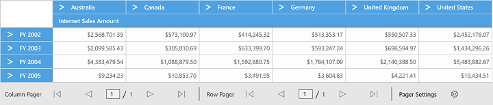

# Paging in UWP Pivot Grid (SfPivotGrid)

The SfPivotGrid supports loading and rendering the large amount of data without any performance constraint. The following code snippet illustrates the paging using the current OLAP report.

The SfPivotPager (custom control) is included and bound with the "OlapDataManager" of the respective SfPivotGrid. To enable paging, set the `EnablePaging` property of "OlapDataManager" to true.

When you process a large CellSet, it is split into several segments and each segment is assigned and rendered in a separate page. You can navigate back and forth in all possible ways by using the UI options, and you can change the page size and page number dynamically with the help of settings available in the SfPivotPager.

N> The assembly **Syncfusion.SfPivotShared.UWP** should be included from the installed location to add the SfPivotPager with SfPivotGrid. You can also get the assemblies by browsing the default assembly location i.e., {System Drive}:\Program Files (x86)\Syncfusion\Essential Studio\<version number>\Assemblies for Universal Windows\10.0\





<Grid Background="{ThemeResource ApplicationPageBackgroundThemeBrush}">
    <Grid.DataContext>
        <local:ViewModel/>
    </Grid.DataContext>

    <Grid.RowDefinitions>
        <RowDefinition Height="*"/>
        <RowDefinition Height="Auto"/>
    </Grid.RowDefinitions>

    <pivotGrid:SfPivotGrid x:Name="PivotGrid1" OlapDataManager="{Binding OlapDataManager}"/>

    <pivotShared:SfPivotPager Grid.Row="1" OlapDataManager="{Binding OlapDataManager}"/>
</Grid>





private void PivotGrid1_Loaded(object sender, Windows.UI.Xaml.RoutedEventArgs e)
{
    PivotGrid1.OlapDataManager.CurrentReport.EnablePaging = true;
    PivotGrid1.OlapDataManager.CurrentReport.PagerOptions.CategoricalPageSize = 5;
    PivotGrid1.OlapDataManager.CurrentReport.PagerOptions.SeriesPageSize = 5;
    PivotGrid1.OlapDataManager.RaiseGetOlapDataWithTotalCount(new GetOlapDataWithTotalCountEventArgs
    {
        SerializedReport = Syncfusion.Olap.UWP.Common.Common.SerializeObject(PivotGrid1.OlapDataManager.CurrentReport)
    });
    PivotGrid1.OlapDataManager.NotifyElementChanged();
}





Private Sub PivotGrid1_Loaded(sender As Object, e As Windows.UI.Xaml.RoutedEventArgs)
PivotGrid1.OlapDataManager.CurrentReport.EnablePaging = True
PivotGrid1.OlapDataManager.CurrentReport.PagerOptions.CategoricalPageSize = 5
PivotGrid1.OlapDataManager.CurrentReport.PagerOptions.SeriesPageSize = 5
PivotGrid1.OlapDataManager.RaiseGetOlapDataWithTotalCount(New GetOlapDataWithTotalCountEventArgs() With { _
    Key .SerializedReport = Syncfusion.Olap.UWP.Common.Common.SerializeObject(PivotGrid1.OlapDataManager.CurrentReport) _
})
PivotGrid1.OlapDataManager.NotifyElementChanged()
End Sub





