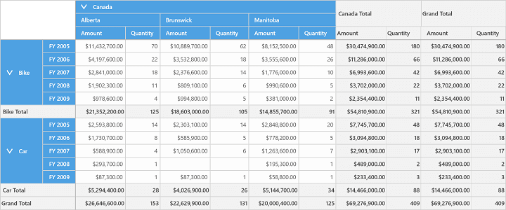
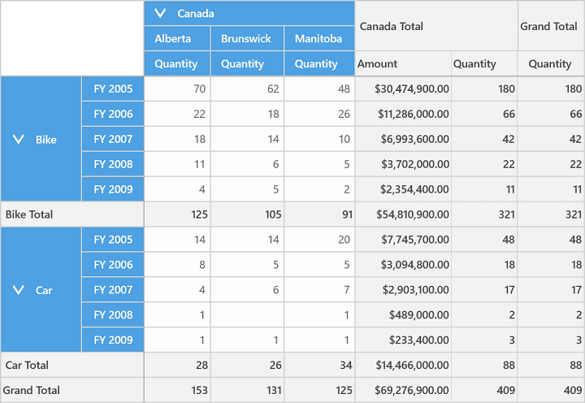
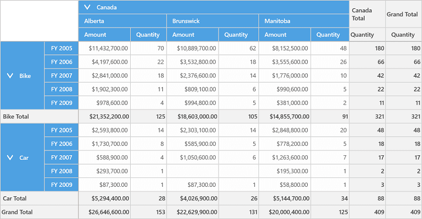
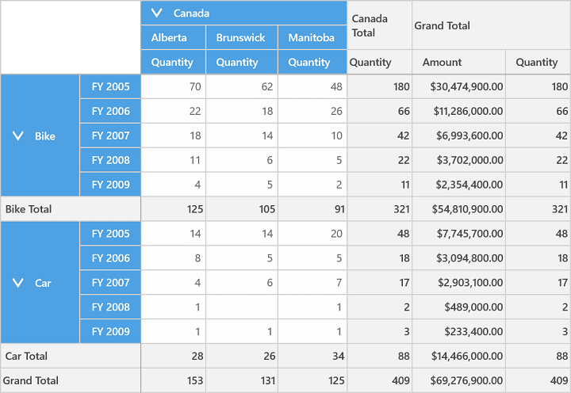
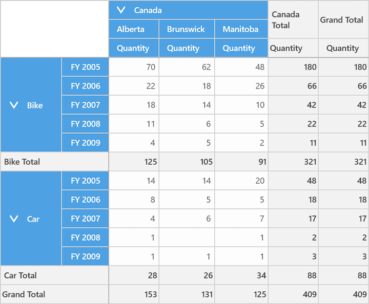

# Display Options in UWP Pivot Grid (SfPivotGrid)

The SfPivotGrid control provides support for PivotComputationInfo to display calculation values in preferred areas of the SfPivotGrid with the help of `DisplayOption` property. The following are the different types of display options available in the SfPivotGrid.

**All option**

This option displays all the calculation values in all columns of the SfPivotGrid. Refer to the following code snippet.





<syncfusion:SfPivotGrid Name="PivotGrid1" ItemSource="{Binding ProductSalesData}"
                        PivotRows="{Binding PivotRows}" PivotColumns="{Binding PivotColumns}">
    <syncfusion:SfPivotGrid.PivotCalculations>
        <pivotanalysis:PivotComputationInfo CalculationName="Total" FieldName="Amount" DisplayOption="All"/>
    </syncfusion:SfPivotGrid.PivotCalculations>
</syncfusion:SfPivotGrid>





PivotGrid1.PivotCalculations[0].DisplayOption = DisplayOption.All;





pivotGrid.PivotCalculations(0).DisplayOption = DisplayOption.All





**Summary option**

The summary option is used to display only the calculation values in summary columns of the SfPivotGrid.





<syncfusion:SfPivotGrid Name="PivotGrid1" ItemSource="{Binding ProductSalesData}"
                        PivotRows="{Binding PivotRows}" PivotColumns="{Binding PivotColumns}">
    <syncfusion:SfPivotGrid.PivotCalculations>
        <pivotanalysis:PivotComputationInfo CalculationName="Total" FieldName="Amount" DisplayOption="Summary"/>
    </syncfusion:SfPivotGrid.PivotCalculations>
</syncfusion:SfPivotGrid>





PivotGrid1.PivotCalculations[0].DisplayOption = DisplayOption.Summary;





pivotGrid.PivotCalculations(0).DisplayOption = DisplayOption.Summary





**Calculations option**

The calculation option displays only the calculation values in value columns other than summary and grand total values of the SfPivotGrid.





<syncfusion:SfPivotGrid Name="PivotGrid1" ItemSource="{Binding ProductSalesData}"
                        PivotRows="{Binding PivotRows}" PivotColumns="{Binding PivotColumns}">
    <syncfusion:SfPivotGrid.PivotCalculations>
        <pivotanalysis:PivotComputationInfo CalculationName="Total" FieldName="Amount" DisplayOption="Calculations"/>
    </syncfusion:SfPivotGrid.PivotCalculations>
</syncfusion:SfPivotGrid>





PivotGrid1.PivotCalculations[0].DisplayOption = DisplayOption.Calculations;





pivotGrid.PivotCalculations(0).DisplayOption = DisplayOption.Calculations





**GrandTotal option**

The grand total option is used to display only the calculation values in grand total columns of the SfPivotGrid.





<syncfusion:SfPivotGrid Name="PivotGrid1" ItemSource="{Binding ProductSalesData}"
                        PivotRows="{Binding PivotRows}" PivotColumns="{Binding PivotColumns}">
    <syncfusion:SfPivotGrid.PivotCalculations>
        <pivotanalysis:PivotComputationInfo CalculationName="Total" FieldName="Amount" DisplayOption="GrandTotal"/>
    </syncfusion:SfPivotGrid.PivotCalculations>
</syncfusion:SfPivotGrid>





PivotGrid1.PivotCalculations[0].DisplayOption = DisplayOption.GrandTotal;





pivotGrid.PivotCalculations(0).DisplayOption = DisplayOption.GrandTotal





**None option**

This option hides all the calculation values in all columns of the SfPivotGrid.





<syncfusion:SfPivotGrid Name="PivotGrid1" ItemSource="{Binding ProductSalesData}"
                        PivotRows="{Binding PivotRows}" PivotColumns="{Binding PivotColumns}">
    <syncfusion:SfPivotGrid.PivotCalculations>
        <pivotanalysis:PivotComputationInfo CalculationName="Total" FieldName="Amount" DisplayOption="None"/>
    </syncfusion:SfPivotGrid.PivotCalculations>
</syncfusion:SfPivotGrid>





PivotGrid1.PivotCalculations[0].DisplayOption = DisplayOption.None;





pivotGrid.PivotCalculations(0).DisplayOption = DisplayOption.None





A demo sample is available in the following location.

{system drive}:\Users\&lt;User Name&gt;\AppData\Local\Syncfusion\EssentialStudio\&lt;Version Number&gt;\Samples\UWP\SampleBrowser\PivotGrid\PivotGrid\View\SummaryDisplay.xaml
