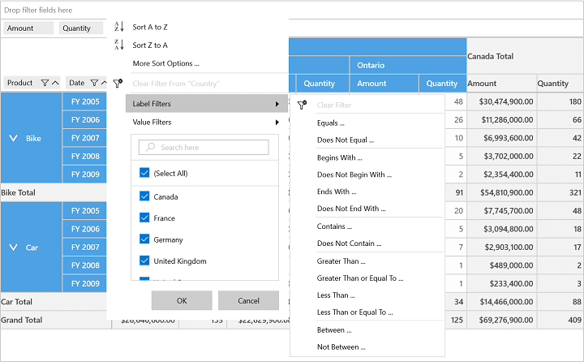
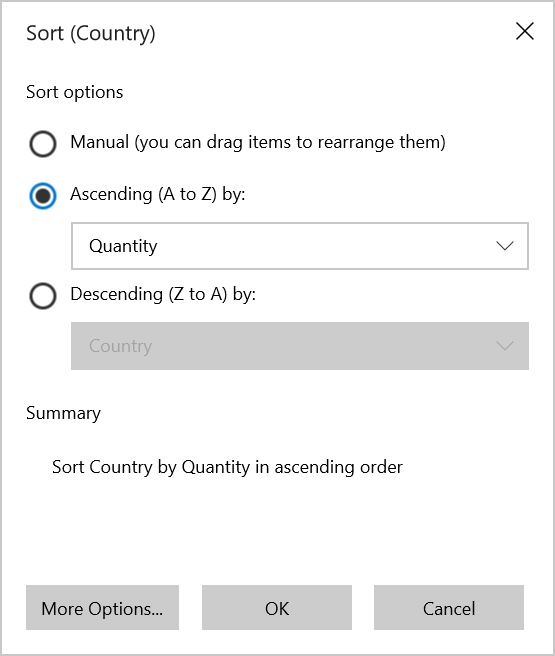
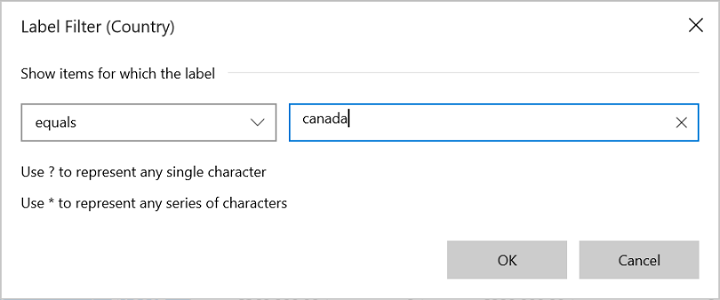
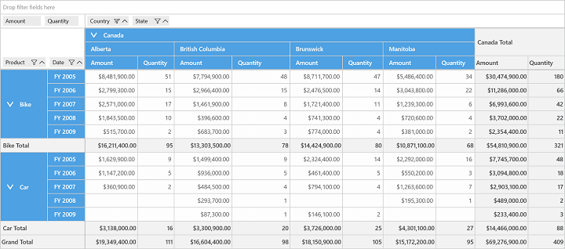
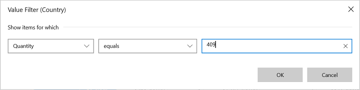

# Excel-Like Filtering and Sorting in UWP Pivot Grid (SfPivotGrid)

The SfPivotGrid control supports Excel-like filtering and sorting applied to a pivot item. You can enable or disable the Excel-like sorting and filtering support by setting the `AllowMultiFunctionalSortFilter` property in the SfPivotGrid.

Refer to the following code snippet to enable Excel-like filtering and sorting.





<syncfusion:SfPivotGrid x:Name="PivotGrid1" **AllowMultiFunctionalSortFilter="True"**/>





this.PivotGrid1.AllowMultiFunctionalSortFilter = true;





Me.PivotGrid1.AllowMultiFunctionalSortFilter = True





## Multi-functional features

**Sort A to Z**

It is used to sort the corresponding pivot item in the ascending order.

**Sort Z to A**

It is used to sort the corresponding pivot item in the descending order.

**More sort options**

It is used to sort the corresponding pivot item based on the grand total of the pivot calculation field.

**Clear filters**

It is used to clear all the filter changes applied to the corresponding pivot item and bring back the SfPivotGrid to normal state.

**Label filters**

It is used to filter the SfPivotGrid based on the labels of pivot item field and it can be achieved by using various options listed below:

* Equals.
* Does not equal.
* Begins with.
* Does not begin with.
* Ends with.
* Does not end with.
* Contains.
* Does not contain.
* Greater than.
* Greater than or equal to.
* Less than.
* Less than or equal to.
* Between.
* Not between.

_Label Filter pop-up for filtering "Canada" in Country_

_SfPivotGrid applied with Label Filter_

**Value filters**

It is used to filter the SfPivotGrid based on the values of pivot item field and it can be achieved by using various options listed below:

* Equals.
* Does not equal.
* Greater than.
* Greater than or equal to.
* Less than.
* Less than or equal to.
* Between.
* Not between.
* Top 10.

_Value Filter pop-up for filtering "Canada" using its Quantity value "409"_

_SfPivotGrid applied with Value Filter_

A demo sample is available in the following location.

{system drive}:\Users\&lt;User Name&gt;\AppData\Local\Syncfusion\EssentialStudio\&lt;Version Number&gt;\Samples\UWP\SampleBrowser\PivotGrid\PivotGrid\View\SummaryDisplay.xaml
