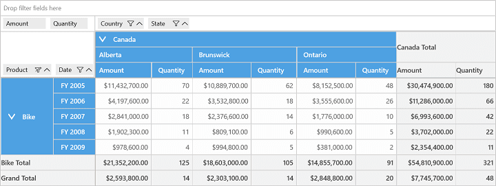
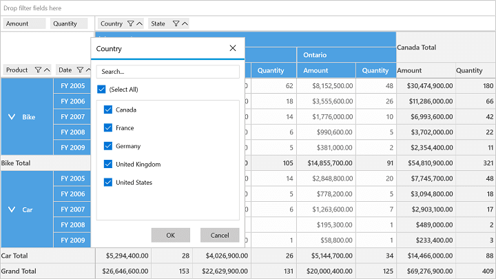

# Filtering in UWP Pivot Grid (SfPivotGrid)

Filtering support displays only a subset of data that meets the specific criteria. You can specify and hide the data that you do not want to display. Filters are automatically reapplied every time when the SfPivotGrid is refreshed or updated until you remove those filters. In SfPivotGrid, filters are additive, which means that each additional filter is based on the current filter and further it reduces the subset of data. You can apply 'n' number of filtering conditions to the SfPivotGrid at a time. To apply filter, an instance of **FilterExpression** has to be created and the data will be filtered based on that specification.

## Filtering using filter expression

**Filter expression** encapsulates the information that are required to define the filter. It contains the following properties:

* **Expression**: Defines the logical expression.
* **Name**: Specifies the name of filter expression.
* **DimensionName**: Specifies the dimension name for filter expression.
* **DimensionHeader**: Specifies the dimension header for filter expression.
* **Format**: Specifies the format of filter expression.
* **Evaluator**: Evaluates the specified value.

The following code snippet illustrates how to apply filtering with the help of filter expression.





<syncfusion:SfPivotGrid Name="PivotGrid1" ItemSource="{Binding ProductSalesData}" PivotAxis="{Binding PivotAxis}"
                        PivotLegend="{Binding PivotLegend}" PivotCalculations="{Binding PivotCalculations}">
    <syncfusion:SfPivotGrid.Filters>
        <syncfusion:FilterExpression DimensionHeader="Product" DimensionName="Product" Name="Product" Expression="Product = Bike" />
    </syncfusion:SfPivotGrid.Filters>
</syncfusion:SfPivotGrid>





FilterExpression filterExpression = new FilterExpression()
{
    DimensionHeader = "Product", Name = "Product", DimensionName = "Product", Expression = "Product = Bike"
};
PivotGrid1.Filters.Add(filterExpression);





Dim filterExpression As New FilterExpression() With { _
	Key .DimensionHeader = "Product", _
	Key .Name = "Product", _
	Key .DimensionName = "Product", _
	Key .Expression = "Product = Bike" _
}
PivotGrid1.Filters.Add(filterExpression)





## Filtering using filter editor

Filtering can also be applied to the SfPivotGrid control at runtime with the help of **Filter Editor**. The filter editor can be opened by clicking the filter icon present in the grouping bar item. The filter editor contains the filter list through which the items can be unchecked to apply filter dynamically. For unchecked items, a FilterExpression is internally created to apply filtering on the SfPivotGrid control.

