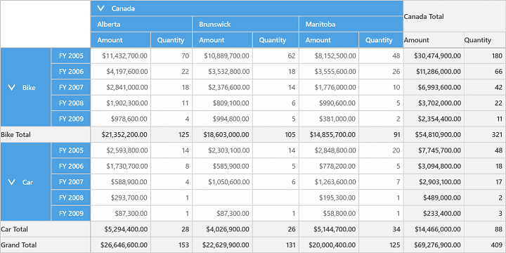
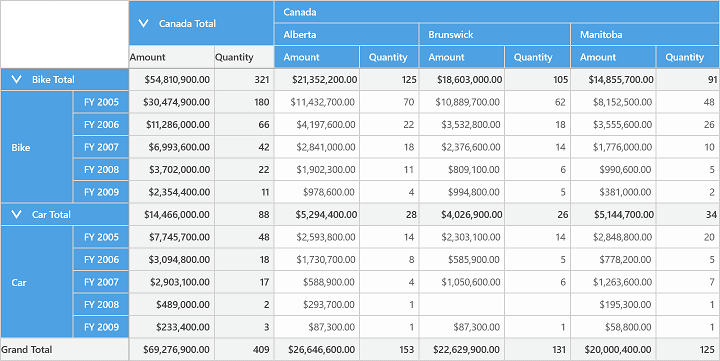

# Grid Layout in UWP Pivot Grid (SfPivotGrid)

The position of summary cells in the SfPivotGrid can be customized with the help of `GridLayout` property. It can be positioned at the top or bottom of value cells.

The following are the two different types of layouts supported by the SfPivotGrid:

* Normal layout
* Top summary layout

**Normal layout**

The normal layout is the default layout of SfPivotGrid, in which the summary cells are positioned at the bottom of value cells. Refer to the following code snippet to customize the grid layout.





 <syncfusion:SfPivotGrid Name="PivotGrid1" GridLayout="Normal"
                         ItemSource="{Binding ProductSalesData}" PivotAxis="{Binding PivotAxis}"
                         PivotLegend="{Binding PivotLegend}" PivotCalculations="{Binding PivotCalculations}"/>





this.PivotGrid1.GridLayout = GridLayout.Normal;





Me.PivotGrid1.GridLayout = GridLayout.Normal





**Top summary layout**

In top summary layout, the summary cells are positioned at the beginning of value cells. The following code snippet illustrates how to set the top summary layout in the SfPivotGrid.





 <syncfusion:SfPivotGrid Name="PivotGrid1" GridLayout="TopSummary"
                         ItemSource="{Binding ProductSalesData}" PivotAxis="{Binding PivotAxis}"
                         PivotLegend="{Binding PivotLegend}" PivotCalculations="{Binding PivotCalculations}"/>





this.PivotGrid1.GridLayout = GridLayout.TopSummary;





Me.PivotGrid1.GridLayout = GridLayout.TopSummary





A demo sample is available in the following location.

{system drive}:\Users\&lt;User Name&gt;\AppData\Local\Syncfusion\EssentialStudio\&lt;Version Number&gt;\Samples\UWP\SampleBrowser\PivotGrid\PivotGrid\View\Relational.xaml
