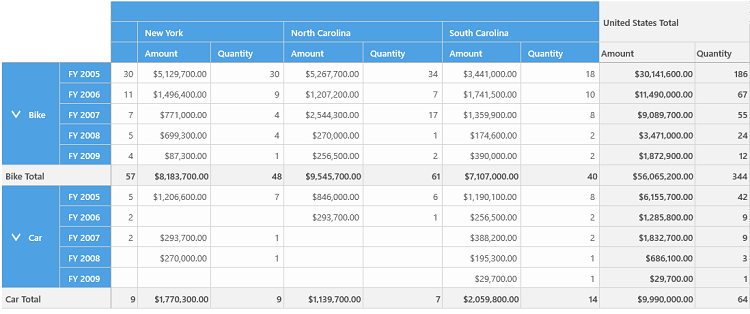

# Hiding Grand Totals in UWP Pivot Grid

You can hide the grand total values of the pivot grid control by setting the `ShowGrandTotals` property to false. By default, the pivot grid displays the grand total values of both rows and columns.

Refer to the following code sample to hide the grand total values of the pivot grid control.





<pivotGrid:SfPivotGrid x:Name="pivotGrid1" ShowGrandTotals="False" />





this.pivotGrid1.ShowGrandTotals = false;





Me.pivotGrid1.ShowGrandTotals = False





