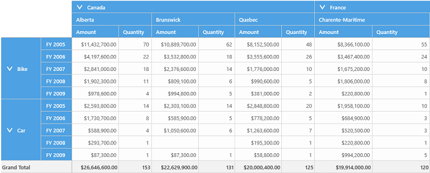
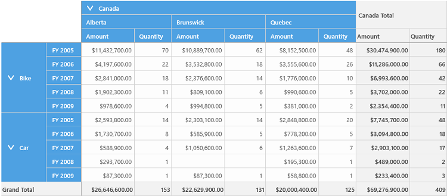
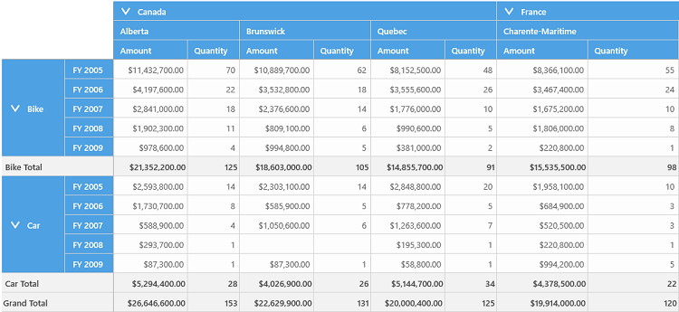
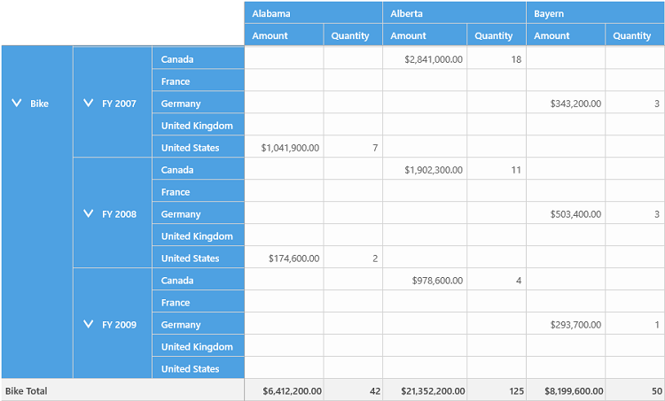

# Hiding Subtotals

The pivot grid control provides support to show or hide its subtotal values. This support allows users to have an abstract view of the data. The following levels of hiding are supported in the pivot grid control.

* Hiding all the subtotals.
* Hiding only the row subtotals.
* Hiding only the column subtotals.
* Hiding the subtotals for the specific pivot item.

## Hiding all the subtotals

The subtotal values of both pivot rows and pivot columns can be hidden by using the [ShowSubTotals](https://help.syncfusion.com/cr/wpf/Syncfusion.Windows.Controls.PivotGrid.PivotGridControl.html#Syncfusion_Windows_Controls_PivotGrid_PivotGridControl_ShowSubTotals) property. Refer to the following code sample to hide all the subtotal values in the pivot grid.





<pivotGrid:SfPivotGrid x:Name="pivotGrid1" ItemSource="{Binding ProductSalesData}" ShowSubTotals="False">
</pivotGrid:SfPivotGrid>





this.pivotGrid1.ShowSubTotals = false;





Me.pivotGrid1.ShowSubTotals = False





## Hiding only the row subtotals

The subtotal values of pivot rows can only be hidden by using the [ShowRowSubTotals](https://help.syncfusion.com/cr/wpf/https://help.syncfusion.com/wpf/welcome-to-syncfusion-essential-wpf#Syncfusion_Windows_Controls_PivotGrid_PivotGridControl_ShowRowSubTotals) property. Refer to the following code sample to hide only the subtotal values of pivot rows in the pivot grid.





<pivotGrid:SfPivotGrid x:Name="pivotGrid1" ItemSource="{Binding ProductSalesData}" ShowRowSubTotals="False">
</pivotGrid:SfPivotGrid>





this.pivotGrid1.ShowRowSubTotals = false;





Me.pivotGrid1.ShowRowSubTotals = False





## Hiding only the column subtotals 

The subtotal values of pivot columns can only be hidden by using the [ShowColumnSubTotals](https://help.syncfusion.com/cr/wpf/https://help.syncfusion.com/wpf/welcome-to-syncfusion-essential-wpf#Syncfusion_Windows_Controls_PivotGrid_PivotGridControl_ShowColumnSubTotals) property. Refer to the following code sample to hide only the subtotal values of pivot columns in the pivot grid.





<pivotGrid:SfPivotGrid x:Name="pivotGrid1" ItemSource="{Binding ProductSalesData}" ShowColumnSubTotals="False">
</pivotGrid:SfPivotGrid>





this.pivotGrid1.ShowColumnSubTotals = false;





Me.pivotGrid1.ShowColumnSubTotals = False





## Hiding the subtotals for specific pivot item

This can be achieved by setting the [ShowSubTotal](https://help.syncfusion.com/cr/wpf/Syncfusion.PivotAnalysis.Base.PivotItem.html#Syncfusion_PivotAnalysis_Base_PivotItem_ShowSubTotal) property to false for the specific pivot item. Refer to the following code sample to hide the subtotal values of "Date" pivot item.

N>
If the `ShowSubTotals` property of pivot grid control is set to false, then hiding the subtotals of specific pivot item will do nothing.





<pivotitem:PivotItem FieldHeader="Date" FieldMappingName="Date" TotalHeader="Total" ShowSubTotal="False"/>
    




this.pivotGrid1.PivotRows.Add(new PivotItem { FieldHeader = "Date", FieldMappingName = "Date", TotalHeader = "Total", ShowSubTotal = false });





pivotGrid.PivotRows.Add(New PivotItem() With { _
    Key .FieldHeader = "Date", _
    Key .FieldMappingName = "Date", _
    Key .TotalHeader = "Total", _
    Key .ShowSubTotal = False _
})





A demo sample is available in the following location.
    
{System Drive}:\Users\Public\Documents\Syncfusion\Universal Windows&lt;Version Number&gt;\SampleBrowser\PivotGrid\PivotGrid\View\TotalsHiding.xaml
