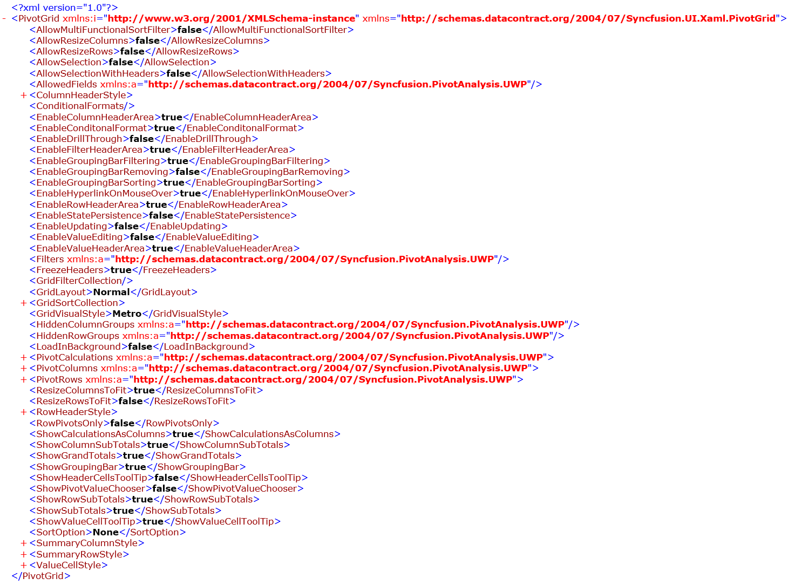

# Serialization and Deserialization in UWP Pivot Grid (SfPivotGrid)

This support allows you to serialize and deserialize the settings of SfPivotGrid control using [DataContractSerializer](https://msdn.microsoft.com/en-in/library/system.runtime.serialization.datacontractserializer.aspx).

## Serialization

Serialization allows you to save the settings of SfPivotGrid by using the `Serialize` method of the SfPivotGrid. It exports the current SfPivotGrid control settings to an XML file and it can be done with the help of one of the following methods.

### Serialize using FileSavePicker

It allows you to save the settings of SfPivotGrid control to the desired location in _*.xml_ format by using the `Serialize` method. Refer to the following code snippet.





this.pivotGrid.Serialize();





Me.pivotGrid.Serialize()





Now, the SfPivotGrid control will be serialized in XML file as follows.

### Serialize using stream

It allows you to save the SfPivotGrid control's settings with the help of `Serialize` method by passing the stream as parameter.





var folder = ApplicationData.Current.LocalFolder;
var storageFile = await folder.CreateFileAsync("PivotGrid.xml", CreationCollisionOption.ReplaceExisting);
var stream = await storageFile.OpenStreamForWriteAsync();
this.pivotGrid.Serialize(stream);





Dim folder As var = ApplicationData.Current.LocalFolder
Dim storageFile As var = folder.CreateFileAsync("PivotGrid.xml", CreationCollisionOption.ReplaceExisting)
Dim stream As var = storageFile.OpenStreamForWriteAsync
Me.pivotGrid.Serialize(stream)





### Serialize using storage file

It allows you to save the SfPivotGrid control's settings with the help of `Serialize` method by passing the storage file as parameter.





var folder = ApplicationData.Current.LocalFolder;
var storageFile = await folder.CreateFileAsync("PivotGrid.xml", CreationCollisionOption.ReplaceExisting);
this.pivotGrid.Serialize(storageFile);





Dim folder As var = ApplicationData.Current.LocalFolder
Dim storageFile As var = folder.CreateFileAsync("PivotGrid.xml", CreationCollisionOption.ReplaceExisting)
Me.pivotGrid.Serialize(storageFile)





### Serialize to XML string

It allows you to save the settings of SfPivotGrid control into an XML string using the `SerializeToXml` method.





string serializedPivotGrid = this.pivotGrid.SerializeToXml();





Me.pivotGrid.SerializeToXml()



Private serializedPivotGrid As String = Me.pivotGrid.SerializeToXml()



## Deserialization

Deserialization allows you to load the settings of SfPivotGrid by using the `Deserialize` method of the SfPivotGrid. It reconstructs the SfPivotGrid control based on the settings stored in the XML file and it can be done with the help of one of the following methods.

### Deserialize using FileSavePicker

It allows you to reload the SfPivotGrid control with the settings available in the _*.xml_ file. This can be achieved by using the `Deserialize` method.





this.pivotGrid.Deserialize();





Me.pivotGrid.Deserialize()





### Deserialize using stream

It allows you to reload the SfPivotGrid control with the settings available in the stream. This can be achieved with the help of `Deserialize` method by passing the stream as parameter.





var folder = ApplicationData.Current.LocalFolder;
var storageFile = await folder.GetFileAsync("PivotGrid.xml");
var stream = await storageFile.OpenStreamForReadAsync();
this.pivotGrid.Deserialize(stream);





Dim folder As var = ApplicationData.Current.LocalFolder
Dim storageFile As var = folder.GetFileAsync("PivotGrid.xml")
Dim stream As var = storageFile.OpenStreamForReadAsync
Me.pivotGrid.Deserialize(stream)





### Deserialize using storage file

It allows you to reload the SfPivotGrid control with the settings available in the storage file. This can be achieved with the help of `Deserialize` method by passing the storage file as parameter.





var folder = ApplicationData.Current.LocalFolder;
var storageFile = await folder.GetFileAsync("PivotGrid.xml");
this.pivotGrid.Deserialize(storageFile);





Dim folder As var = ApplicationData.Current.LocalFolder
Dim storageFile As var = folder.GetFileAsync("PivotGrid.xml")
Me.pivotGrid.Deserialize(storageFile)





### Deserialize from XML string

It allows you to reload the SfPivotGrid with the settings available in the XML string. This can be achieved with the help of `Deserialize` method by passing the XML string as parameter.





// string serializedPivotGrid = this.pivotGrid.Serialize();
this.pivotGrid.Deserialize(serializedPivotGrid);





' Dim serializedPivotGrid As String = Me.pivotGrid.Serialize()
Me.pivotGrid.Deserialize(serializedPivotGrid)





A demo sample is available in the following location.

{system drive}:\Users\&lt;User Name&gt;\AppData\Local\Syncfusion\EssentialStudio\&lt;Version Number&gt;\Samples\UWP\SampleBrowser\PivotGrid\PivotGrid\View\Serialization.xaml
