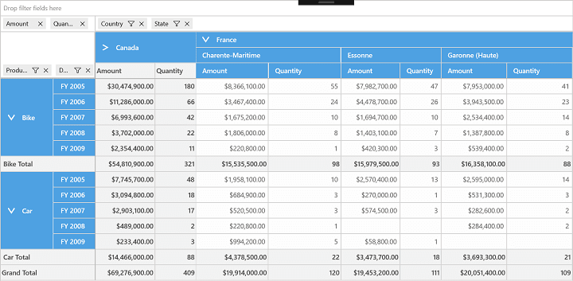
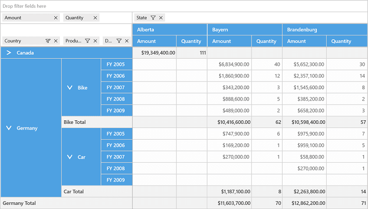

# State Persistence in UWP Pivot Grid (SfPivotGrid)

The SfPivotGrid supports maintaining the collapsed and expanded state of the corresponding pivot item when it gets changed. This can be achieved by enabling the `StatePersistenceEnabled` property in the SfPivotGrid control. Refer to the following code snippet to enable the state persistence.





<syncfusion:SfPivotGrid x:Name="PivotGrid1" StatePersistenceEnabled="True"/>





PivotGrid1.StatePersistenceEnabled = true;





PivotGrid1.StatePersistenceEnabled = True





_SfPivotGrid with collapsed "Canada"_

_SfPivotGrid maintaining collapsed state of "Canada" after pivot change_
