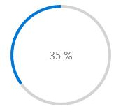
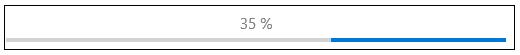
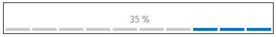

---
layout: post
title: Animating Custom Objects in UWP Progress Bar control | Syncfusion
description: Learn here all about Animating Custom Objects support in Syncfusion UWP Progress Bar (SfProgressBar) control and more.
platform: UWP
control: SfProgressBar
documentation: ug
--- 

# Animating Custom Objects in UWP Progress Bar (SfProgressBar)

Custom objects animation can be customized by change the [FillDirection](https://help.syncfusion.com/cr/uwp/Syncfusion.UI.Xaml.Controls.Notification.SfProgressBar.html#Syncfusion_UI_Xaml_Controls_Notification_SfProgressBar_FillDirection) of path and perform reverse animation.

## Animating Custom Objects along Directions

The direction of fill for Custom progress type can be changed in [SfProgressBar](https://help.syncfusion.com/cr/uwp/Syncfusion.UI.Xaml.Controls.Notification.SfProgressBar.html#Syncfusion_UI_Xaml_Controls_Notification_SfProgressBar_ProgressType) control using the property [FillDirection](https://help.syncfusion.com/cr/uwp/Syncfusion.UI.Xaml.Controls.Notification.SfProgressBar.html#Syncfusion_UI_Xaml_Controls_Notification_SfProgressBar_FillDirection). The enumeration “Directions” values are 

1. Horizontal
2. Vertical

The default value is Horizontal. 

Set a custom object using Template property as given below:





<notification:SfProgressBar ProgressType="Custom" FillPath="CloudFillPath" Value="35">
<notification:SfProgressBar.Template>
<ControlTemplate TargetType="notification:SfProgressBar">
<Viewbox>
<Grid>
<Path Data="F1M88.6366,20.4367C104.1566,20.4367,117.9286,29.6127,123.7326,43.2487C124.4526,44.9407,126.0886,46.1447,128.0046,46.5567C141.9406,49.5567,152.4046,61.6487,152.4046,76.0887C152.4046,92.7767,138.4526,106.3527,121.2846,106.3527L47.1966,106.3527C34.6246,106.3527,24.4046,96.3967,24.4046,84.1807C24.4046,71.9487,34.6246,62.0127,47.1966,62.0127C47.3606,62.0127,47.5206,62.0127,47.6846,62.0167C49.3766,62.0607,50.8006,60.8127,50.7006,59.2567C50.6646,58.6327,50.6446,58.0087,50.6446,57.3847C50.6446,37.0087,67.6886,20.4367,88.6366,20.4367" Fill="White" Stroke="#FF1196CD" StrokeThickness="1.5" Height="85.916" Stretch="Fill" Width="128" HorizontalAlignment="Center" VerticalAlignment="Center"/>
<Path x:Name="CloudFillPath" Data="F1M88.6366,20.4367C104.1566,20.4367,117.9286,29.6127,123.7326,43.2487C124.4526,44.9407,126.0886,46.1447,128.0046,46.5567C141.9406,49.5567,152.4046,61.6487,152.4046,76.0887C152.4046,92.7767,138.4526,106.3527,121.2846,106.3527L47.1966,106.3527C34.6246,106.3527,24.4046,96.3967,24.4046,84.1807C24.4046,71.9487,34.6246,62.0127,47.1966,62.0127C47.3606,62.0127,47.5206,62.0127,47.6846,62.0167C49.3766,62.0607,50.8006,60.8127,50.7006,59.2567C50.6646,58.6327,50.6446,58.0087,50.6446,57.3847C50.6446,37.0087,67.6886,20.4367,88.6366,20.4367" Fill="#FF1196CD" Height="85.916" Stretch="Fill" Width="128" HorizontalAlignment="Center" VerticalAlignment="Center"/>
</Grid>
</Viewbox>
</ControlTemplate>
</notification:SfProgressBar.Template>
</notification:SfProgressBar>





Set the [FillDirection](https://help.syncfusion.com/cr/uwp/Syncfusion.UI.Xaml.Controls.Notification.SfProgressBar.html#Syncfusion_UI_Xaml_Controls_Notification_SfProgressBar_FillDirection) to Horizontal and the object will be filled in horizontal direction.





progressBar.FillDirection = Syncfusion.UI.Xaml.Controls.Notification.Directions.Horizontal;





Set the [FillDirection](https://help.syncfusion.com/cr/uwp/Syncfusion.UI.Xaml.Controls.Notification.SfProgressBar.html#Syncfusion_UI_Xaml_Controls_Notification_SfProgressBar_FillDirection) to Vertical and the object will be filled in vertical direction.





progressBar.FillDirection = Syncfusion.UI.Xaml.Controls.Notification.Directions.Vertical;





N> Progress types other than `Custom` does not show any changes in their animation direction

## Reverse Animation

The direction of animation can be reversed in [SfProgressBar]((https://help.syncfusion.com/cr/uwp/Syncfusion.UI.Xaml.Controls.Notification.SfProgressBar.html#Syncfusion_UI_Xaml_Controls_Notification_SfProgressBar_ProgressType) control using the property [IsDirectionReversed](https://help.syncfusion.com/cr/uwp/Syncfusion.UI.Xaml.Controls.Notification.SfProgressBar.html#Syncfusion_UI_Xaml_Controls_Notification_SfProgressBar_IsDirectionReversed). The default value is false and it can be set as given below:





<notification:SfProgressBar x:Name="progressBar" IsDirectionReversed="true"/>









progressBar.IsDirectionReversed = true;









<notification:SfProgressBar x:Name="progressBar" IsDirectionReversed="true" ProgressType="SolidLinear" Width="500"/>









progressBar.ProgressType = Syncfusion.UI.Xaml.Controls.Notification.ProgressTypes.SolidLinear;

progressBar.IsDirectionReversed = true;









<notification:SfProgressBar x:Name="progressBar" IsDirectionReversed="true" ProgressType="SegmentedCircular"  />









progressBar.ProgressType = Syncfusion.UI.Xaml.Controls.Notification.ProgressTypes.SegmentedCircular;

progressBar.IsDirectionReversed = true;









<notification:SfProgressBar x:Name="progressBar" IsDirectionReversed="true" ProgressType="SegmentedLinear" Width="500"/>








progressBar.ProgressType = Syncfusion.UI.Xaml.Controls.Notification.ProgressTypes.SegmentedLinear;

progressBar.IsDirectionReversed = true;









<notification:SfProgressBar x:Name="progressBar" IsDirectionReversed="true" ProgressType="CustomFill"/>









progressBar.IsDirectionReversed = true;





The above code shows the reverse animation in Horizontal direction.





progressBar.FillDirection = Syncfusion.UI.Xaml.Controls.Notification.Directions.Vertical;

progressBar.IsDirectionReversed = true;





The above code shows the reverse animation in Vertical direction.

