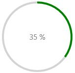
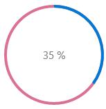
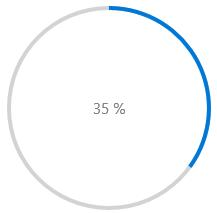
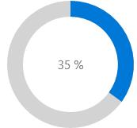
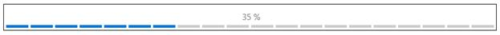
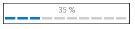
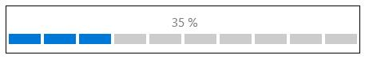
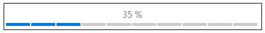

---
layout: post
title: Appearance and Styling in UWP Progress Bar control | Syncfusion®
description: Learn here all about Appearance and Styling support in Syncfusion® UWP Progress Bar (SfProgressBar) control and more.
platform: UWP
control: SfProgressBar
documentation: ug
--- 

# Appearance and Styling in UWP Progress Bar (SfProgressBar)

## Customizing the Hot Spots

The brush of animating element (except Custom progress type) in the control can be changed using the `FillColor` property. It can set as given below:





<notification:SfProgressBar x:Name="progressBar" FillColor="Green"/>









progressBar.FillColor = new SolidColorBrush(Colors.Green);





The brush of background element (except Custom progress type) in the control can be changed using `BackRimFillColor` property. It can be set as given below:





<notification:SfProgressBar x:Name="progressBar" BackRimillColor="PaleVioletRed"/>









progressBar.BackRimFillColor = new SolidColorBrush(Colors.PaleVioletRed);





## Customizing the Circular Progress Types

### Increasing Radius of the ArcSegment

The Radius of ArcSegments in SolidCircular progress type can be increased using `Radius` and `BackRimRadius` properties. It can be set as given below:





<notification:SfProgressBar ProgressType="SolidCircular" Height="210" Width="210" Radius="100" BackRimRadius="100" Value="35"/>





### Increasing the StrokeThickness of ArcSegment

The `StrokeThickness` of ArcSegments in SolidCircular progress type can be increased using `StrokeThickness` and `BackRimStrokeThickness` properties. It can be set as given below:





<notification:SfProgressBar ProgressType="SolidCircular" Height="210" Width="210" StrokeThickness="20" BackRimStrokeThickness="20" Value="35"/>





## Customizing the SegmentedLinear Progress Type

The SegmentedLinear progress type can be customized as given below:

### Changing the Segment Counts

`SegmentCount` property is used to increase or decrease the segment count.





<notification:SfProgressBar ProgressType="SegmentedLinear" Height="38" Width="900" SegmentCount="20" Value="35"/>





### Increasing the Width of Progress Line Segment





<notification:SfProgressBar ProgressType="SegmentedLinear" Height="38" Width="900" SegmentWidth="20" Value="35">





### Increasing the Height of Progress Line Segment





<notification:SfProgressBar ProgressType="SegmentedLinear" Height="38" Width="900" SegmentHeight="20" Value="35">





### Adjusting the Spacing between Line Segments





<notification:SfProgressBar ProgressType="SegmentedLinear" Height="38" Width="900" SegmentSpacing="2" Value="35">





