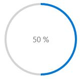
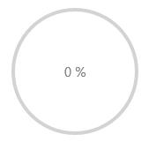
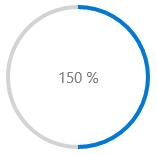

---
layout: post
title: Dealing with Value in UWP Progress Bar control | Syncfusion
description: Learn here all about Dealing with Value support in Syncfusion UWP Progress Bar (SfProgressBar) control and more.
platform: UWP
control: SfProgressBar
documentation: ug
--- 

# Dealing with Value in UWP Progress Bar (SfProgressBar)

## Setting Progress Value

`Value` property is used to set the progress in `SfProgressBar` control. Value should fall in between `Minimum` and `Maximum` values.





<notification:SfProgressBar x:Name="progressBar" Value="35"/>









progressBar.Value = 35.0;





## Setting Progress Range 

`Minimum` and `Maximum` properties are used to set a range for the progress Value. By default, `Minimum` is 1 and `Maximum` is 100.





<notification:SfProgressBar x:Name="progressBar" Minimum="100"  Maximum="200"  Value="50"/>









progressBar.Minimum = 100.0;

progressBar.Maximum = 200.0;

progressBar.Value = 50.0;









<notification:SfProgressBar x:Name="progressBar" Minimum="100"  Maximum="200"  Value="150"/>









progressBar.Minimum = 100.0;

progressBar.Maximum = 200.0;

progressBar.Value = 150.0;





## Retrieving Progress Percentage

`Percentage` property is used to get the progress in terms of percentage. It is computed from Value, `Minimum` and `Maximum` properties. 





<notification:SfProgressBar Minimum="100" Maximum="200" Value="50"/>









progressBar.Minimum = 100.0;

progressBar.Maximum = 200.0;

progressBar.Value = 50.0;





The above code yields a result of zero Percentage (Value is not in `Minimum` and `Maximum` range).





<notification:SfProgressBar Minimum="100" Maximum="200" Value="150"/>









progressBar.Minimum = 100.0;

progressBar.Maximum = 200.0;

progressBar.Value = 150.0;





The above code yields a result of fifty Percentage (Value is not in Minimum and Maximum range).

