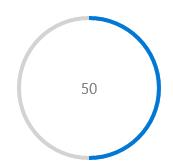
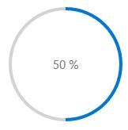
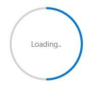
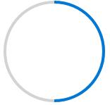
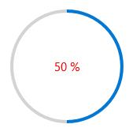

---
layout: post
title: Displaying Progress Text in UWP Progress Bar control | Syncfusion
description: Learn here all about Displaying Progress Text support in Syncfusion UWP Progress Bar (SfProgressBar) control and more.
platform: UWP
control: SfProgressBar
documentation: ug
--- 

# Displaying Progress Text in UWP Progress Bar (SfProgressBar)

`SfProgressBar` can display either `Value` or `Percentage` or `Custom Text` as display content using the property `DisplayContentMode`. The values of `DisplayContentMode` are

* None
* Value
* Percentage
* Custom

## Showing Value as Display Text

`SfProgressBar` can display Value as display content by set the property `DisplayContentMode` to Value.





<notification:SfProgressBar x:Name="progressBar" DisplayContentMode="Value"  />









progressBar.DisplayContentMode = DisplayContentMode.Value;





The above code displays the Value as display content.

## Showing Percentage as Display Text

`SfProgressBar` can display `Percentage` as display content by set the property `DisplayContentMode` to `Percentage`.





<notification:SfProgressBar x:Name="progressBar" DisplayContentMode="Percentage"  />









progressBar.DisplayContentMode = DisplayContentMode.Percentage;





The above code displays the computed Percentage value as display content.

## Showing Custom Content as Display Text

`SfProgressBar` can display Custom Text as display content by set the property `DisplayContentMode` to Custom.





<notification:SfProgressBar x:Name="progressBar" DisplayContentMode="Custom" CustomContent="Loading.." />









progressBar.DisplayContentMode = DisplayContentMode.Custom;





The above code displays the custom content as display content.

## Disabling the Display Text

`SfProgressBar` display content can be disabled by set the property `DisplayContentMode` to None.





<notification:SfProgressBar x:Name="progressBar" DisplayContentMode="None"  />









progressBar.DisplayContentMode = DisplayContentMode.None;





The above code displays nothing in display content.

## Customizing the Display Content

`DisplayContentStyle` property is used to customize the display content. It can be set as follows:





<notification:SfProgressBar Value="50" DisplayContentMode="Percentage">

<notification:SfProgressBar.DisplayContentStyle>

</notification:SfProgressBar.DisplayContentStyle>

</notification:SfProgressBar>





