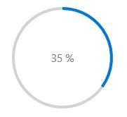
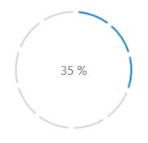
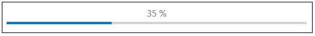
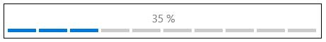
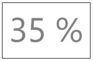

---
layout: post
title: Progress Animations in UWP Progress Bar control | Syncfusion®
description: Learn here all about Progress Animations support in Syncfusion® UWP Progress Bar (SfProgressBar) control and more.
platform: UWP
control: SfProgressBar
documentation: ug
--- 

# Progress Animations in UWP Progress Bar (SfProgressBar)

The built-in progress bar shapes are circular and linear. However, any custom object can be used for fill animation. [ProgressType](https://help.syncfusion.com/cr/uwp/Syncfusion.UI.Xaml.Controls.Notification.SfProgressBar.html#Syncfusion_UI_Xaml_Controls_Notification_SfProgressBar_ProgressType) property is used to choose the progress type(shape) and the enumeration values are

1. SolidCircular
2. SolidLinear
3. SegmentedCircular
4. SegmentedLinear
5. Custom

## Circular Progress Animations

In `SolidCircular` and `SegmentedCircular` progress types, the arc segments are animated to show the progress. The default progress type is `SolidCircular`.





<notification:SfProgressBar x:Name="progressBar" ProgressType="SolidCircular"  />









progressBar.ProgressType = Syncfusion.UI.Xaml.Controls.Notification.ProgressTypes.SolidCircular;

progressBar.Value = 35.0;









<notification:SfProgressBar x:Name="progressBar" ProgressType="SegmentedCircular"  />









progressBar.ProgressType = Syncfusion.UI.Xaml.Controls.Notification.ProgressTypes.SegmentedCircular;

progressBar.Value = 35.0;





## Linear Progress Animations

In `SolidLinear` and `SegmentedLinear` progress types, the line segments is animated to show the progress. 





<notification:SfProgressBar ProgressType="SolidLinear" Value="35" Width="500"/>









progressBar.ProgressType = Syncfusion.UI.Xaml.Controls.Notification.ProgressTypes.SolidLinear;

progressBar.Value = 35.0;









<notification:SfProgressBar ProgressType="SegmentedLinear" Value="35" Width="500"/>









progressBar.ProgressType = Syncfusion.UI.Xaml.Controls.Notification.ProgressTypes.SegmentedLinear;

progressBar.Value = 35.0;





## Animating Fill in Custom Object

Set the property `ProgressType` to `Custom` for animating a custom object with fill animation. 





<notification:SfProgressBar x:Name="progressBar" ProgressType="Custom"  />









progressBar.ProgressType = Syncfusion.UI.Xaml.Controls.Notification.ProgressTypes.Custom;

progressBar.Value = 35.0;





The above code displays only the display content. The custom object can be set using `Template` and [FillPath](https://help.syncfusion.com/cr/uwp/Syncfusion.UI.Xaml.Controls.Notification.SfProgressBar.html#Syncfusion_UI_Xaml_Controls_Notification_SfProgressBar_FillPath) property. `FillPath` property holds the name of the element in template that is to be animated.





<notification:SfProgressBar ProgressType="Custom" FillPath="CloudFillPath" Value="35">

<notification:SfProgressBar.Template>

<ControlTemplate TargetType="notification:SfProgressBar">

<Viewbox>

<Grid>

<Path Data="F1M88.6366,20.4367C104.1566,20.4367,117.9286,29.6127,123.7326,43.2487C124.4526,44.9407,126.0886,46.1447,128.0046,46.5567C141.9406,49.5567,152.4046,61.6487,152.4046,76.0887C152.4046,92.7767,138.4526,106.3527,121.2846,106.3527L47.1966,106.3527C34.6246,106.3527,24.4046,96.3967,24.4046,84.1807C24.4046,71.9487,34.6246,62.0127,47.1966,62.0127C47.3606,62.0127,47.5206,62.0127,47.6846,62.0167C49.3766,62.0607,50.8006,60.8127,50.7006,59.2567C50.6646,58.6327,50.6446,58.0087,50.6446,57.3847C50.6446,37.0087,67.6886,20.4367,88.6366,20.4367" Fill="White" Stroke="#FF1196CD" StrokeThickness="1.5" Height="85.916" Stretch="Fill" Width="128" HorizontalAlignment="Center" VerticalAlignment="Center"/>

<Path x:Name="CloudFillPath" Data="F1M88.6366,20.4367C104.1566,20.4367,117.9286,29.6127,123.7326,43.2487C124.4526,44.9407,126.0886,46.1447,128.0046,46.5567C141.9406,49.5567,152.4046,61.6487,152.4046,76.0887C152.4046,92.7767,138.4526,106.3527,121.2846,106.3527L47.1966,106.3527C34.6246,106.3527,24.4046,96.3967,24.4046,84.1807C24.4046,71.9487,34.6246,62.0127,47.1966,62.0127C47.3606,62.0127,47.5206,62.0127,47.6846,62.0167C49.3766,62.0607,50.8006,60.8127,50.7006,59.2567C50.6646,58.6327,50.6446,58.0087,50.6446,57.3847C50.6446,37.0087,67.6886,20.4367,88.6366,20.4367" Fill="#FF1196CD" Height="85.916" Stretch="Fill" Width="128" HorizontalAlignment="Center" VerticalAlignment="Center"/>

</Grid>

</Viewbox>

</ControlTemplate>

</notification:SfProgressBar.Template>

</notification:SfProgressBar>





