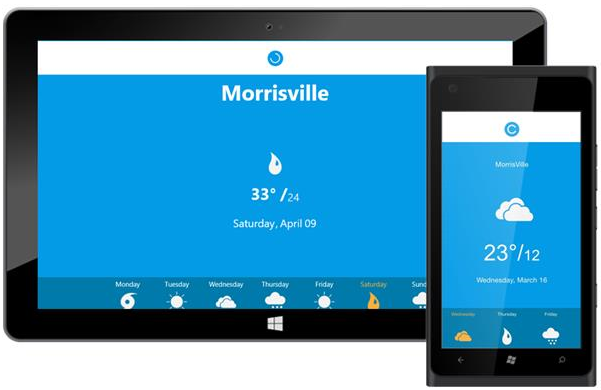

---
layout: post
title: Customization in UWP Pull To Refresh control | Syncfusion
description: Learn here all about Customization support in Syncfusion UWP Pull To Refresh (SfPullToRefresh) control and more.
platform: UWP
control: PullToRefresh
documentation: ug
--- 

# Customization in UWP Pull To Refresh (SfPullToRefresh)

## PullingThreshold

Gets or sets the threshold value from the edges for easy panning from the edges. The default value of TouchThreshold is 3 times the RefreshContentHeight.





    <syncfusion:SfPullToRefresh x:Name="pullToRefresh" PullingThreshold="225"/>

 



    pullToRefresh.PullingThreshold = 225d;



 

## PullableContent

PullableContent is the main view of the PullToRefresh control on which the desired items can be placed.


    
    <syncfusion:SfPullToRefresh Refreshing="SfPullToRefresh_Refreshing" PullingThreshold="200" x:Name="pullToRefresh"  Transition="SlideOnTop" Position="Top">
           
            <syncfusion:SfPullToRefresh.PullableContent>
                <StackPanel Orientation="Vertical" HorizontalAlignment="Center" VerticalAlignment="Center">
                    <TextBlock  FontSize="25" Foreground="White"   Text = "Temperature"/>

                    <TextBlock FontSize="25"  Foreground="White" HorizontalAlignment="Center" Text ="{Binding Temp}" />
                </StackPanel>
            </syncfusion:SfPullToRefresh.PullableContent>

    </syncfusion:SfPullToRefresh>


## RefreshContentHeight

`RefreshContentHeight` sets the height of the refresh content.





    <syncfusion:SfPullToRefresh x:Name="pulltorefresh" RefreshContentHeight="200"/>





    pullToRefresh.RefreshContentHeight = 200d;





## Refresh ()

Refresh method is used to Refresh the `PullableContent` and also hides the `RefreshContent`.



    pullToRefresh.Refresh();



## Transition

The Transition property specifies the animations for the RefreshContent. Transition property has the following two options:

* `SlideOnTop`
* `Push`

The default transition is `SlideOnTop`. That draws the `RefreshContent` on top of the `PullableContent`.





    <syncfusion:SfPullToRefresh x:Name="pullToRefresh" Transition="SlideOnTop" />





    pullToRefresh.Transition = Transition.SlideOnTop;





The following code example shows how to set `Transition` as `Push` to SfPullToRefresh. This transition moves the refresh content and main content simultaneously.





    <syncfusion:SfPullToRefresh x:Name=" pullToRefresh" Transition="Push" />





    pullToRefresh.Transition = Transition.Push;





## PullDirection

PullDirection property specifies the position of the transition to take place.PullDirection property has the following two options:
* `Top`
* `Bottom`

The default PullDirection is `Top`. That draws the `RefreshContent` on top of the `pullableContent`.





    pullToRefresh.PullDirection=PullDirection.Top;





    <syncfusion:SfPullToRefresh x:Name=" pullToRefresh" PullDirection="Top" />





The following code example shows how to set `PullDirection` as `Bottom` to SfPullToRefresh.That draws the `RefreshContent` on Bottom of the `pullableContent`.





    pullToRefresh.PullDirection=PullDirection.Bottom;





    <syncfusion:SfPullToRefresh x:Name=" pullToRefresh" PullDirection="Bottom" />





